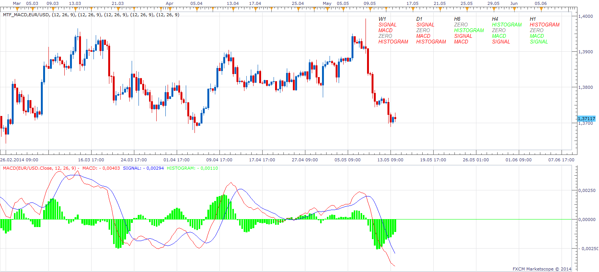
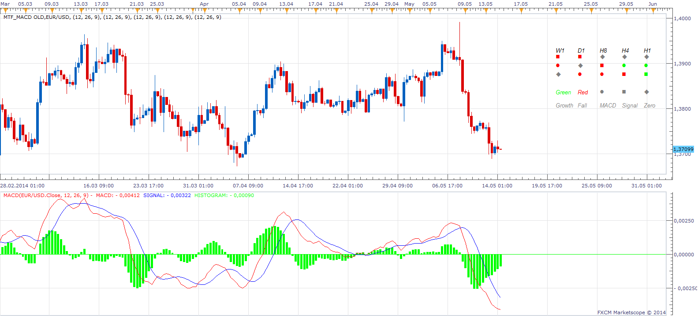

# MTF MACD

> Source: https://fxcodebase.com/code/viewtopic.php?f=17&t=4089  
> Forum: 17 · Topic 4089 · 21 post(s)

---

## MTF MACD

**Apprentice** · Mon May 02, 2011 9:12 am

In this MTF indicator, position of the MACD line is shown in relation to the signal/zero/histogram lines.

 [MTF_MACD.lua](files/10255/MTF_MACD.lua)

 

Old (Symbolic) Implementation

 [MTF_MACD Old.lua](files/10255/MTF_MACD%20Old.lua)

---

## Re: MTF MACD

**dljohn** · Fri May 06, 2011 12:35 pm

Thanks!

---

## Re: MTF MACD

**serchfx** · Tue May 10, 2011 6:20 pm

Excelent indicator.

Do you can make a strategy for this indicator???

Thank's

---

## Re: MTF MACD

**Apprentice** · Wed May 11, 2011 3:42 am

Of course, if you give me Entry and Exit signals.
I could think of several ways to implementat it.

---

## Re: MTF MACD

**fabfxcm** · Thu Sep 15, 2011 10:48 am

Hi Apprentice,
I think the idea of making a strategy from this indicator is very good. A strategy in which you could choose as entry signal the cross of the two EMA or MVA lines under zero and close when they cross aboce zero (but maybe some false signlas could start!!). Or you should insert, if it is possilbe, when the red line cross the blue line enter short, while long when the opposite happen.

---

## Re: MTF MACD

**JPNWV7** · Thu Sep 29, 2011 6:46 am

> **Apprentice wrote:**
>
>
> MTF MACD.png
>
>
>
> In this MTF indicator, position of the MACD lines in relation to the signal and the zero line,
> is shown by symbols.
>
> Histogram is not shown.
>
>
>
> MTF_MACD.lua
>
>
> Multi Time Frame MACD

What are the buy & sell signals of the MTF MACD when

the circle is green & the sqaure is red
and
when the circle is red & the square is green

Thanks

---

## Re: MTF MACD

**Apprentice** · Thu Sep 29, 2011 3:16 pm

In the current version I have not implemented the trading signals.
Shows only the position and slope.

Green is Up
Red Trend is Down

---

## Re: MTF MACD

**JPNWV7** · Thu Sep 29, 2011 7:45 pm

> **Apprentice wrote:**
> In the current version I have not implemented the trading signals.
> Shows only the position and slope.
>
> Green is Up
> Red Trend is Down

Ok, I know that, but in the chart above under the 4H time frame you have a Red Square & under it is a Green Circle, is the trend up or down? Why is one red & the other one green? In the 4H Time Frame with a red square first then under it a green circle, would you enter a long or short position?

Thanks

---

## Re: MTF MACD

**Apprentice** · Fri Sep 30, 2011 5:17 am

> Red Square & under it is a Green Circle, is the trend up or down?

Green Circle tells us, the MACD is rising but it is still below the signal lines.
Red Square tells us that the Signal is in decline, approaching the MACD line.
You should take a close look at the actual chart.
It seems that soon we will have long signal, but it is not happening yet.

Relying on color alone. No.
Timing is critical, if you caught the change early enough, probably yes.

But for me this is for me a theoretical discussion,
because I do not use indicators in my trading.

---

## Re: MTF MACD

**MrRiversideDude** · Tue May 13, 2014 10:06 am

Is it possible to modify this indicator to use the histogram? Is there already an indicator available that provides this functionality?

Thanks in advance!!

---

## Re: MTF MACD

**Apprentice** · Wed May 14, 2014 1:44 am

Your request is added to the development list.

---

## Re: MTF MACD

**Apprentice** · Wed May 14, 2014 8:02 am

I just added new implementation with Histogram.
Old Version Is optimized a bit.

---

## Re: MTF MACD

**MrRiversideDude** · Wed May 14, 2014 2:01 pm

Thanks apprentice.

---

## Re: MTF MACD

**MrRiversideDude** · Fri May 16, 2014 3:31 am

Thanks apprentice. Quick question, parts of the indicator doesn't show up when you lower the timeframe.. Any idea why? Test it on m15.

Thanks in advance!!

---

## Re: MTF MACD

**Apprentice** · Sat May 17, 2014 2:08 am

Insufficient data is loaded to run correctly.
Try re-download, I have increased the minimum data retrieval for one.

---

## Re: MTF MACD

**kappa2547** · Sun May 18, 2014 6:59 am

I'm wondering if there is already an MACD indicator that has its histogram bars turn red when below 0 and stay green when above 0? If not could this selection be added? Or even the option of choosing what two colours are to be used.

---

## Re: MTF MACD

**Apprentice** · Mon May 19, 2014 2:52 am

Try this version.
[viewtopic.php?f=17&t=229&p=322&hilit=macd#p322](https://fxcodebase.com/code/viewtopic.php?f=17&t=229&p=322&hilit=macd#p322)
In fact, this is one of the first things added to the forum.

---

## Re: MTF MACD

**MrRiversideDude** · Sat Jun 07, 2014 6:25 pm

Hey Apprentice,

Sometimes this indicator is completely off, any idea why? The same timeframe will show different results depending in the TF of the current chart.

Thanks in advance for checking.

---

## Re: MTF MACD

**Apprentice** · Sun Jun 08, 2014 2:18 am

Can you give me an example (with screen shot).
My testing did not reveal this.

---

## Re: MTF MACD

**MrRiversideDude** · Mon Jun 09, 2014 8:56 pm

Ok, if it happens again. I will.

Thanks for all your hard work!

---

## Re: MTF MACD

**Apprentice** · Mon Apr 09, 2018 7:00 am

The indicator was revised and updated.
