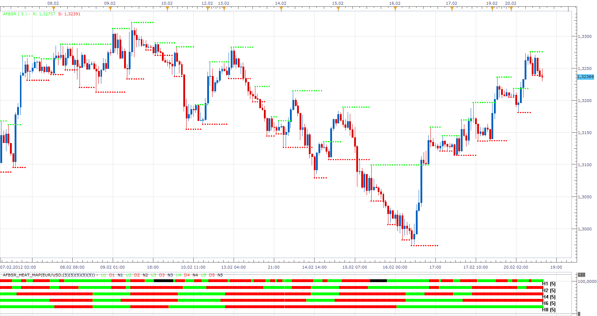

# MTF MCP Advanced fractal

> Source: https://fxcodebase.com/code/viewtopic.php?f=17&t=13608  
> Forum: 17 · Topic 13608 · 20 post(s)

---

## MTF MCP Advanced fractal

**Apprentice** · Sat Feb 18, 2012 12:49 pm

This indicator shows the 4 data points for the selected currency pair / time frame.

1. Color shows whether we have up or down trend.
Green - Higher Highs, Higher Lows
Red - Lower Highs, Lower Lows

2. Fractal Based Support / Resistance Lines Levels

3. Last Activ Fractal Indication (Arrow)

 [MTF MCP Advanced fractal.lua](files/26309/MTF%20MCP%20Advanced%20fractal.lua)

 

I could not find a better presentation mode of Fractal in Heatmap.
 Heatmap Indicates latest indication given by Fractal.
If we have simultaneous indication they are shown as neutral.

 [AFBSR_Heat_Map.lua](files/26309/AFBSR_Heat_Map.lua)

If you already do have have Advanced Fractal Based Support/Resistance lines (AFBSR.lua)
on your trading station, download and install it.
 It can be found here [viewtopic.php?f=17&t=724](https://fxcodebase.com/code/viewtopic.php?f=17&t=724)

---

## Re: MTF MCP Advanced fractal

**flem_wad** · Sun Feb 19, 2012 7:14 am

hI,
Can you make this indiatotor a heatmsp?

---

## Re: MTF MCP Advanced fractal

**Apprentice** · Mon Feb 20, 2012 4:02 am

Your request is added to the development list.

---

## Re: MTF MCP Advanced fractal

**Apprentice** · Mon Feb 20, 2012 1:50 pm

Requested can be found, at Top most post.

---

## Re: MTF MCP Advanced fractal

**cash4u** · Tue Jun 19, 2012 6:33 am

dear programmers,

i request strategy based on AFBSR HEAT MAP

time frames: m15, h1,h4, d1

buy:

h1,h4, d1 green in color and m 15 changes its color from red to green

sell:

h1,h4, d1 red in color and m15 changes its color from green to red

thank you

---

## Re: MTF MCP Advanced fractal

**Apprentice** · Wed Jun 20, 2012 1:42 am

Your request is added to the development list.

---

## Re: MTF MCP Advanced fractal

**Apprentice** · Tue Mar 13, 2018 11:51 am

The indicator was revised and updated.

---

## Re: MTF MCP Advanced fractal

**Avignon** · Mon Mar 19, 2018 4:08 pm

Hello,

2 screenshots to show the bug.

 

 

And beyond H2, there is definitely a black band.

Regards.

---

## Re: MTF MCP Advanced fractal

**Avignon** · Sun May 09, 2021 11:09 am

At times, if you scroll down, you get this.

 

It is not a really problem, you can put it in low priority.

---

## Re: MTF MCP Advanced fractal

**Apprentice** · Tue May 11, 2021 3:20 am

You are using AFBSR_Heat_Map.lua or?

---

## Re: MTF MCP Advanced fractal

**ahmedalhosenyy** · Fri Jan 13, 2023 2:28 pm

Hello Apprentice,

What is the difference between " AFBSR Heat map " and fractal trend

---

## Re: MTF MCP Advanced fractal

**Apprentice** · Sun Jan 15, 2023 4:48 am

Can you provide link to "fractal trend"?

---

## Re: MTF MCP Advanced fractal

**ahmedalhosenyy** · Sun Jan 15, 2023 6:33 am

> **Apprentice wrote:**
> Can you provide link to "fractal trend"?

Here is the link
[https://fxcodebase.com/code/viewtopic.php?f=17&t=724&hilit=advanced+fractal&start=110](https://fxcodebase.com/code/viewtopic.php?f=17&t=724&hilit=advanced+fractal&start=110)

---

## Re: MTF MCP Advanced fractal

**Apprentice** · Fri Jan 20, 2023 1:55 pm

They will show the same information
The overlay will show the current chart and time frame signal,
while Heat_Map has the ability to provide information about higher time frame signals.

---

## Re: MTF MCP Advanced fractal

**ahmedalhosenyy** · Fri Jan 20, 2023 2:48 pm

> **ahmedalhosenyy wrote:**
> Hello Apprentice,
>
> What is the difference between " AFBSR Heat map " and fractal trend

In the picture both indicators are 1 Hr time frame and same settings but the colors don't match.

Do I miss something !

---

## Re: MTF MCP Advanced fractal

**Apprentice** · Mon Jan 23, 2023 12:09 pm

Signals are ok.
Overlay color will show trends, not individual signals.

---

## Re: MTF MCP Advanced fractal

**Avignon** · Wed Jan 25, 2023 7:13 am

> **Apprentice wrote:**
> Signals are ok.
> Overlay color will show trends, not individual signals.

OK, I see, I get it!

(I had to go over it again and again.)

---

## Re: MTF MCP Advanced fractal

**ahmedalhosenyy** · Wed Jan 25, 2023 7:40 pm

Hello and many thanks for the efforts

If both indicators are the same but different shapes so (histogram indicator 1D ) must match the (overlay indicator 1D) which is not the case

[https://postimg.cc/3k9X99HK](https://postimg.cc/3k9X99HK)

---

## Re: MTF MCP Advanced fractal

**Apprentice** · Thu Jan 26, 2023 5:46 am

The histogram will reflect changes in Arrows, NOT candle colors(Trend).
Will write a trend version.

---

## Re: MTF MCP Advanced fractal

**Apprentice** · Fri Jan 27, 2023 9:53 am

AFBSR_Heat_Map.lua updated.
