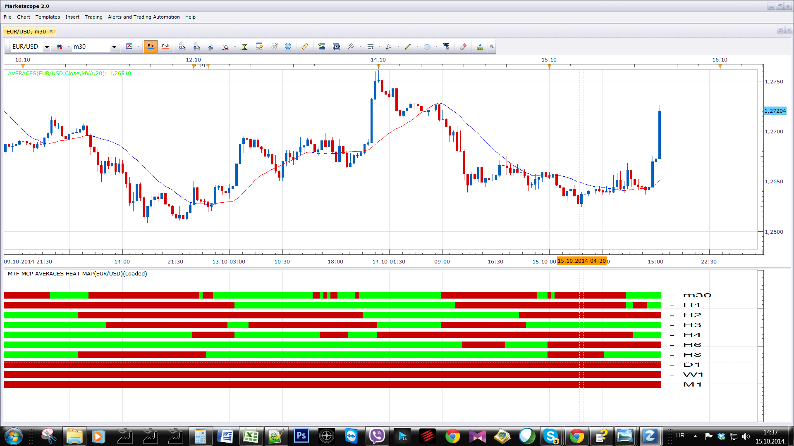
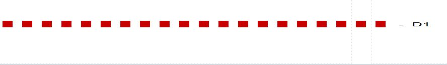

# MTF MCP Averages Heat Map

> Source: https://fxcodebase.com/code/viewtopic.php?f=17&t=61329  
> Forum: 17 · Topic 61329 · 10 post(s)

---

## MTF MCP Averages Heat Map

**Apprentice** · Wed Oct 15, 2014 7:25 am

Filter
1. "MA Slope"
Up MA > MA-1
Down MA < MA-1

2. "Price/MA"
Up Price > MA
Down Price < MA

3. "Price + Price Slope / MA + MA Slope"
Trend
Up - Price > MA
Down - Price < MA

MA Slope (outline color coded)
Up MA > MA-1
Down MA < MA-1

Slope
Up - Close > Open
Down - Close < Open

4. "Price/MA + MA Slope"
Trend
Up - Price > MA
Down - Price < MA

Slope
Up MA > MA-1
Down MA < MA-1

 [MTF MCP Averages Heat Map.lua](files/96543/MTF%20MCP%20Averages%20Heat%20Map.lua)

Based on Averages Indicator.
[viewtopic.php?f=17&t=2430&hilit=Averages](https://fxcodebase.com/code/viewtopic.php?f=17&t=2430&hilit=Averages)

---

## Re: MTF MCP Averages Heat Map

**cave76** · Wed Oct 15, 2014 11:29 am

thanks

---

## Re: MTF MCP Averages Heat Map

**cave76** · Sun Oct 19, 2014 11:58 am

issue with indicator

when go to lower tf indicator is not reading correct

 

 

 

---

## Re: MTF MCP Averages Heat Map

**Apprentice** · Sun Oct 19, 2014 12:10 pm

Please Re-Download.
Support for Lower time frame is removed,
was initially added my mistake.

---

## Re: MTF MCP Averages Heat Map

**birillo** · Tue Dec 02, 2014 8:44 am

Hi.
Great job! Thanks.
Would it be possible to add CMA "Centered Moving Averages" (Method simple) to the list of averages in order to map its slope ?

---

## Re: MTF MCP Averages Heat Map

**Apprentice** · Tue Dec 02, 2014 6:43 pm

Completely new indicator should be written.
This is due to the unusual Centered Moving Averages behavior.

---

## Re: MTF MCP Averages Heat Map

**birillo** · Wed Dec 03, 2014 3:15 am

The idea would be to have evidence (different color, map ...) of the slope of a CMA (even in a single time frame).
Thanks.

---

## Re: MTF MCP Averages Heat Map

**Apprentice** · Wed Dec 03, 2014 5:23 am

CMA Option Added.
Note, CMA is not supported by Averages indicator.
U will have to install CMA.BIN indicator separately.
[viewtopic.php?f=17&t=24476](https://fxcodebase.com/code/viewtopic.php?f=17&t=24476)

---

## Re: MTF MCP Averages Heat Map

**eurusd86** · Sun Nov 15, 2015 2:09 am

different time different result，mistake

---

## Re: MTF MCP Averages Heat Map

**Apprentice** · Wed May 02, 2018 6:07 am

The indicator was revised and updated.
