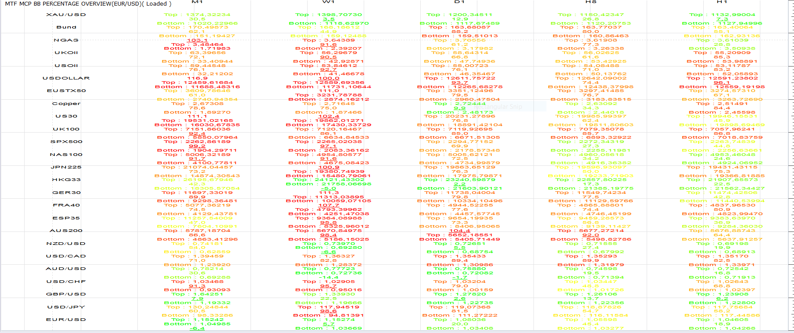

# MTF MCP BB Percentage

> Source: https://fxcodebase.com/code/viewtopic.php?f=17&t=64223  
> Forum: 17 · Topic 64223 · 7 post(s)

---

## MTF MCP BB Percentage

**Apprentice** · Sun Dec 18, 2016 6:21 pm

 [MTF MCP BB Percentage.lua](files/110147/MTF%20MCP%20BB%20Percentage.lua)

 [MTF MCP BB Percentage with Alert.lua](files/110147/MTF%20MCP%20BB%20Percentage%20with%20Alert.lua)

 

 [MTF MCP BB Percentage Overview.lua](files/110147/MTF%20MCP%20BB%20Percentage%20Overview.lua)

BB-PERCENTAGES is available here.
[viewtopic.php?f=17&t=226&hilit=BB+Percentage](https://fxcodebase.com/code/viewtopic.php?f=17&t=226&hilit=BB+Percentage)

---

## Re: MTF MCP BB Percentage

**Apprentice** · Thu Dec 22, 2016 3:20 pm

MTF MCP BB Percentage Overview.lua added

---

## Re: MTF MCP BB Percentage

**plkdtm** · Fri Dec 23, 2016 5:27 am

Many thanks, it's perfect.

---

## Re: MTF MCP BB Percentage

**Asack55** · Fri Feb 24, 2017 6:25 pm

Is it possible to have an email alert and audio alert if it goes above or below a specific percent on the top and a specific percent on the bottom? I am looking for an MTF MCP indicator that would identify outlier tags of the 3rd standard deviation.

Many Thanks

---

## Re: MTF MCP BB Percentage

**Apprentice** · Sat Feb 25, 2017 3:41 pm

Your request is added to the development list, Under Id Number 3750
 If someone is interested to do this task, please contact me.

---

## Re: MTF MCP BB Percentage

**Apprentice** · Sat Mar 04, 2017 10:24 am

MTF MCP BB Percentage with Alert.lua added.

---

## Re: MTF MCP BB Percentage

**Apprentice** · Mon Feb 05, 2018 6:25 am

The Indicator was revised and updated.
