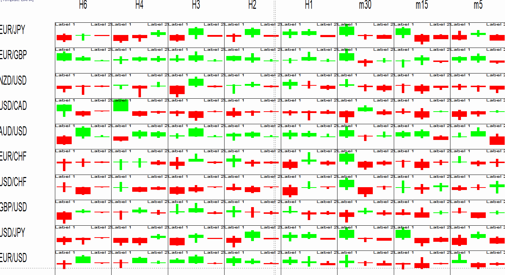

# MTF MCP Candle Pattern View

> Source: https://fxcodebase.com/code/viewtopic.php?f=17&t=63210  
> Forum: 17 · Topic 63210 · 9 post(s)

---

## MTF MCP Candle Pattern View

**Apprentice** · Thu Mar 03, 2016 7:09 am

Algorithms are customized to the forex market.
Which will rarely have gap patterns.

 [MTF MCP Candle Pattern View.lua](files/105091/MTF%20MCP%20Candle%20Pattern%20View.lua)

I'm open to suggestions about detection algorithm improvement.
Also, Code is open, you can add new patterns or modify detection algorithm.

The indicator was revised and updated

Long Patterns
"Three White Soldiers (+)"
"Bullish Three Outside (+)"
 "Bullish Three Inside (+)"
 "Dragonfly Doji (+)"
 "Hammer (+)

Short Patterns {"Three Black Crows (-)"
"Bearish Three Outside (-)"
 "Bearish Three Inside (-)"
 "Gravestone Doji (-)"
 "HangingMan (-)"

---

## Re: MTF MCP Candle Pattern View

**Coondawg71** · Fri Mar 04, 2016 2:30 pm

Great tool!

Actually, in the Fx market, Weekly openings will occasionally have gaps. Which is a great "formation" to trade. If you look at weekly openings, you will see they most likely reverse. Fx market is open prior to retail access and smart money gets orders in place prior to retail market. Hence the reversals commonly seen. So, if possible, are you able to display the gaps on the weekly time slot???

thanks!!!

sjc

---

## Re: MTF MCP Candle Pattern View

**nchatzoglou** · Fri Nov 18, 2016 11:36 am

This view is very helpfull but unfortunately it requires a few option-adjustments. Can you please add the option to see more than 4 bars? It is very crucial to know if the market is in consolidation or in a trending mode.4 bars are not enough to show its mode. It would also be very heplfull if the bars could take over the entire - small screen, from the bottom to the top. As it is now, a lot of space remains empty. What I mean is to make it Just like in Marketscope in automatic vertical adjustment...
Thank you for the great work anyway.

---

## Re: MTF MCP Candle Pattern View

**Apprentice** · Fri Dec 02, 2016 5:04 am

Minor update.

---

## Re: MTF MCP Candle Pattern View

**Silverthorn** · Thu Oct 25, 2018 12:19 am

Hi Apprentice,

Can you please have a look at this View. It only displays Label 1 and Label 2 and does nothing like your description or your picture.

Cheers!!

 

---

## Re: MTF MCP Candle Pattern View

**Apprentice** · Thu Oct 25, 2018 1:40 pm

Try it now.
We intended for the indicator to be a template.
Only three White/Black Soldiers pattern was added.
We can add any new pattern on request if the definition is provided.

---

## Re: MTF MCP Candle Pattern View

**Silverthorn** · Fri Oct 26, 2018 10:10 pm

Thanks Apprentice. Really appreciate that. I think I'm getting it.

The addition of one more pattern would be very helpful to see the correct way to handle multiple patterns. Any pattern will do, perhaps the Bullish and Bearish Engulfing patterns shown in the original screen shot.

I'd also like to see how to implement another indicator stream to use as a confirmation signal like:-

and ATR[i][j][p0] > ATR[i][j][p1]

Lastly I accidently overwrote the original template when I downloaded the example version so no longer have it for comparison. Could you please make the original template version available for download as well again.

Thanks as always for your great work.

Cheers,
Mark

---

## Re: MTF MCP Candle Pattern View

**Apprentice** · Sat Oct 27, 2018 7:00 am

Long Patterns
"Three White Soldiers (+)"
"Bullish Three Outside (+)"
 "Bullish Three Inside (+)"
 "Dragonfly Doji (+)"
 "Hammer (+)

Short Patterns {"Three Black Crows (-)"
"Bearish Three Outside (-)"
 "Bearish Three Inside (-)"
 "Gravestone Doji (-)"
 "HangingMan (-)"

---

## Re: MTF MCP Candle Pattern View

**Silverthorn** · Wed Oct 31, 2018 4:01 am

Mate thank you sooooooo much. Excellent!!
