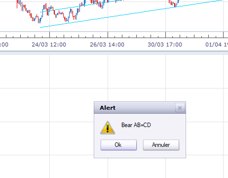

# MTF MCP Harmonic Pattern

> Source: https://fxcodebase.com/code/viewtopic.php?f=17&t=68312  
> Forum: 17 · Topic 68312 · 19 post(s)

---

## MTF MCP Harmonic Pattern

**Apprentice** · Tue Apr 09, 2019 5:13 am

NOTE: it needs Harmonic Pattern_with Alert v3 to be installed

 [Harmonic Pattern_with Alert v3.lua](files/125628/Harmonic%20Pattern_with%20Alert%20v3.lua)

 [MTF MCP Harmonic Pattern.lua](files/125628/MTF%20MCP%20Harmonic%20Pattern.lua)

---

## Re: MTF MCP Harmonic Pattern

**SANTOSH** · Tue Apr 09, 2019 5:47 am

Hello Apprentice , great work again !

But as I have already raised a query ,
Whenever the zig makes a new high low , the ratios chang e and the pattern repaints !!

So if traded the pattern it's a loss ! Kindly fix it buddy

---

## Re: MTF MCP Harmonic Pattern

**Method** · Fri Jun 28, 2019 5:25 am

Just wondering if this was ever fixed?

---

## Re: MTF MCP Harmonic Pattern

**Method** · Tue Jul 02, 2019 10:44 am

Also wondering how you get this to paint? For example, it says pattern detected on UJ 2 hours ago on 1M but on the 1M chart of UJ there is no pattern painted?

---

## Re: MTF MCP Harmonic Pattern

**SANTOSH** · Tue Jul 09, 2019 2:38 pm

> **Apprentice wrote:**
>
>
> EURUSD m1 (04-09-2019 1017).png
>
>
> NOTE: it needs Harmonic Pattern_with Alert v3 to be installed
>
>
> Harmonic Pattern_with Alert v3.lua
>
>
>
>
> MTF MCP Harmonic Pattern.lua

Hello ,
Can u do the following ,
1. BOX the cells .
2. A setting in the menu section to vertical and horizontal gap between the cells , as present code , the cells are very close and really looks messy . Just need a proper arrangement .

---

## Re: MTF MCP Harmonic Pattern

**Apprentice** · Wed Jul 10, 2019 3:21 pm

Your request is added to the development list under Id Number 4775

---

## Re: MTF MCP Harmonic Pattern

**Apprentice** · Fri Jul 12, 2019 6:11 am

[MTF MCP Harmonic Pattern.lua](files/127315/MTF%20MCP%20Harmonic%20Pattern.lua)

Try this version.

---

## Re: MTF MCP Harmonic Pattern

**SANTOSH** · Sun Jul 14, 2019 8:11 am

Working great ,
excellent work as always
Thanks Mario .

Regards ,
Santosh Sahu .

---

## Re: MTF MCP Harmonic Pattern

**caaaaaaalmement** · Mon Mar 30, 2020 2:19 pm

Hi Apprentice,
I like very much the Harmonic Pattern but I have problems to make the MTH MCP Harmonic Pattern work.
I don't know what I am doing wrong. When I load the indicator, the Dashboard appears and after 1 second, it disappears.
I tried to change the settings but nothing to do...
I hope you can help me out with this.

---

## Re: MTF MCP Harmonic Pattern

**Apprentice** · Tue Mar 31, 2020 5:03 am

Your request is added to the development list.
Development reference 969.

---

## Re: MTF MCP Harmonic Pattern

**Apprentice** · Tue Mar 31, 2020 6:43 am

[MTF MCP Harmonic Pattern.lua](files/132420/MTF%20MCP%20Harmonic%20Pattern.lua)

Try this version.

---

## Re: MTF MCP Harmonic Pattern

**caaaaaaalmement** · Tue Mar 31, 2020 7:44 am

Thank you Apprentice, you are the best !

---

## Re: MTF MCP Harmonic Pattern

**caaaaaaalmement** · Tue Mar 31, 2020 11:52 am

It would be perfect if the pair name could be shown with the pop up alert.

---

## Re: MTF MCP Harmonic Pattern

**Apprentice** · Wed Apr 01, 2020 6:00 am

Your request is added to the development list.
Development reference 979.

---

## Re: MTF MCP Harmonic Pattern

**Apprentice** · Wed Apr 01, 2020 6:31 am

It does show the pair name.

---

## Re: MTF MCP Harmonic Pattern

**caaaaaaalmement** · Wed Apr 01, 2020 3:52 pm

Hi Apprentice,
I don't know what to do. I uninstalled the trading station and I still don't get the name of the pairs.
I can see the dashboard but when the alerts arives, I get a popup without the name of the pair

 

.

---

## Re: MTF MCP Harmonic Pattern

**Apprentice** · Thu Apr 02, 2020 5:08 am

Your request is added to the development list.
Development reference 990.

---

## Re: MTF MCP Harmonic Pattern

**Apprentice** · Thu Apr 02, 2020 6:45 am

[MTF MCP Harmonic Pattern.lua](files/132511/MTF%20MCP%20Harmonic%20Pattern.lua)

Try this version.

---

## Re: MTF MCP Harmonic Pattern

**caaaaaaalmement** · Thu Apr 02, 2020 11:41 am

Thank you, now it works.
