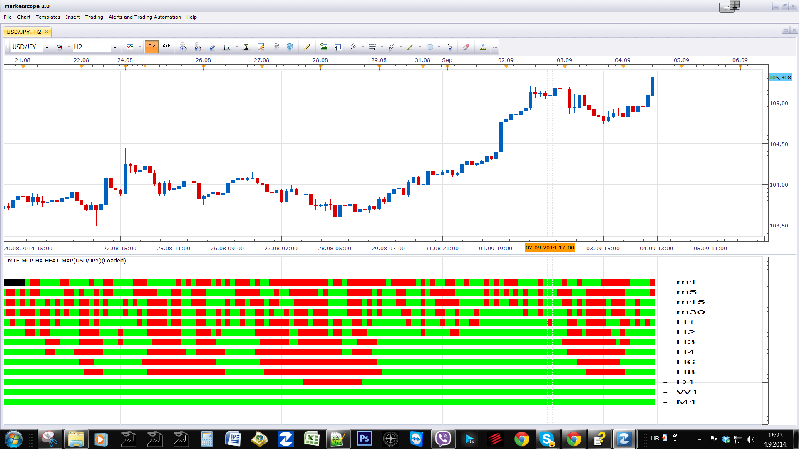

# MTF MCP Heikin-Ashi Heat Map

> Source: https://fxcodebase.com/code/viewtopic.php?f=17&t=7610  
> Forum: 17 · Topic 7610 · 30 post(s)

---

## MTF MCP Heikin-Ashi Heat Map

**vstrelnikov** · Tue Oct 25, 2011 5:23 pm

Will provide support for all currency pairs and all frames.
Up to 13 slots simultaneously.

 [HA_Heat_Map.lua](files/16879/HA_Heat_Map.lua)

---

## Re: Heikin-Ashi Heat Map

**lisa_baby_xx** · Tue Nov 29, 2011 9:09 am

Hi Guys,

Can you add the following parameter to this indicator?:

Parameter Required
-Enable/Disable: Time-frame1, Time-frame2, Time-frame3, Time-frame4 or Time-frame5.

Many thanks sweetie. X-X.
lisa_baby_xx

---

## Re: Heikin-Ashi Heat Map

**lisa_baby_xx** · Tue Nov 29, 2011 9:17 am

Hi Guys,

I would like to request a strategy based upon this indicator, with the following parameters and trading rules applied:

Parameters
-Allow Long/Short/Both positions?
-Allow multiple positions in the same direction?
-Allow strategy to trade?
-Price: Open, High, Low, Close.

Trading Rule
If [Time-frame1] + [Time-frame2] + [Time-frame3] + [Time-frame4] + [Time-frame5] = Green Then Buy
**OR**
If [Time-frame1] + [Time-frame2] + [Time-frame3] + [Time-frame4] + [Time-frame5] = Red Then Sell
**Else**
No trade.

-As one position opens, the previous position closes.

I hope this is clear sweetie.
Much love. X-X.
lisa_baby_xx

---

## Re: Heikin-Ashi Heat Map

**Apprentice** · Thu Dec 01, 2011 9:26 am

Your request is added to the developmental cue.

---

## Re: Heikin-Ashi Heat Map

**lisa_baby_xx** · Mon Oct 08, 2012 6:46 am

Hi,

There is a problem with this indicator.
Please see attached image.

Much love guys. xx.
lisa_baby_xx

---

## Re: Heikin-Ashi Heat Map

**Apprentice** · Mon Oct 08, 2012 9:03 am

I found a bug within Indicator, please re-download.
My version also have Time Frame selection option.

---

## Re: Heikin-Ashi Heat Map

**lisa_baby_xx** · Mon Oct 08, 2012 9:27 am

Thank you very much.
I can now trade live without no fears.

Much love Apprentice. X-X.
lisa_baby_xx

---

## Re: Heikin-Ashi Heat Map

**Apprentice** · Mon Oct 08, 2012 11:26 am

Strategy can be found here.
[viewtopic.php?f=31&t=24198](https://fxcodebase.com/code/viewtopic.php?f=31&t=24198)

---

## Re: Heikin-Ashi Heat Map

**Outside_The_Box** · Mon Oct 21, 2013 2:49 am

How can I get this to look like the picture? I don't like how it is all one solid line. I like to be able to see each separate reading for each candle, whether it's bars or dots, doesn't matter. Dots would be cool though, like the symphony matrix. The solid line bothers my old eyes. LOL

---

## Re: Heikin-Ashi Heat Map

**Apprentice** · Tue Oct 22, 2013 4:39 am

Currently this is not possible.
It seems that during the time this indicator has changed.
Only way is to offer / re-write this indicator?!

---

## Re: Heikin-Ashi Heat Map

**amazon1a** · Fri Aug 08, 2014 9:54 pm

Hi Apprentice,

I use this indi all the time with TS2. Is it possible to prepare a MT4 version just like it.

Thanks, AG

---

## Re: Heikin-Ashi Heat Map

**Apprentice** · Sat Aug 09, 2014 4:12 am

Your request is added to the development list.

---

## Re: Heikin-Ashi Heat Map

**7510109079** · Thu Sep 04, 2014 4:00 am

May I add a very brief request for a quick expansion of this indicator so we have the choice of 10 timeframes instead of five
many thx

---

## Re: Heikin-Ashi Heat Map

**Apprentice** · Thu Sep 04, 2014 11:23 am

Try MTF MCP HA Heat Map, see topmost (first) post of this topic.
Will provide support for all currency pairs and all frames.
Up to 13 slots simultaneously.

---

## Re: Heikin-Ashi Heat Map

**steveped** · Sun Oct 19, 2014 4:13 am

Hi guys,
is it possible to add a 'weekly' version where the heat map shows the daily value for the weekly ha calculation? I mean, weekly value of ha could change day by day. if on Friday Ha changes from green to red, all previous days will change colour accordingly (from Monday to Thursday). I think it would be helpful to have the daily value even if on a weekly calculation scenario, also to run a better backtest. Thanks!

---

## Re: Heikin-Ashi Heat Map

**7510109079** · Mon Oct 27, 2014 7:19 am

thx

---

## Re: MTF MCP Heikin-Ashi Heat Map

**Apprentice** · Tue Sep 19, 2017 5:40 am

The indicator was revised and updated.

---

## Re: MTF MCP Heikin-Ashi Heat Map

**Apprentice** · Sun Feb 04, 2018 8:31 am

The Indicator was revised and updated.

---

## Re: MTF MCP Heikin-Ashi Heat Map

**rickytrader** · Fri Jan 04, 2019 11:49 am

Hello,

I am new here but if possible I want help for someone.
Why this HA heat map change last colours bar?

i.e: I use for entry a 5 minutes time frame. The last bar of HA heat map is red, but happen often when the next bar close green, the last bar was red change fo green to. this is normal?

thank you.

---

## Re: MTF MCP Heikin-Ashi Heat Map

**Apprentice** · Sat Jan 05, 2019 5:39 am

Everything looks normal.
Will re-test as markets re-open.
Found unrelated HA candles bug in simulation mode.

---

## Re: MTF MCP Heikin-Ashi Heat Map

**SavvyStrategist** · Sat May 11, 2019 10:59 am

I very much like the smoothing heikin ashi provides as well as the clarity of heatmap displays. However, I have a concern with timeliness and redrawing, and a workaround.

My thinking is that, if I'm displaying a 2hr option on a 5m chart, the 2hr heatmap display is limited to changes at 12:00, 2:00, 4:00, 6:00, etc., lasting the entire duration of the candle, which can cause delays, flickers or recolouring to occur.

Hence my suggestion, and request, is a heatmap display of the Heikin-Ashi Smoothed indicator that simulates a higher time frame with an selectable average. Right now, MTF MCP HASM allows to select one average for all time frames and changes the period. I'm looking for the opposite: to change the average only.

To clarify: if 5m is the chart, the 1st mtf display would be "5m and period to smooth prices: 1", the next would be "5m and period to smooth prices: 3" (simulating 15m), to simulate 1hr "5m and period to smooth prices: 12", etc. Personally I leave "period to smooth candles" with a value of 1, always, as I find using both delays signals too much.

**So to sum up:** I'm requesting a Heikin Ashi Smoothed heatmap display that allows alterations to the smoothing value per individual time frame selected. 3-5 timeframes is more than plenty for me and I personally don't care for "period to smooth candles" (only "period to smooth prices"), though others might. Currently, MTF MCP HASM does the opposite: one smoothing value, many time frames selectable.

---

## Re: MTF MCP Heikin-Ashi Heat Map

**Apprentice** · Mon May 13, 2019 6:12 am

Your request is added to the development list under Id Number 4653

---

## Re: MTF MCP Heikin-Ashi Heat Map

**Apprentice** · Tue May 14, 2019 12:27 pm

Try this version.

 [MTF MCP HASM.lua](files/126336/MTF%20MCP%20HASM.lua)

---

## Re: MTF MCP Heikin-Ashi Heat Map

**PAULUC02** · Sat Sep 19, 2020 9:35 am

hello apprentice
could you create the same indicator as the one but for the Japanese candlestick.
thank you .

---

## Re: MTF MCP Heikin-Ashi Heat Map

**Apprentice** · Sun Sep 20, 2020 5:16 am

Your request is added to the development list.
Development reference 2066.

---

## Re: MTF MCP Heikin-Ashi Heat Map

**Apprentice** · Sun Sep 20, 2020 8:42 am

[HA_Heat_Map.lua](files/137754/HA_Heat_Map.lua)

Regular candle option added.

---

## Re: MTF MCP Heikin-Ashi Heat Map

**ahmedalhosenyy** · Sun Aug 17, 2025 6:04 am

Many thanks

---

## Re: MTF MCP Heikin-Ashi Heat Map

**fx1954** · Tue Dec 02, 2025 11:03 am

> **SavvyStrategist wrote:**
> I very much like the smoothing heikin ashi provides as well as the clarity of heatmap displays. However, I have a concern with timeliness and redrawing, and a workaround.
>
> My thinking is that, if I'm displaying a 2hr option on a 5m chart, the 2hr heatmap display is limited to changes at 12:00, 2:00, 4:00, 6:00, etc., lasting the entire duration of the candle, which can cause delays, flickers or recolouring to occur.
>
> Hence my suggestion, and request, is a heatmap display of the Heikin-Ashi Smoothed indicator that simulates a higher time frame with an selectable average. Right now, MTF MCP HASM allows to select one average for all time frames and changes the period. I'm looking for the opposite: to change the average only.
>
> To clarify: if 5m is the chart, the 1st mtf display would be "5m and period to smooth prices: 1", the next would be "5m and period to smooth prices: 3" (simulating 15m), to simulate 1hr "5m and period to smooth prices: 12", etc. Personally I leave "period to smooth candles" with a value of 1, always, as I find using both delays signals too much.
>
> **So to sum up:** I'm requesting a Heikin Ashi Smoothed heatmap display that allows alterations to the smoothing value per individual time frame selected. 3-5 timeframes is more than plenty for me and I personally don't care for "period to smooth candles" (only "period to smooth prices"), though others might. Currently, MTF MCP HASM does the opposite: one smoothing value, many time frames selectable.

Is it possiblee to add the timeframe H12 to this indicator?

---

## Re: MTF MCP Heikin-Ashi Heat Map

**Apprentice** · Sat Dec 06, 2025 2:21 am

We have added your request to the development list.
Development reference 773

---

## Re: MTF MCP Heikin-Ashi Heat Map

**fx1954** · Tue Dec 30, 2025 5:27 am

> **Apprentice wrote:**
> We have added your request to the development list.
> Development reference 773

Is it poossible to pay privately for changing the indicator that it includes H12 timeframe?
