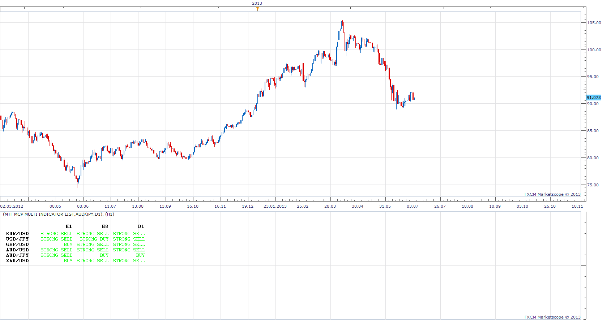

# MTF MCP Multi Indicator List

> Source: https://fxcodebase.com/code/viewtopic.php?f=17&t=44162  
> Forum: 17 · Topic 44162 · 9 post(s)

---

## MTF MCP Multi Indicator List

**Apprentice** · Thu Jul 04, 2013 6:01 am

indicator conditions:

1.stochastic with default parameters
ob level 80
os level 20
k>d and k<ob level=====score +1
k<d and k>os level ===score -1
k>d and k>ob level=====score 0
k<d and k<os level ===score 0

2.rsi period 14
buy level :50
sell level :50
rsi>buy level====score +1
rsi<sell level ===score-1

3.cci period14
buy level==0
sell level==0

cci>buy level ----score +1
cci<sell level----score -1

4.williams ossilator:(%larry willlams RLW)

buy level:-50
sell level:-50
ob level:-20
os level:-80

williams ossilator>buy level and <ob level ==== score+1
williams ossilator<sell level and >os level ==== score -1
williams ossilator>buy level and >ob level ==== score 0
williams ossilator<sell level and <os level ==== score 0

5.BULLS AND BEARS IMPULSE:

[viewtopic.php?f=17&t=20561&p=36016&hilit=BearsBullsImpuls#p36016](https://fxcodebase.com/code/viewtopic.php?f=17&t=20561&p=36016&hilit=BearsBullsImpuls#p36016)

IMPULSE>0----SCORE 1
IMPULSE<0---SCORE-1

6.MACD WITH DEFAULT PARAMETER

MACD>0-----SCORE+1
MACD<0----SCORE-1

7.ADX AND DMI WITH DEFAULT PARAMETER

ENTRY LEVEL:25

ADX> ENTRY LEVEL AND DMI POSITIVE>DMI NEGATIVE =====SCORE +1
ADX< ENTRY LEVEL AND DMI NEGATIVE> DMI POSITIVE=====SCORE -1

8.STOCHASTIC RSI WITH DEAULT PARAMETERS

OB LEVEL:80
OS LEVEL:20

K>D AND K<OB LEVEL ----SCORE+1
K<D AND K>OS LEVEL---- SCORE-1
K>D AND K>OB LEVEL ----SCORE 0
K<D AND K<OS LEVEL---- SCORE 0

MOVING AVERAGES:

1. MVA 5,10,20,50,100,200
PRICE > MVA ---- SCORE+1
PRICE<MVA-----SCORE-1

2.EMA 5,10.20.50,100,200
PRICE >EMA--- SCORE +1
PRICE <EMA ----SCORE -1

MAXIMUM SCORE WILL BE 20

STRONG BUY WHEN SCORE >+15
BUY WHEN SCORE> +12
STRONG SELL WHEN SCORE <-15
SELL WHEN SCORE<-12
NEUTRAL SCORE <12 AND SCORE>-12

 [MTF MCP Multi Indicator List.lua](files/70889/MTF%20MCP%20Multi%20Indicator%20List.lua)

Please Install

BULLS AND BEARS IMPULSE
[http://www.fxcodebase.com/code/viewtopi ... 1e1#p36016](http://www.fxcodebase.com/code/viewtopic.php?f=17&t=20561&p=36016&hilit=BULLS+AND+BEARS&sid=8a2a55b66e8cab85e29e2b99ebb851e1#p36016)
STOCHASTIC RSI
[http://www.fxcodebase.com/code/viewtopi ... HASTIC+RSI](http://www.fxcodebase.com/code/viewtopic.php?f=17&t=451&hilit=STOCHASTIC+RSI)

MT4/Mq4 version.
[viewtopic.php?f=38&t=65344&p=115915#p115915](https://fxcodebase.com/code/viewtopic.php?f=38&t=65344&p=115915#p115915)

---

## Re: MTF MCP Multi Indicator List

**supertrader123** · Thu Jul 04, 2013 6:43 am

this is very useful one for stock analysis but it is giveing worng idea .
now upper trend for usd/jpy but the analysis says strong down trend.. i think there is some error.
thank you for your wonderful idea and programming.

---

## Re: MTF MCP Multi Indicator List

**axeas69** · Mon Feb 23, 2015 4:45 am

Hello,

How can we reduce the list of pairs?
Thank's in advance.
Axeas

---

## Re: MTF MCP Multi Indicator List

**axeas69** · Mon Feb 23, 2015 6:08 am

Hi,
I'm getting only STRONG SELL (green color) for all 20 pairs.
Plse could you check?
Thank's in advance
Axeas

---

## Re: MTF MCP Multi Indicator List

**Apprentice** · Tue Feb 24, 2015 3:32 am

Please Re-Download.
Various Performance, presentation, algorithm improvements introduced.
Now u can can select Individual indicators.

---

## Re: MTF MCP Multi Indicator List

**Apprentice** · Mon Nov 13, 2017 6:18 am

The indicator was revised and updated.

---

## Re: MTF MCP Multi Indicator List

**speakinmymind** · Wed Dec 20, 2017 11:57 am

Can this be coded to allow for larger periods? I get this message saying it must be between 0, 300.

I get the same error with the MTF MCP Change indicator, it limits me to 300: [viewtopic.php?f=17&t=59338&hilit=mtf+mi&start=10](https://fxcodebase.com/code/viewtopic.php?f=17&t=59338&hilit=mtf+mi&start=10)

Thanks!

---

## Re: MTF MCP Multi Indicator List

**Apprentice** · Thu Dec 21, 2017 11:18 am

Unfortunately as it is limit is 300.

---

## Re: MTF MCP Multi Indicator List

**Apprentice** · Wed Jan 31, 2018 10:52 am

The Indicator was revised and updated.
