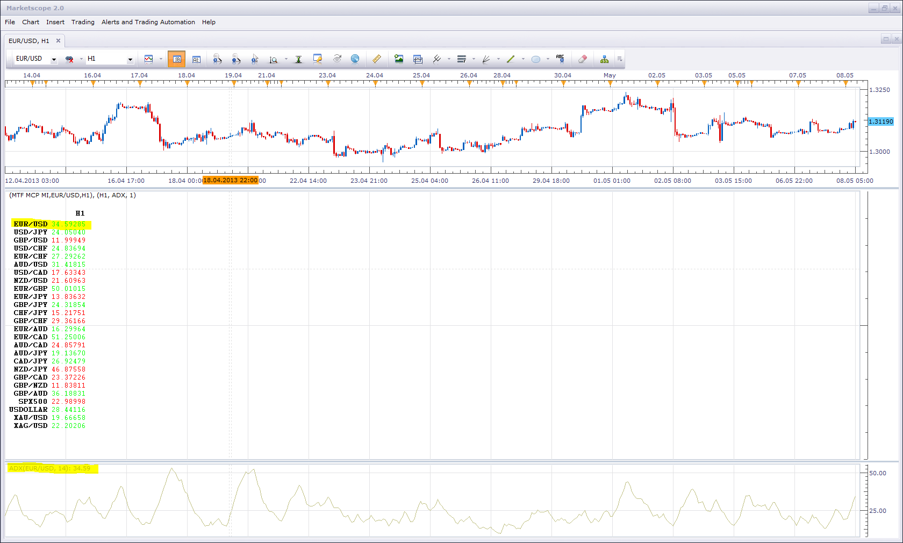

# MTF MCP Multi Indicator List

> Source: https://fxcodebase.com/code/viewtopic.php?f=17&t=25257  
> Forum: 17 · Topic 25257 · 46 post(s)

---

## MTF MCP Multi Indicator List

**Apprentice** · Thu Nov 01, 2012 9:58 am

This list will generate list with value or trend indicationfor any selected indicators,
and all currency pairs.
You can choose different indicator for different time frames.

 [MTF MCP MI.lua](files/43441/MTF%20MCP%20MI.lua)

 [MTF MCP MI with Sort.lua](files/43441/MTF%20MCP%20MI%20with%20Sort.lua)

 

 [MTF MCP MI List.lua](files/43441/MTF%20MCP%20MI%20List.lua)

---

## Re: MTF MCP Multi Indicator List

**Jeffreyvnlk** · Tue May 07, 2013 7:11 am

> **Apprentice wrote:**
>
>
> MTF MCP MI.png
>
>
>
> This list will generate list with value or trend indicationfor any selected indicators,
> and all currency pairs.
> You can choose different indicator for different time frames.
>
>
>
> MTF MCP MI.lua
>
>
>
> This indicator is written for the current beta version of TS.
> Beta Version can be found here.
> [viewtopic.php?f=30&t=20383](https://fxcodebase.com/code/viewtopic.php?f=30&t=20383)

I checked with a real ADX, it show a different value from this indicator when set up with its ADX

---

## Re: MTF MCP Multi Indicator List

**Apprentice** · Wed May 08, 2013 5:43 am

Can you give me an example.
I made a few short tests, and everything is ok.
True, there may be a difference, the original indicator may use a different number of digits.

---

## Re: MTF MCP Multi Indicator List

**Jeffreyvnlk** · Thu May 09, 2013 7:51 am

Oops, I was comparing ADX in a demo account with that in real one. For the same demo, it is fine .Sorry about that.

The problem is this indicator only for beta.I guess we can not get over it. Sometime i see XAU in a demo account moving big when real just a bit.

---

## Re: MTF MCP Multi Indicator List

**Fx4mt.com** · Thu May 09, 2013 4:44 pm

Would it be possible to get this indicator to calculate (Price - EMA Close) and output the value as pips? I love it as it is, but seeing the divergence from price and the ema over several time frames would greatly aid my trading plan. Thanks a bunch, all of your work is fantastic.

---

## Re: MTF MCP Multi Indicator List

**Apprentice** · Sat May 11, 2013 2:18 am

Your request is added to the development list.

---

## Re: MTF MCP Multi Indicator List

**Fx4mt.com** · Sun May 12, 2013 4:13 pm

Thanks Apprentice, I really appreciate it

---

## Re: MTF MCP Multi Indicator List

**Apprentice** · Mon May 13, 2013 6:22 am

Requested can be found here.
[viewtopic.php?f=17&t=37544](https://fxcodebase.com/code/viewtopic.php?f=17&t=37544)

---

## Re: MTF MCP Multi Indicator List

**speakinmymind** · Wed Jun 05, 2013 11:01 am

Instead of high/low making the color change, can you please make it two customizable numbers that represent a high and low.

That way if an indicator produces an output above a certain threshold the numbers light up, same if they go below the threshold. With the norm being obviously all black, grey or something.

Thanks alot this is a very useful indicator.

---

## Re: MTF MCP Multi Indicator List

**speakinmymind** · Thu Jun 06, 2013 5:31 pm

Can you please allow for left / right scrolling? Is this posible?

Also, for most indicators I have found they will not produce an output for a timeframe of D1 or above, can this be fixed?

---

## Re: MTF MCP Multi Indicator List

**Apprentice** · Fri Jun 07, 2013 6:37 am

What do you mean with, left / right scrolling?

---

## Re: MTF MCP Multi Indicator List

**speakinmymind** · Fri Jun 07, 2013 6:57 am

If you put all the timeframes posiblie on the chart, but choose not to have that chart fullscreen (i.e. you have other charts on the screen) you cannot access the right-most data (i.e. 1M, 1D, H8, etc.)

If you could scroll left/right to see these values instead of having to make the chart fullscreen, it would be great!

---

## Re: MTF MCP Multi Indicator List

**speakinmymind** · Fri Jun 07, 2013 7:55 am

Up/Down scrolling would be great for the same purpose as well

---

## Re: MTF MCP Multi Indicator List

**speakinmymind** · Tue Feb 11, 2014 10:21 pm

could you please add the option to add more decimal places?

Also, the ability to drop all leading zeros would help ( for example 0.2334 would be .2334)

Also, the ability to add a base ten multiplier. (for example instead of 0.000252 you could choose base multiplier 4. This would multiply the data by 1000 and thus the output would be 2.52

Thanks!

---

## Re: MTF MCP Multi Indicator List

**Apprentice** · Wed Feb 12, 2014 3:43 am

Your request is added to the development list.

---

## Re: MTF MCP Multi Indicator List

**speakinmymind** · Mon Apr 28, 2014 1:26 am

I can't seem to get this to work with the "Split Moving Average of Volume" indicator. I get the following error.

The indicator can be found here:
 [viewtopic.php?f=17&t=59276&hilit=split&start=10](https://fxcodebase.com/code/viewtopic.php?f=17&t=59276&hilit=split&start=10)

Thanks for the help!

---

## Re: MTF MCP Multi Indicator List

**Apprentice** · Mon Apr 28, 2014 2:10 am

Unfortunately, I was unable to reproduce.
Can specify for which currency pair, time frame do you get this message.

---

## Re: MTF MCP Multi Indicator List

**speakinmymind** · Mon Apr 28, 2014 5:44 pm

I found that the problem was the number of periods used on the split moving average of volume indicator, as long as it is 1 - 299 it will work with this indicator.

Can you adjust this restriction?

---

## Re: MTF MCP Multi Indicator List

**Apprentice** · Tue Apr 29, 2014 3:47 am

Not in this implementation.

---

## Re: MTF MCP Multi Indicator List

**eurusd86** · Thu Apr 21, 2016 1:32 am

> **Apprentice wrote:**
>
>
> The attachment **MTF MCP MI.png** is no longer available
>
>
>
> This list will generate list with value or trend indicationfor any selected indicators,
> and all currency pairs.
> You can choose different indicator for different time frames.
>
>
>
> The attachment **MTF MCP MI.png** is no longer available

can you modify it like the upper one？thanks very much！

---

## Re: MTF MCP Multi Indicator List

**Apprentice** · Thu Apr 21, 2016 3:20 am

MTF MCP MI List.lua Added.

---

## Re: MTF MCP Multi Indicator List

**kitefrog** · Sat Jun 11, 2016 3:54 pm

> **Apprentice wrote:**
>
>
> MTF MCP MI.png
>
>
>
> This list will generate list with value or trend indicationfor any selected indicators,
> and all currency pairs.
> You can choose different indicator for different time frames.
>
>
>
> MTF MCP MI.lua
>
>
>
>
>
> EURUSD H6 (04-21-2016 0945).png
>
>
>
>
> MTF MCP MI List.lua

Can the sorting function be added to this indicator and alert which pops right at the top ?

---

## Re: MTF MCP Multi Indicator List

**Apprentice** · Sun Jun 12, 2016 12:09 pm

By which date indicator will be sorted?
For which event alert will be given?

---

## Re: MTF MCP Multi Indicator List

**kitefrog** · Sun Jun 12, 2016 6:26 pm

> **Apprentice wrote:**
> By which date indicator will be sorted?
> For which event alert will be given?

example moving average stream .
now different pairs will have different values for a particular time frame .

now sort it out which has the highest moving average value . this would cater my functionality for sure and alert when the highest value is pushed to the top of list .

---

## Re: MTF MCP Multi Indicator List

**Apprentice** · Tue Jun 14, 2016 2:35 am

Different currencies moving averages are not comparable.
Index, Gold or Jen Pairs will be always on top.

---

## Re: MTF MCP Multi Indicator List

**kitefrog** · Wed Jun 15, 2016 1:13 pm

> **Apprentice wrote:**
> Different currencies moving averages are not comparable.
> Index, Gold or Jen Pairs will be always on top.

Can the instruments be alphabetically sorted ??

---

## Re: MTF MCP Multi Indicator List

**kitefrog** · Wed Jun 15, 2016 6:52 pm

> **Apprentice wrote:**
> By which date indicator will be sorted?
> For which event alert will be given?

see if RSI indicator is called
can the sort function once applied sorts different instrument according to their respective RSI values .

I mean the overbought instruments are right at the top of list , whereas the oversold instruments line up to the bottom of the list .

hope its clear ??

---

## Re: MTF MCP Multi Indicator List

**Apprentice** · Thu Jun 16, 2016 3:30 am

Your request is added to the development list,
Under Bugzilla Id Number 3548

---

## Re: MTF MCP Multi Indicator List

**kitefrog** · Thu Jun 23, 2016 5:34 pm

> **Apprentice wrote:**
> Your request is added to the development list,
> Under Bugzilla Id Number 3548

any progress with the sorting function ?

---

## Re: MTF MCP Multi Indicator List

**kitefrog** · Fri Jul 08, 2016 11:35 am

> **Apprentice wrote:**
> Your request is added to the development list,
> Under Bugzilla Id Number 3548

hello apprentice,
any development on this stuff recently i am looking for ?

thanks !

---

## Re: MTF MCP Multi Indicator List

**kitefrog** · Fri Jul 22, 2016 1:33 am

> **kitefrog wrote:**
>
>
> > **Apprentice wrote:**
> > Your request is added to the development list,
> > Under Bugzilla Id Number 3548
>
>
>
>
> any progress with the sorting function ?

sorting function added to it ??

---

## Re: MTF MCP Multi Indicator List

**SANTOSH** · Tue Jul 18, 2017 10:50 pm

> **kitefrog wrote:**
>
>
> > **Apprentice wrote:**
> > By which date indicator will be sorted?
> > For which event alert will be given?
>
>
>
>
> see if RSI indicator is called
> can the sort function once applied sorts different instrument according to their respective RSI values .
>
> I mean the overbought instruments are right at the top of list , whereas the oversold instruments line up to the bottom of the list .
>
> hope its clear ??

Anything on it !?
It's most awaited buddy !

---

## Re: MTF MCP Multi Indicator List

**Apprentice** · Sun Aug 06, 2017 4:44 am

Sorry about the delay I was on vacation.
Will we add sort for MTF MCP MI.lua or MTF MCP MI List.lua?

---

## Re: MTF MCP Multi Indicator List

**Apprentice** · Sat Jan 06, 2018 7:05 am

MTF MCP MI with Sort.lua added.

---

## Re: MTF MCP Multi Indicator List

**Apprentice** · Wed Jan 31, 2018 11:08 am

The Indicator was revised and updated.

---

## Re: MTF MCP Multi Indicator List

**speakinmymind** · Mon May 21, 2018 10:39 am

The color of the output changes based on if the change in value.

Instead, or as an additional option, can you make the color based on the current value? If it is a negative number it is red, if positive it is green.

This will make trends easier to spot if for example 1M 1W and 1D are all positive, but the 8h is negative it should be easily noticeable.

Actually, it would be better to color the background of the number instead of the numbers if possible. I've been doing this manually for a while by drawing a rectangle around the numbers and changing the fill. However, any adjustments to the screen size will resize the rectangles. Also, this automation will save me a lot of time and stop me from missing sign changes.

 

As you can tell from the screen shot, I start highlighting from the lowest available timeframe and stop when there is a mismatch. In the pic it is left to right. I skip the 1m timeframe only because it changes so often. This should be optional.

I also highlight from the highest timeframe and stop when there is a mismatch. That would right to left.

The result is a heatmap that shows which timeframe is "out of sync"

 

Thanks!

---

## Re: MTF MCP Multi Indicator List

**Apprentice** · Tue May 22, 2018 3:57 am

[MTF MCP MI.lua](files/119336/MTF%20MCP%20MI.lua)

Have it add label as color.
It will require complete indicator re-write for background options.
Will try to find the time next week.

---

## Re: MTF MCP Multi Indicator List

**speakinmymind** · Tue May 22, 2018 7:27 am

Thanks Apprentice. I can't seem to try it out though, because is only returning positive values.

---

## Re: MTF MCP Multi Indicator List

**speakinmymind** · Thu Jun 07, 2018 9:04 pm

Have you had a chance to look at this?

---

## Re: MTF MCP Multi Indicator List

**Apprentice** · Fri Jun 08, 2018 6:46 am

Selected indicator will determine the values.
CCI example.

---

## Re: MTF MCP Multi Indicator List

**SANTOSH** · Sun Mar 24, 2019 2:41 pm

Hi Apprentice a quick question :

Can the harmonic pattern indicator be imported here in this mtf mcp multi indicator list ?

It would be great if this mtf mcp multi indicator could support harmonic pattern indicator !!

Is it possible???

---

## Re: MTF MCP Multi Indicator List

**Apprentice** · Mon Mar 25, 2019 8:28 am

Your request is added to the development list under Id Number 4561

---

## Re: MTF MCP Multi Indicator List

**SANTOSH** · Tue Sep 24, 2019 8:52 pm

> **Apprentice wrote:**
>
>
> MTF MCP MI.png
>
>
>
> This list will generate list with value or trend indicationfor any selected indicators,
> and all currency pairs.
> You can choose different indicator for different time frames.
>
>
>
> MTF MCP MI.lua
>
>
>
>
> MTF MCP MI with Sort.lua
>
>
>
>
>
> EURUSD H6 (04-21-2016 0945).png
>
>
>
>
> MTF MCP MI List.lua

Can you add the DDE support to it ??

Regards,
Santosh .

---

## Re: MTF MCP Multi Indicator List

**Apprentice** · Wed Sep 25, 2019 3:25 pm

Your request is added to the development list.
Development reference 130.

---

## Re: MTF MCP Multi Indicator List

**Apprentice** · Thu Oct 03, 2019 4:33 am

Try this version.

 [MTF_MCP_MI.lua](files/128983/MTF_MCP_MI.lua)

---

## Re: MTF MCP Multi Indicator List

**Apprentice** · Thu Aug 10, 2023 11:32 am

[MTF_MCP_MI.lua](files/151993/MTF_MCP_MI.lua)

Updated version.
