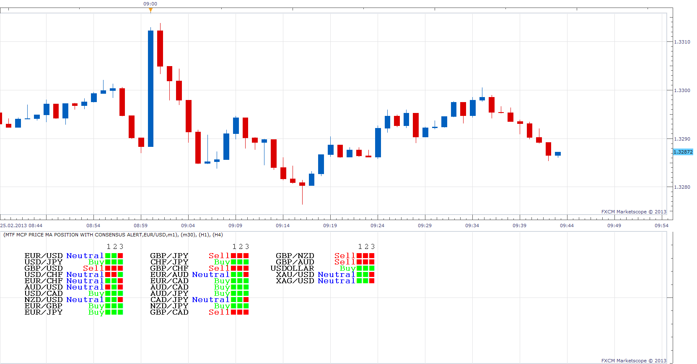
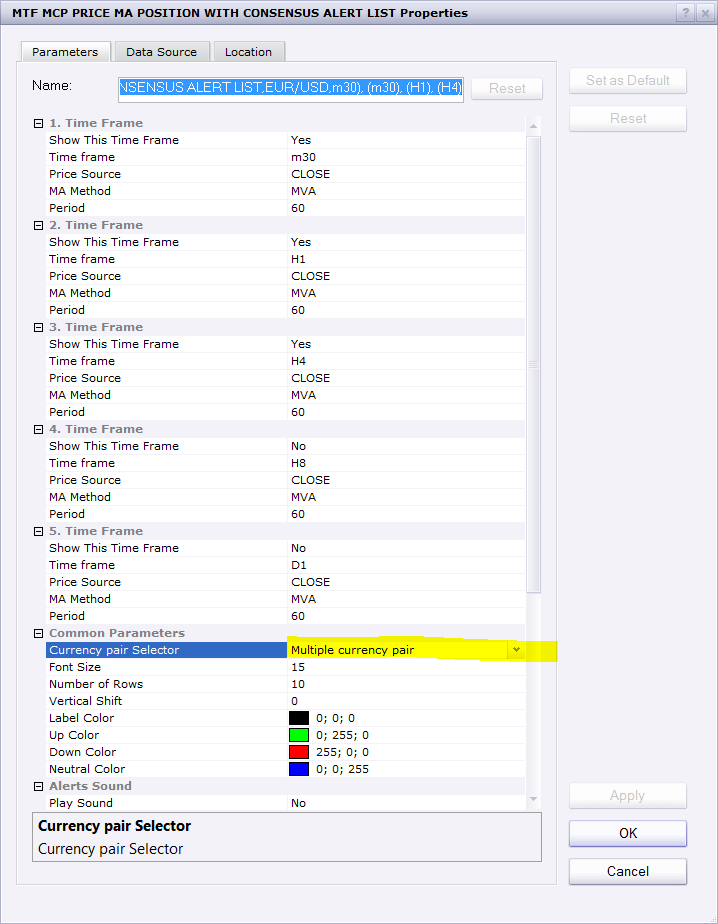

# MTF MCP Price / MA position with Consensus Alert

> Source: https://fxcodebase.com/code/viewtopic.php?f=17&t=32425  
> Forum: 17 · Topic 32425 · 9 post(s)

---

## MTF MCP Price / MA position with Consensus Alert

**Apprentice** · Mon Feb 25, 2013 10:13 am

This is my implementation of 3Duck System.
Indicator will show position of price in relation to the moving average.
For all selected time frames.

 [MTF MCP Price MA position with Consensus Alert.lua](files/55243/MTF%20MCP%20Price%20MA%20position%20with%20Consensus%20Alert.lua)

 

Same data, presented as a list.

 [MTF MCP Price MA position with Consensus Alert.lua](files/55243/MTF%20MCP%20Price%20MA%20position%20with%20Consensus%20Alert%20%282%29.lua)

The indicator can give Email and Sound Alert if we have Consensus.
Dec 28, 2015: Compatibility issue Fix. _Alert helper is not longer needed.

---

## Re: MTF MCP Price / MA position with Consensus Alert

**speakinmymind** · Mon Mar 25, 2013 8:30 am

This is yet another great indicator. can you make the vertical adjustment possible to be a negative number, so the data in focus can be aligned to the top of the indicator area, eliminating unused space?

Can you allow a selection list of currency pairs instead of all of them?

Can you order the pairs to display as you see fit?

---

## Re: MTF MCP Price / MA position with Consensus Alert

**speakinmymind** · Mon Mar 25, 2013 8:33 am

To add to my last post, the ability to align all data to the far left or to the far right would also be of benefit.

Thanks for all the work you guys do!

---

## Re: MTF MCP Price / MA position with Consensus Alert

**Apprentice** · Mon Mar 25, 2013 5:40 pm

Your request has been added to the development list.

---

## Re: MTF MCP Price / MA position with Consensus Alert

**Francis D** · Wed Apr 30, 2014 3:45 am

> **Apprentice wrote:**
> Bump Up.

Hello,

Can you change the indicator to add Hull Moving Average and have only one currency pair or selected it.

Thank you for your excellent work that helps us as.

---

## Re: MTF MCP Price / MA position with Consensus Alert

**Apprentice** · Thu May 01, 2014 5:03 am

Currency Pair Selector parameter has been added.
HMA, Added.
Presentation is compacted.
Performance is optimized.

Although major update is need.
In order for this indicator could use all new TS features.
This update will have to suffice for now.

---

## Re: MTF MCP Price / MA position with Consensus Alert

**Francis D** · Thu May 01, 2014 5:13 am

Thank you very much for your help, your availability, and the speed of your response.

---

## Re: MTF MCP Price / MA position with Consensus Alert

**Apprentice** · Fri Aug 22, 2014 4:02 am

Update.
U can now select up to 10 Currency pairs.

---

## Re: MTF MCP Price / MA position with Consensus Alert

**Apprentice** · Fri Apr 13, 2018 8:49 am

The indicator was revised and updated.
