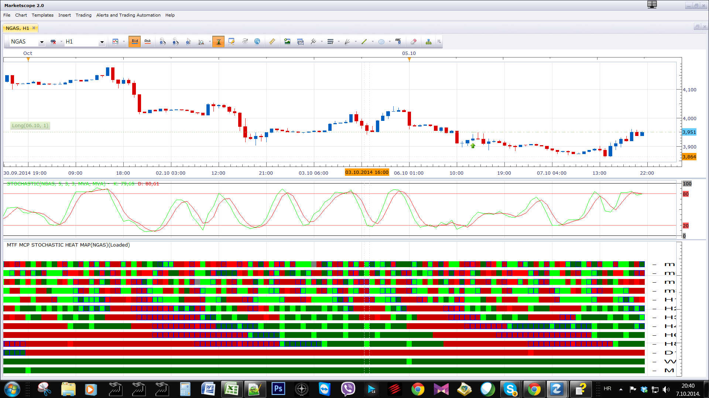

# MTF MCP Stochastic Heat Map

> Source: https://fxcodebase.com/code/viewtopic.php?f=17&t=61308  
> Forum: 17 · Topic 61308 · 3 post(s)

---

## MTF MCP Stochastic Heat Map

**Apprentice** · Tue Oct 07, 2014 1:36 pm

I have tried to color code as much information as possible.
The trend is defined by K / D line relationship.
Slope is defined by K Line slope
OversoldOverbought conditions are marked by blue outline.

 [MTF MCP Stochastic Heat Map.lua](files/96437/MTF%20MCP%20Stochastic%20Heat%20Map.lua)

---

## Re: MTF MCP Stochastic Heat Map

**Apprentice** · Wed Oct 15, 2014 6:14 am

Update.

---

## Re: MTF MCP Stochastic Heat Map

**Apprentice** · Sun Feb 04, 2018 8:34 am

The indicator was revised and updated.
