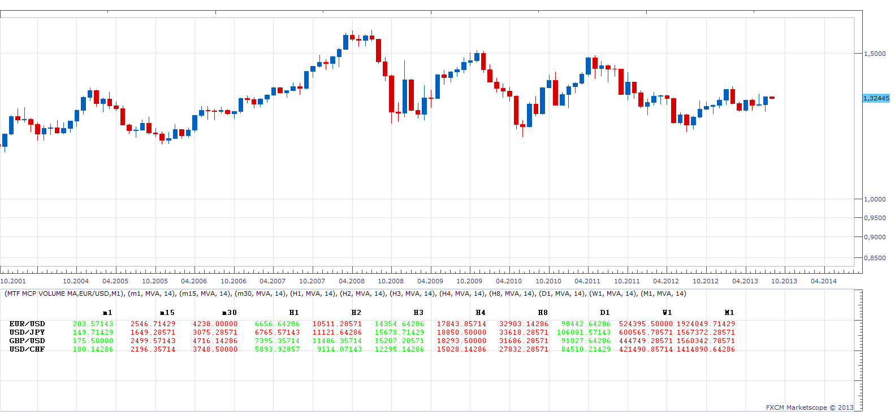

# MTF MCP Volume MA

> Source: https://fxcodebase.com/code/viewtopic.php?f=17&t=58665  
> Forum: 17 · Topic 58665 · 11 post(s)

---

## MTF MCP Volume MA

**Apprentice** · Mon Aug 05, 2013 9:26 am

will show Volume or moving average of Volume,
for all time frames and currency pairs.

 [MTF MCP Volume MA.lua](files/87952/MTF%20MCP%20Volume%20MA.lua)

 [MTF MCP Volume MA with Filter.lua](files/87952/MTF%20MCP%20Volume%20MA%20with%20Filter.lua)

The indicator was revised and updated

---

## Re: MTF MCP Volume MA

**speakinmymind** · Mon Aug 05, 2013 12:56 pm

This is great! Can you drop the decimal?

Also, Can you put the current volume in a column next the the MA for easy comparison?

Thanks a lot!

---

## Re: MTF MCP Volume MA

**speakinmymind** · Mon Aug 05, 2013 1:02 pm

Also, I'm not getting the 1d, 1w, or 1M

---

## Re: MTF MCP Volume MA

**Apprentice** · Tue Aug 06, 2013 4:30 am

Try to use biger Chart Time frame. H4 or biger.

---

## Re: MTF MCP Volume MA

**speakinmymind** · Sat Aug 10, 2013 8:13 am

can you please drop the decimal to make a little easier on the eye?

---

## Re: MTF MCP Volume MA

**Coondawg71** · Sun Aug 11, 2013 9:30 am

Perhaps we can request this indicator to be enhanced in the fashion of a radar screen. The following attachment may help in this effort.

Thanks,

Sjc

[https://community.tradestation.com/disc ... ential.doc](https://community.tradestation.com/discussions/data/20051127230324volume%20average%20exponential.doc)

---

## Re: MTF MCP Volume MA

**Apprentice** · Mon Aug 12, 2013 4:54 am

without decimals

 [MTF MCP Volume MA.lua](files/88328/MTF%20MCP%20Volume%20MA.lua)

---

## Re: MTF MCP Volume MA

**SANTOSH** · Fri May 05, 2017 8:10 pm

> **Apprentice wrote:**
>
>
> nova.png
>
>
> will show Volume or moving average of Volume,
> for all time frames and currency pairs.
>
>
> MTF MCP Volume MA.lua

Can u add the sorting function to it based on largest or lowest volume ?

---

## Re: MTF MCP Volume MA

**Apprentice** · Sat May 06, 2017 4:01 am

Will have time in two weeks time.

---

## Re: MTF MCP Volume MA

**SANTOSH** · Wed May 24, 2017 6:04 am

> **Apprentice wrote:**
> Will have time in two weeks time.

is the sorting function added?

---

## Re: MTF MCP Volume MA

**Apprentice** · Thu May 25, 2017 8:18 am

Try MTF MCP Volume MA with Filter.lua
