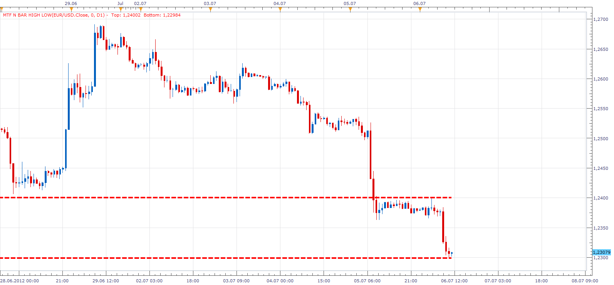

# MTF N BAR HIGH LOW

> Source: https://fxcodebase.com/code/viewtopic.php?f=17&t=20899  
> Forum: 17 · Topic 20899 · 4 post(s)

---

## MTF N BAR HIGH LOW

**Apprentice** · Fri Jul 06, 2012 10:05 am

Gives High, Low value, for selected, Time Frame.
And a selected number of periods.

 [MTF N BAR HIGH LOW.lua](files/36606/MTF%20N%20BAR%20HIGH%20LOW.lua)

---

## Re: MTF N BAR HIGH LOW

**cc.matt** · Mon Sep 24, 2012 5:03 am

Works on the beta version. Thank you!

---

## Re: MTF N BAR HIGH LOW

**Apprentice** · Mon Apr 24, 2017 5:33 am

Indicator was revised and updated.

---

## Re: MTF N BAR HIGH LOW

**Apprentice** · Tue Mar 13, 2018 11:28 am

The indicator was revised and updated.
