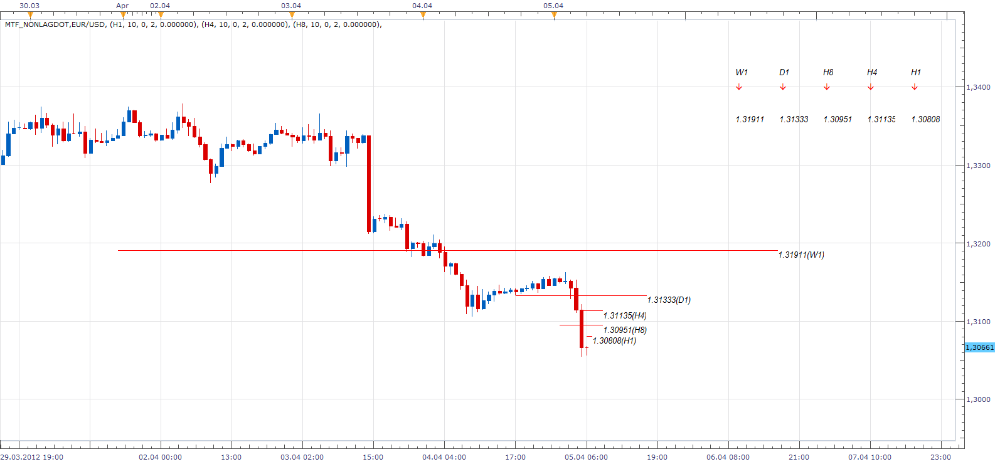

# MTF NonLagDot

> Source: https://fxcodebase.com/code/viewtopic.php?f=17&t=15574  
> Forum: 17 · Topic 15574 · 4 post(s)

---

## MTF NonLagDot

**Apprentice** · Thu Apr 05, 2012 5:08 am

 [MTF_NonLagDot.lua](files/29351/MTF_NonLagDot.lua)

For this to work, you need to install NLD.lua
[viewtopic.php?f=17&t=1721](https://fxcodebase.com/code/viewtopic.php?f=17&t=1721)

---

## Re: MTF NonLagDot

**virgilio** · Tue Apr 16, 2013 10:31 am

Whenever time allows it, could you make this a strategy? It should work as follows:
BUY:
If three or more of the five time frames turn positive
SELL:
If three or more of the fivew time frames turn negative

Thanks,
V.

---

## Re: MTF NonLagDot

**Apprentice** · Wed Apr 17, 2013 2:49 am

Your request is added to the development list.

---

## Re: MTF NonLagDot

**Apprentice** · Mon Feb 19, 2018 8:23 am

The Indicator was revised and updated.
