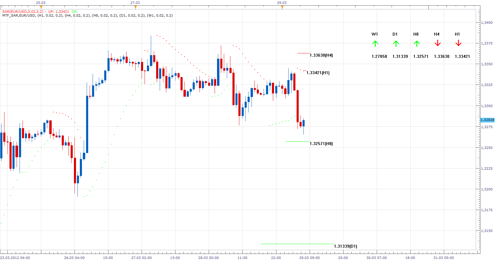
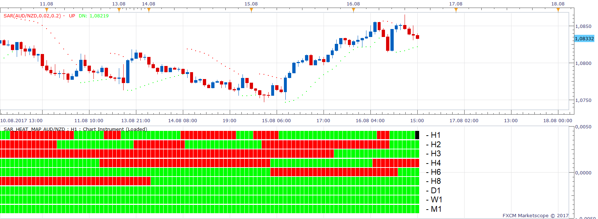

# MTF SAR & SAR Heat_Map

> Source: https://fxcodebase.com/code/viewtopic.php?f=17&t=15356  
> Forum: 17 · Topic 15356 · 30 post(s)

---

## MTF SAR & SAR Heat_Map

**Apprentice** · Thu Mar 29, 2012 6:28 am

In addition to conventional MTF overlay.
I added on Chart MTF SAR Levels .
It givu you, better understanding of relation between Price Action on different time frames.

 [MTF_SAR.lua](files/28952/MTF_SAR.lua)

---

## Re: MTF SAR

**jackfx09** · Thu Mar 29, 2012 9:44 am

Love the way you think! Here is my impromptu layout I thought of the other day. Is it possible to create a heatmap for SAR?

Is it also possible in this heatmap to allow the user to specify the "Step" and "Max" settings. As you will see it the image, I have changed my settings in order to smooth the SAR.

Thanks,

sjc

---

## Re: MTF SAR

**Apprentice** · Fri Mar 30, 2012 2:30 am

 [SAR_Heat_Map.lua](files/28996/SAR_Heat_Map.lua)

---

## Re: MTF SAR & SAR Heat_Map

**luciana** · Fri Oct 19, 2012 6:56 am

Hi, could you please code alerts for this indicator with time/date when switch and option yes/no to alert on each TF.
Thank you.

---

## Re: MTF SAR & SAR Heat_Map

**Apprentice** · Sun Oct 21, 2012 6:17 am

 [MTF MCP SAR with Alert.lua](files/42488/MTF%20MCP%20SAR%20with%20Alert.lua)

To use this indicator there are two conditions.

The indicator provides audio and Email Alerts.
 Alert is given, if a particular timeframe / currency pair change their indication.

Compatibility issue Fix. _Alert helper is not longer needed.

If you want to use the updated version,
please make sure to use latest version of TS.

---

## Re: MTF SAR & SAR Heat_Map

**luciana** · Mon Oct 22, 2012 7:48 am

many thanks.

---

## Re: MTF SAR & SAR Heat_Map

**luciana** · Mon Oct 22, 2012 8:49 am

Hi, I"m wondering why there is a discrepancy between the two indicators (H4) I attach the chart for clarification. Thank you.

---

## Re: MTF SAR & SAR Heat_Map

**Apprentice** · Mon Oct 22, 2012 5:37 pm

I have update both indicators, there was a problem with insufficient data on very long time frames.

---

## Re: MTF SAR & SAR Heat_Map

**nicolovitch** · Mon Dec 03, 2012 9:39 am

hello,

I would like to know if you can add an indication on the indicator "SAR_Heat_Map.lua".
I want to have the SAR value at a given time, because with the indicator, we have only the final values.

Sorry for my english......

Best regards.

---

## Re: MTF SAR & SAR Heat_Map

**Apprentice** · Mon Dec 03, 2012 10:31 am

Can you elaborate, I do not understand.
Current value, or value for each of the historical periods.

---

## Re: MTF SAR & SAR Heat_Map

**nicolovitch** · Mon Dec 03, 2012 10:45 am

value for each of the historical periods for each SAR (h1....)

---

## Re: MTF SAR & SAR Heat_Map

**nicolovitch** · Mon Dec 03, 2012 12:42 pm

The value for each of the historical periods for each SAR (H1, H2...) as the standard indicator SAR in the "Informations" window

---

## Re: MTF SAR & SAR Heat_Map

**Apprentice** · Mon Dec 03, 2012 12:46 pm

Value of all periods, for every time frame, from the first till last,
or only last period for all time frames.

---

## Re: MTF SAR & SAR Heat_Map

**nicolovitch** · Mon Dec 03, 2012 2:30 pm

Value of all periods, for every time frame, from the first till last...

As the standard indicator SAR in the "Informations" window... when I click on a specific period, I have old values ​​in the information window....

---

## Re: MTF SAR & SAR Heat_Map

**nicolovitch** · Tue Dec 04, 2012 5:08 am

you understand my question ?

---

## Re: MTF SAR & SAR Heat_Map

**Apprentice** · Tue Dec 04, 2012 6:27 pm

Everything is clear now.
Forgive me for waiting theanswer.
But I was A.F.C. for all day.

---

## Re: MTF SAR

**zoltanh** · Mon Sep 15, 2014 5:08 am

> **Apprentice wrote:**
>
>
> SAR_Heat_Map.png
>
>
>
>
> SAR_Heat_Map.lua

hi, is there a strategy for this indicator?
thanks

---

## Re: MTF SAR & SAR Heat_Map

**Apprentice** · Wed Sep 17, 2014 11:37 am

Can you specify the conditions for such strategy.

---

## Re: MTF SAR & SAR Heat_Map

**zoltanh** · Thu Sep 18, 2014 12:27 pm

The strategy should use 5 timeframe SAR:

Buy condition: all timeframe gives DN signal
Sell condition: all TF gives UP signal
Optional exit: if the selected or any TF changes the signal
Start time and stop time of the strategy should be given.
Allow multiple yes or no.

Basically the logic would be the same as the MTF HA strategy you did, just I would replace the HA with SAR. Such a strategy would be a great help!

---

## Re: MTF SAR & SAR Heat_Map

**Apprentice** · Fri Sep 19, 2014 3:32 am

Your request is added to the development list.

---

## Re: MTF SAR & SAR Heat_Map

**gabriel_trade** · Sat Sep 20, 2014 1:19 pm

Friends,

can I ask you to kindly add the option to size the indicator labels?

.. and, only if possible and if you have time, add the options to select (Y/N) the time-frames involved in the indicator (sometimes we only need a few, and not the five of them).

Thank you so much .. this is an outstanding indicator that I know is helping a lot of people!

---

## Re: MTF SAR & SAR Heat_Map

**Apprentice** · Sun Sep 21, 2014 4:30 am

MTF_SAR.lua presentation, SAR_Heat_Map.lua, performance update.
All time frames now can be added simultaneously.

---

## Re: MTF SAR & SAR Heat_Map

**Apprentice** · Sun Dec 13, 2015 4:15 pm

Compatibility issue Fix. _Alert helper is not longer needed.

---

## Re: MTF SAR & SAR Heat_Map

**smookem** · Mon Aug 14, 2017 9:59 pm

Can the MTF SAR Indicator be converted to MT4? Would love to have it for Timeframes from 1Min to 1Month.

---

## Re: MTF SAR & SAR Heat_Map

**Apprentice** · Wed Aug 16, 2017 4:01 pm

Your request is added to the development list, Under Id Number 3856
 If someone is interested to do this task, please contact me.

---

## Re: MTF SAR & SAR Heat_Map

**Apprentice** · Wed Aug 16, 2017 4:32 pm

The indicator was revised and updated.

---

## Re: MTF SAR & SAR Heat_Map

**smookem** · Fri Sep 29, 2017 12:13 am

Any way this could be converted to work on MT4?

---

## Re: MTF SAR & SAR Heat_Map

**Apprentice** · Fri Sep 29, 2017 4:46 am

We did not forget you.
Unfortunately, we did not have time for this task.

---

## Re: MTF SAR & SAR Heat_Map

**Alexander.Gettinger** · Mon Oct 02, 2017 1:14 pm

> **smookem wrote:**
> Can the MTF SAR Indicator be converted to MT4? Would love to have it for Timeframes from 1Min to 1Month.

MT4 version of indicator: [viewtopic.php?f=38&t=65138](https://fxcodebase.com/code/viewtopic.php?f=38&t=65138)

---

## Re: MTF SAR & SAR Heat_Map

**Apprentice** · Fri Aug 03, 2018 4:36 am

The indicator was revised and updated.
