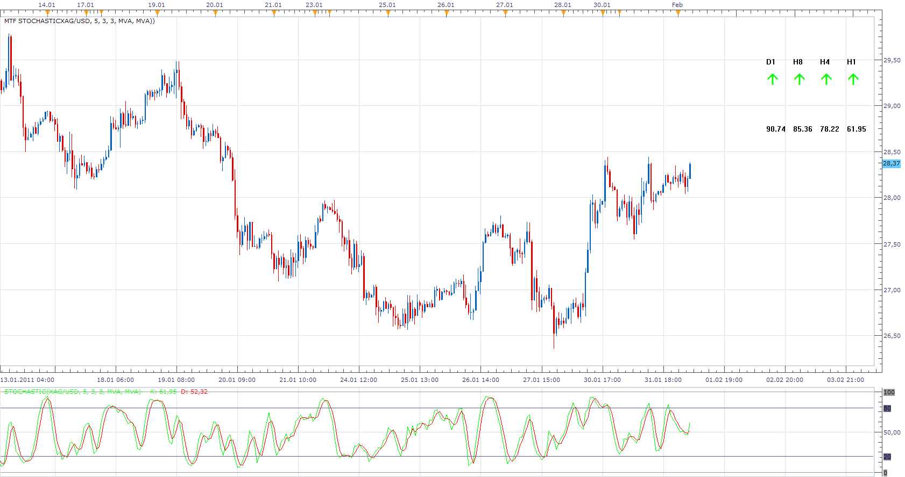
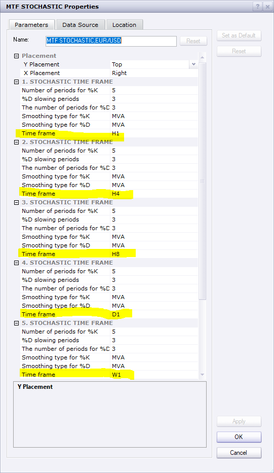

# MTF STOCHASTIC

> Source: https://fxcodebase.com/code/viewtopic.php?f=17&t=3301  
> Forum: 17 · Topic 3301 · 20 post(s)

---

## MTF STOCHASTIC

**Apprentice** · Tue Feb 01, 2011 5:22 am



This indicator gives the MTF Price Overlay.

 [MTF STOCHASTIC.lua](files/7843/MTF%20STOCHASTIC.lua)

---

## Re: MTF STOCHASTIC

**DS0167** · Mon Mar 28, 2011 8:33 am

Hello Master of this indicator

When you have a moment could you please update this indicator like the MTF RSI and MTF TSI (the arrows + the possibity to move this indicator withing the chart) ?

Many thank you in advance.

All the best,
Danielle

---

## Re: MTF STOCHASTIC

**serchfx** · Mon Apr 04, 2011 7:27 pm

Hello Apprentice.

I really like this indicator, and I want a strategy that show when 5 arrows run in the same direction.
I looking in the internet and I cant find any like this.

Can you help me with this strategy???

Thanks

---

## Re: MTF STOCHASTIC

**Apprentice** · Tue Apr 05, 2011 4:19 am

This can be found here.
[viewtopic.php?f=31&t=3833](https://fxcodebase.com/code/viewtopic.php?f=31&t=3833)

---

## Re: MTF STOCHASTIC

**dspurr624** · Thu Aug 04, 2011 8:00 am

Great Indicator - Thanks !!

---

## Re: MTF STOCHASTIC

**ClivePackham** · Mon Jan 30, 2012 11:29 am

Hi
Love this indicator but as I use a black background colour for my charts I can't see the writing in black. I have changed my colour to dark grey now but would it be possible to change the colour of the text?

Maybe you could put the option under common parameters section?

Many thanks for a great indicator.

---

## Re: MTF STOCHASTIC

**Apprentice** · Tue Jan 31, 2012 3:54 am

Style Options Added.

---

## Re: MTF STOCHASTIC

**ClivePackham** · Mon Feb 06, 2012 4:04 pm

Thats great many thanks

---

## Re: MTF STOCHASTIC

**sedraude** · Sat Apr 26, 2014 9:26 pm

Dear Apprentice,

Can you make it for %RLW with conditions:
1. Cross Up OS = BUY Weak
2. Cross Up 50% = BUY
3. Cross Up OB = BUY Strong
and vice versa

Thanks in advanced

> **Apprentice wrote:**
>
>
> MTF.png
>
>
> This indicator gives the MTF Price Overlay.
>
>
> MTF STOCHASTIC.lua

---

## Re: MTF STOCHASTIC

**Apprentice** · Mon Apr 28, 2014 5:02 am

Requested can be found here.
[viewtopic.php?f=17&t=60584](https://fxcodebase.com/code/viewtopic.php?f=17&t=60584)

---

## Re: MTF STOCHASTIC

**lancelune** · Thu Oct 01, 2015 8:03 am

Hello,
at line 139 of the code. i found this condition.
Something wrong ?
Thanks for your sharing work. best regards.

```
if not Indicator[i].DATA:hasData(Indicator[i].DATA:size()-1)  or not Indicator[i].DATA:hasData(Indicator[i].DATA:size()-1)then   
                        return;
```

---

## Re: MTF STOCHASTIC

**midas9090** · Wed Oct 07, 2015 11:39 am

The MTF Stochastic very useful, only 1 thing is can the location of the indicator be adjusted to the top left hand side of sreen , or make an options for us to adjust its location on the screen?

---

## Re: MTF STOCHASTIC

**Apprentice** · Fri Oct 09, 2015 4:12 am

Try it now.

---

## Re: MTF STOCHASTIC

**Apprentice** · Wed May 02, 2018 6:22 am

The indicator was revised and updated.

---

## Re: MTF STOCHASTIC

**MadMan** · Wed Jun 10, 2020 8:44 am

Hi ... Can we have the option of selecting the time frames to be used?

Thanks

---

## Re: MTF STOCHASTIC

**Apprentice** · Thu Jun 11, 2020 5:22 am



Do you need on / off option?

---

## Re: MTF STOCHASTIC

**MadMan** · Thu Jun 11, 2020 11:46 am

Yes exactly

---

## Re: MTF STOCHASTIC

**Apprentice** · Fri Jun 12, 2020 3:00 am

Your request is added to the development list.
Development reference 1467.

---

## Re: MTF STOCHASTIC

**Apprentice** · Fri Jun 12, 2020 4:19 am

Added.

---

## Re: MTF STOCHASTIC

**MadMan** · Fri Jun 12, 2020 7:00 am

Thanks a lot

Regards
