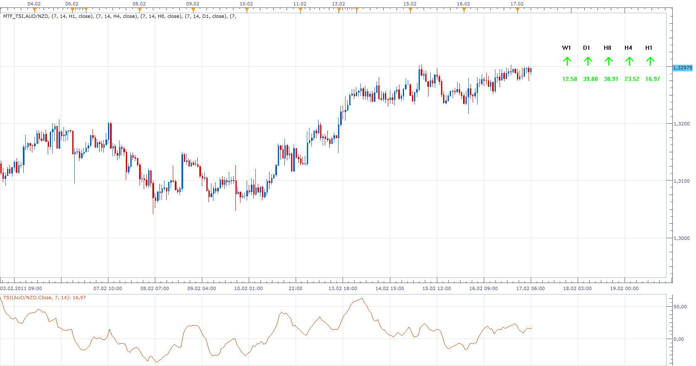

# MTF TSI

> Source: https://fxcodebase.com/code/viewtopic.php?f=17&t=3430  
> Forum: 17 · Topic 3430 · 5 post(s)

---

## MTF TSI

**Apprentice** · Thu Feb 17, 2011 6:55 am

This indicator enables the simultaneous monitoring of TSI on five time frames.

 [MTF_TSI.lua](files/8191/MTF_TSI.lua)

MT4/MQ4 version.
[viewtopic.php?f=38&t=65679&p=117315#p117315](https://fxcodebase.com/code/viewtopic.php?f=38&t=65679&p=117315#p117315)

The indicator was revised and updated

---

## Re: MTF TSI

**Apprentice** · Thu Feb 17, 2011 9:07 am

Update.

Added option for vertical positioning.
Added choice of type of presentation Arrows or Numbers

---

## Re: MTF TSI

**rtsayers** · Thu Feb 17, 2011 3:25 pm

Sorry

I tried to install but keep getting a error code eof 93! I have changed the name multiple times still giving me error code!

Thanks!

---

## Re: MTF TSI

**Apprentice** · Thu Feb 17, 2011 3:36 pm

It should work now.

---

## Re: MTF TSI

**Apprentice** · Mon Feb 13, 2017 1:44 pm

Indicator was revised and updated.
