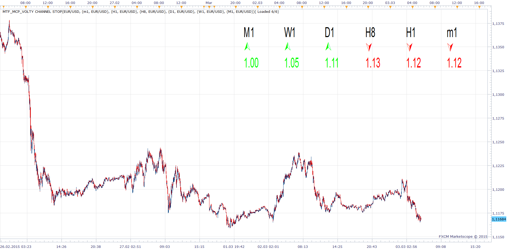
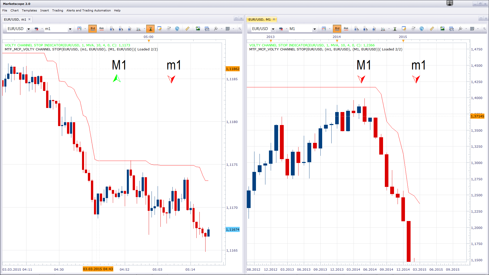

# MTF Volty Channel Stop

> Source: https://fxcodebase.com/code/viewtopic.php?f=17&t=12521  
> Forum: 17 · Topic 12521 · 14 post(s)

---

## MTF Volty Channel Stop

**Apprentice** · Tue Jan 31, 2012 4:53 am

 [MTF_MCP_Volty Channel Stop.lua](files/24707/MTF_MCP_Volty%20Channel%20Stop.lua)

Please install Volty Channel Stop Indicator.lua in order to use this indicator.
[viewtopic.php?f=17&t=893](https://fxcodebase.com/code/viewtopic.php?f=17&t=893)

---

## Re: MTF Volty Channel Stop

**rose123** · Tue Jan 31, 2012 12:48 pm

sir,

i request mtf mcp volutality stop indicator . in which we can monitor all timeframes of all instruments in a single chart

---

## Re: MTF Volty Channel Stop

**Apprentice** · Wed Feb 01, 2012 2:57 am

Your request is added to the developmental cue.

---

## Re: MTF Volty Channel Stop

**Apprentice** · Wed Feb 01, 2012 7:54 am

MTF MCP Version Added.

---

## Re: MTF Volty Channel Stop

**easytrading** · Mon Mar 02, 2015 11:27 pm

Hello Apprentice,

when i am on H1- EUR/USD chart MTF gives me wrong signal for D1 timeframe, but when i am on D1 chart it gives me true signal for H1 .could you please check that when you have time ? i am using your original settings .
Best regards.

---

## Re: MTF Volty Channel Stop

**Apprentice** · Tue Mar 03, 2015 5:30 am

Thank you for reporting this problem.
Will investigate this issue.
In the meantime, please test updated version.

---

## Re: MTF Volty Channel Stop

**Apprentice** · Tue Mar 03, 2015 6:00 am

Fixed.

---

## Re: MTF Volty Channel Stop

**easytrading** · Tue Mar 03, 2015 5:51 pm

he is showing error message to install volty channal stop indicator which i did already, as in picture below please.

---

## Re: MTF Volty Channel Stop

**Apprentice** · Wed Mar 04, 2015 1:59 am

Volty Channel Stop Indicator.lua is needed, old version VoltyChannel_Stop.lua will not be sufficient.

---

## Re: MTF Volty Channel Stop

**easytrading** · Wed Mar 04, 2015 4:35 pm

sorry Apprentice, after i insall Volty Channel Stop Indicator.lua ,the wrong signal between H1 and D1 tomeframes only is still there when i am on H1 chart, the other timeframes are all true.you can check that by putting both indicatores on the chart then swich between H1 and D1 timeframes and observe the MTF results.
Best regards.

---

## Re: MTF Volty Channel Stop

**easytrading** · Wed Jun 17, 2015 10:36 pm

kindly Apprentice,
it would be a great help if we have a strategy for this indicator based on arrow direction as below:
buy on up arrow
sell on down arrow
close on opposite
for all selected time frames .with much much appreciation as always in advance.

---

## Re: MTF Volty Channel Stop

**Apprentice** · Fri Jun 19, 2015 5:07 am

So you are asking a multi time frame strategy.
Not a single time frame strategy, which can be applied to multiple time frames.

---

## Re: MTF Volty Channel Stop

**easytrading** · Fri Jun 19, 2015 5:24 am

yes a multi time frame strategy,please

---

## Re: MTF Volty Channel Stop

**Apprentice** · Thu May 03, 2018 3:54 pm

The indicator was revised and updated.
