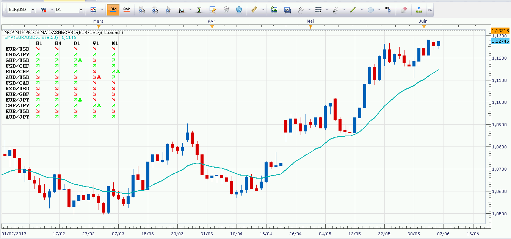
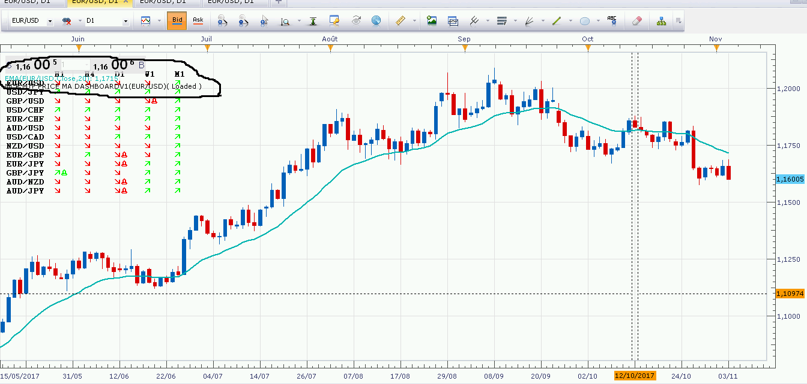

# Multi currency pair, Multi Time Frame, Price MA Dashboard

> Source: https://fxcodebase.com/code/viewtopic.php?f=17&t=63592  
> Forum: 17 · Topic 63592 · 14 post(s)

---

## Multi currency pair, Multi Time Frame, Price MA Dashboard

**Apprentice** · Fri Jun 10, 2016 4:00 am

Up
Price > MA
Down
Price < MA

 [MCP MTF Price MA Dashboard.lua](files/106723/MCP%20MTF%20Price%20MA%20Dashboard.lua)

The indicator was revised and updated

---

## Re: Multi currency pair, Multi Time Frame, Price MA Dashboar

**Avignon** · Tue Jun 06, 2017 2:44 pm

Hello,

This is a bug only at me or I am the only one to (dare) report it?

 

It's reversed !

---

## Re: Multi currency pair, Multi Time Frame, Price MA Dashboar

**Apprentice** · Thu Jun 08, 2017 3:52 pm

I appreciate your feedback.

---

## Re: Multi currency pair, Multi Time Frame, Price MA Dashboar

**douvanik** · Wed Aug 16, 2017 8:00 am

Can you make to show the distance in pips to this indicator. Maybe this indicator can help [viewtopic.php?f=17&t=60178&p=91841&hilit=MCP+MTF+MMA+TABLE#p91841](https://fxcodebase.com/code/viewtopic.php?f=17&t=60178&p=91841&hilit=MCP+MTF+MMA+TABLE#p91841). Thanks.

---

## Re: Multi currency pair, Multi Time Frame, Price MA Dashboar

**Apprentice** · Thu Aug 17, 2017 3:16 am

Your request is added to the development list, Under Id Number 3680
 If someone is interested to do this task, please contact me.

---

## Re: Multi currency pair, Multi Time Frame, Price MA Dashboar

**Alexander.Gettinger** · Fri Sep 29, 2017 10:19 am

> **douvanik wrote:**
> Can you make to show the distance in pips to this indicator. Maybe this indicator can help [viewtopic.php?f=17&t=60178&p=91841&hilit=MCP+MTF+MMA+TABLE#p91841](https://fxcodebase.com/code/viewtopic.php?f=17&t=60178&p=91841&hilit=MCP+MTF+MMA+TABLE#p91841). Thanks.

Indicator updated.

---

## Re: Multi currency pair, Multi Time Frame, Price MA Dashboar

**Avignon** · Fri Nov 03, 2017 3:26 pm

Hello,

Little graphic bug.

 

---

## Re: Multi currency pair, Multi Time Frame, Price MA Dashboar

**Apprentice** · Fri Nov 03, 2017 4:46 pm

Vertical Shift added.

---

## Re: Multi currency pair, Multi Time Frame, Price MA Dashboar

**Avignon** · Sun Nov 05, 2017 10:47 am

Thank you !

---

## Re: Multi currency pair, Multi Time Frame, Price MA Dashboar

**stainer** · Tue Dec 12, 2017 11:08 pm

Is it possible to have this but with a EMA cross direction?

---

## Re: Multi currency pair, Multi Time Frame, Price MA Dashboar

**Avignon** · Wed Dec 13, 2017 7:10 pm

Hello,

It is by default.

 

---

## Re: Multi currency pair, Multi Time Frame, Price MA Dashboar

**stainer** · Thu Dec 14, 2017 11:15 pm

Hey
That only shows if price is above or below the ema, not direction of the cross

---

## Re: Multi currency pair, Multi Time Frame, Price MA Dashboar

**Apprentice** · Fri Dec 15, 2017 7:13 am

If Price is above the moving average.
The last cross was UP
and vice versa.

The bell will indicate the active cross.

---

## Re: Multi currency pair, Multi Time Frame, Price MA Dashboar

**Apprentice** · Wed Jan 31, 2018 10:42 am

The strategy was revised and updated.
