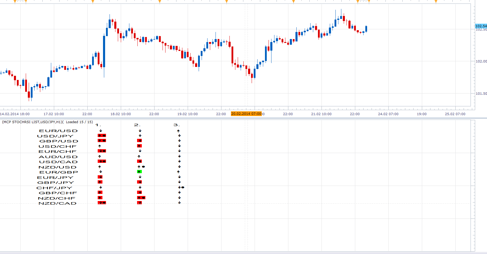

# Multi currency Pair StochRSI List

> Source: https://fxcodebase.com/code/viewtopic.php?f=17&t=60341  
> Forum: 17 · Topic 60341 · 16 post(s)

---

## Multi currency Pair StochRSI List

**Apprentice** · Sun Feb 23, 2014 5:18 pm

Red - position within the OS Zone
Green - positions within the OB Zone
Dot - Active K / D Line Cross
Up Arrow - K> D
Down Arrow - K <D

 [MCP StochRSI List.lua](files/92836/MCP%20StochRSI%20List.lua)

 [MCP MTF StochRSI List.lua](files/92836/MCP%20MTF%20StochRSI%20List.lua)

Please Install StochRSI
[viewtopic.php?f=17&t=451&hilit=StochRSI](https://fxcodebase.com/code/viewtopic.php?f=17&t=451&hilit=StochRSI)

The indicator was revised and updated

---

## Re: Multi currency Pair StochRSI List

**Yodian** · Tue Feb 25, 2014 6:18 am

Dear Apprentice,

Thank you indeed for this. Your services is a very significant reason for me for using FXCM for trading, and I mean it!

The list seem to work properly. Just some minor display modifications would be mostly appreciated, such as: (a) The pairs to be left alligned in a straight column, (b) The 3 collumns with the arrows to be left aligned and come closer so that the indicator uses more efficiently its window space, and (c) Gridlines so that it would be easier to match the pair with the statuses.

Thank you again!

Yodian

---

## Re: Multi currency Pair StochRSI List

**Apprentice** · Wed Feb 26, 2014 4:15 pm

Your request is added to the development list.

---

## Re: Multi currency Pair StochRSI List

**Yodian** · Wed Mar 26, 2014 6:49 am

> **Apprentice wrote:**
> Your request is added to the development list.

Kind Reminder...

---

## Re: Multi currency Pair StochRSI List

**Yodian** · Mon Jul 28, 2014 1:27 pm

Dear Apprentice,

Can you please create the same list for standard stochastic please?

Thank you in advance,

Regards,

Yodian

---

## Re: Multi currency Pair StochRSI List

**Apprentice** · Tue Jul 29, 2014 1:11 am

Requested can be found here.
[viewtopic.php?f=17&t=60997&p=95181#p95181](https://fxcodebase.com/code/viewtopic.php?f=17&t=60997&p=95181#p95181)

---

## Re: Multi currency Pair StochRSI List

**Yodian** · Tue Jul 29, 2014 7:14 am

Faster than light!

Thanks!

Yodian

---

## Re: Multi currency Pair StochRSI List

**Yodian** · Fri Sep 25, 2015 11:39 am

Apprentice hi... again...

Can you please add the option to choose the timeframe for each of the 3 stochrsi in the list (possibly be able to choose different timeframe for each of these)?

Thank you in advance.

Yodian

---

## Re: Multi currency Pair StochRSI List

**Yodian** · Fri Sep 25, 2015 2:01 pm

...

---

## Re: Multi currency Pair StochRSI List

**Apprentice** · Mon Sep 28, 2015 3:57 am

MCP MTF StochRSI List added.

---

## Re: Multi currency Pair StochRSI List

**Yodian** · Mon Sep 28, 2015 1:00 pm

Respect!

---

## Re: Multi currency Pair StochRSI List

**Yodian** · Mon Aug 29, 2016 9:19 am

Dear Apprentice,

The MCP MTF StochRSI List has a serious performance issue (too slow to load or sometime crashes).

Can you please take a look?

Thanks!

---

## Re: Multi currency Pair StochRSI List

**Apprentice** · Tue Aug 30, 2016 5:05 am

Have made a minor update.
I failed to reproduce the crash.
Loading during first load is normal/expected.

---

## Re: Multi currency Pair StochRSI List

**ThemBonez** · Wed May 24, 2017 3:51 pm

Just Installed this.
I Set the MCP MTF StochRsi List to 4Hr, 1D and 1W...all at 8 5 3 3.
I set up a chart with the StochRSI and the List.
I compared the List to the Actual StochRsi oscillator on a number of Currency Pairs with those settings and timeframes and the StochRsi List and Actual StochRSI do not match.

Something's not right.
Might want to recheck calculations?

Thanx
ThemBonez

---

## Re: Multi currency Pair StochRSI List

**Apprentice** · Thu May 25, 2017 5:53 am

Everything looks OK.
Can you show me on example/chart.

---

## Re: Multi currency Pair StochRSI List

**ThemBonez** · Thu May 25, 2017 6:42 am

Funny, yesterday when I downloaded it, everything was off.
Today it works great! Curious.
Thanx!
