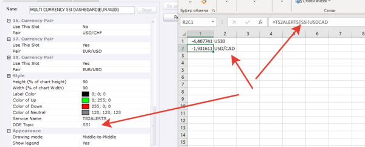

# Multi Currency SSI Dashboard

> Source: https://fxcodebase.com/code/viewtopic.php?f=17&t=65683  
> Forum: 17 · Topic 65683 · 16 post(s)

---

## Multi Currency SSI Dashboard

**Apprentice** · Tue Jan 30, 2018 11:45 am

SSI.BIN is available here.
[https://www.fxcmapps.com/apps/speculati ... ent-index/](https://www.fxcmapps.com/apps/speculative-sentiment-index/)

 [Multi Currency SSI Dashboard.lua](files/117356/Multi%20Currency%20SSI%20Dashboard.lua)

---

## Re: Multi Currency SSI Dashboard

**Stoneguard** · Wed Jan 31, 2018 1:25 pm

Hi Apprentice

An interesting dashboard, many thanks for that.
Question: What are the rules for the bell to appear next to an arrow?

Many thanks
Stoneguard

---

## Re: Multi Currency SSI Dashboard

**Apprentice** · Thu Feb 01, 2018 2:47 am

Change in SSI direction/indication.

---

## Re: Multi Currency SSI Dashboard

**Enlightened1** · Thu Jan 03, 2019 10:31 pm

Beautiful! Could the following indicator be made for MT4?
Thanks

---

## Re: Multi Currency SSI Dashboard

**Apprentice** · Fri Jan 04, 2019 6:22 am

Your request is added to the development list under Id Number 4401

---

## Re: Multi Currency SSI Dashboard

**Apprentice** · Mon Jan 07, 2019 5:30 pm

The indicator in build on encrypted SSI indicator.
Impossible to convert to MT4

---

## Re: Multi Currency SSI Dashboard

**easytrading** · Mon Jul 22, 2019 3:08 am

Hello Apprentice,

Is it possible please ,to show the SSI indicator below the price chart for the selected pair from the dashboard list so we can have both the price chart and SSI for the same pair together on one chart beside the dashboard .your help is highly appreciated .

---

## Re: Multi Currency SSI Dashboard

**Apprentice** · Tue Jul 23, 2019 8:34 am

FXCM SSI with instrument auto select?
[https://www.fxcmapps.com/apps/speculati ... ent-index/](https://www.fxcmapps.com/apps/speculative-sentiment-index/)

---

## Re: Multi Currency SSI Dashboard

**Apprentice** · Tue Jul 23, 2019 8:35 am

Your request is added to the development list under Id Number 4801

---

## Re: Multi Currency SSI Dashboard

**Apprentice** · Tue Aug 06, 2019 7:59 am

when you put SSI on the chart it automatically shows data for the chart's instrument

---

## Re: Multi Currency SSI Dashboard

**SANTOSH** · Tue Sep 10, 2019 10:16 am

> **Apprentice wrote:**
>
>
> EURUSD m5 (01-30-2018 1544).png
>
>
>
> SSI.BIN is available here.
> [https://www.fxcmapps.com/apps/speculati ... ent-index/](https://www.fxcmapps.com/apps/speculative-sentiment-index/)
>
>
> Multi Currency SSI Dashboard.lua

Can SSI data be pulled to excel using DDE server ?

---

## Re: Multi Currency SSI Dashboard

**Apprentice** · Thu Sep 12, 2019 6:58 am

[Multi Currency SSI Dashboard.lua](files/128603/Multi%20Currency%20SSI%20Dashboard.lua)

DDE support added.

---

## Re: Multi Currency SSI Dashboard

**SANTOSH** · Thu Sep 12, 2019 3:36 pm

> **Apprentice wrote:**
>
>
> Multi Currency SSI Dashboard.lua
>
>
> DDE support added.

Hello ,
Can you give a excel screenshot of how all 18 pairs SSI Values are exported to excel ?

Regards,
Santosh .

---

## Re: Multi Currency SSI Dashboard

**SANTOSH** · Thu Sep 19, 2019 2:24 am

> **SANTOSH wrote:**
>
>
> > **Apprentice wrote:**
> >
> >
> > Multi Currency SSI Dashboard.lua
> >
> >
> > DDE support added.
>
>
>
> Hello ,
> Can you give a excel screenshot of how all 18 pairs SSI Values are exported to excel ?
>
> Regards,
> Santosh .

Still awaiting how the dde for SSI works in excel ?

---

## Re: Multi Currency SSI Dashboard

**Apprentice** · Thu Sep 19, 2019 12:46 pm

Bug fixed.

 

---

## Re: Multi Currency SSI Dashboard

**SANTOSH** · Sat Sep 21, 2019 12:12 am

> **Apprentice wrote:**
> Bug fixed.
>
>
> изображение.png

Great work , it's working now
