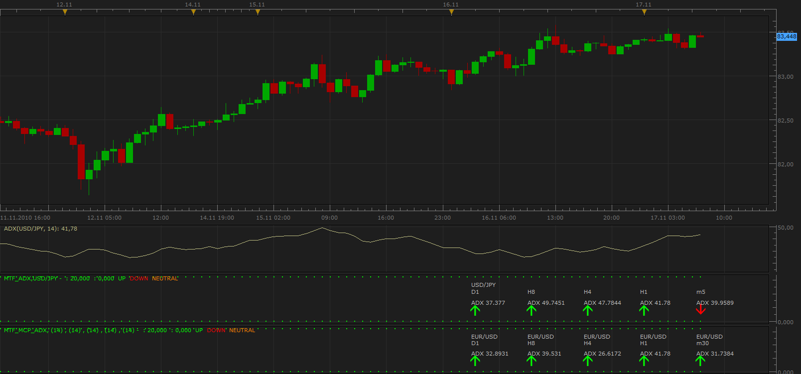

# Multi Time Frame ADX

> Source: https://fxcodebase.com/code/viewtopic.php?f=17&t=2724  
> Forum: 17 · Topic 2724 · 10 post(s)

---

## Multi Time Frame ADX

**Apprentice** · Wed Nov 17, 2010 7:37 am

This indicator shows the value of an ATR for selected currency pairs and time frames.

If you choose Lock mode of operation.
Then, depending on your preference, the indicator is locked,
for a specific time frame or specific currency pair.

 [MTF_MCP_ADX.lua](files/6187/MTF_MCP_ADX.lua)

---

## Re: Multi Time Frame ADX

**Apprentice** · Thu Jul 14, 2011 6:52 am

Multi Time Frame, Multi Currency Pairs DMI can be found here.
[viewtopic.php?f=17&t=5190&p=12683](https://fxcodebase.com/code/viewtopic.php?f=17&t=5190&p=12683) # p12683

---

## Re: Multi Time Frame ADX

**arstechnica** · Wed Oct 31, 2012 1:57 am

It would be very usefull if you could create a table:

In the row all cross you have in main TS page
In the column indicator value you want to display at a specified tF

It should contain about 20 columns.

---

## Re: Multi Time Frame ADX

**Apprentice** · Wed Oct 31, 2012 5:55 am

Try this Version

 [MTF MCP ADX List.lua](files/43325/MTF%20MCP%20ADX%20List.lua)

---

## Re: Multi Time Frame ADX

**arstechnica** · Wed Oct 31, 2012 8:35 am

Thak You for the indicator, but probably it is for TS beta..it gives me an error.

What I intented is not only adx but the possibility to select the columns with a specified indicator and TF

---

## Re: Multi Time Frame ADX

**Apprentice** · Thu Nov 01, 2012 2:54 am

I will think about it.

---

## Re: Multi Time Frame ADX

**Apprentice** · Thu Nov 01, 2012 4:44 pm

Something like this.
[viewtopic.php?f=17&t=25257](https://fxcodebase.com/code/viewtopic.php?f=17&t=25257)

---

## Re: Multi Time Frame ADX

**trendwatch** · Wed Aug 20, 2014 6:40 am

Very helpfull indicator! I like to use the list. I have a wish though and I hope you could integrate it in the list indicator.

Could you add the option (to each TF) to also incorporate the angle of the ADX in the decision? Up slope: arrow and down slope: grey dot.

I mean, if ADX is above the level it could well be descending for multiple periods and that's not what one wants to see right?

---

## Re: Multi Time Frame ADX

**Apprentice** · Wed Aug 20, 2014 2:19 pm

Can you confirm.
If the ADX is above a certain level color, gray dot would suggest this?

---

## Re: Multi Time Frame ADX

**Apprentice** · Fri Apr 13, 2018 9:05 am

The indicator was revised and updated.
