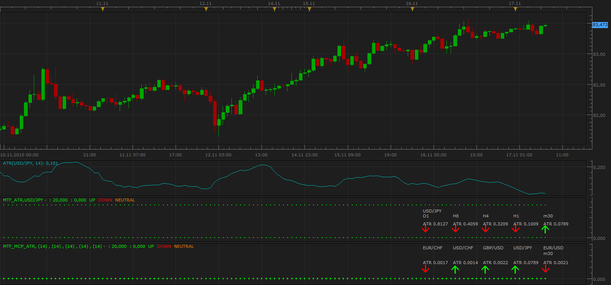
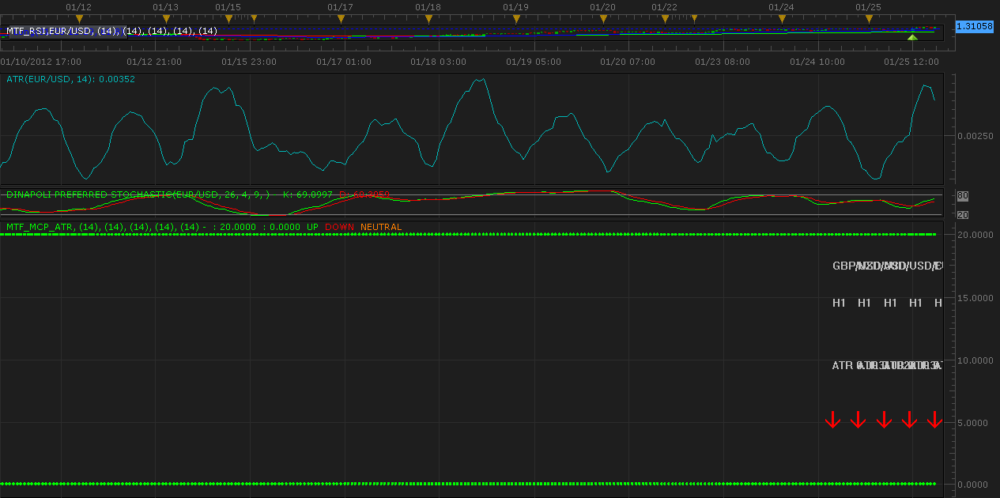

# Multi Time Frame ATR

> Source: https://fxcodebase.com/code/viewtopic.php?f=17&t=2723  
> Forum: 17 · Topic 2723 · 8 post(s)

---

## Multi Time Frame ATR

**Apprentice** · Wed Nov 17, 2010 7:18 am

This indicator shows the value of an ATR for the currency pair, in several time frames.

 [MTF_ATR.lua](files/6186/MTF_ATR.lua)

Its advanced version, allows you selection of currency pair.
If you choose Lock mode of operation.
Then, depending on your preference, the indicator is locked,
 for a specific time frame or specific currency pair.

 [MTF_MCP_ATR.lua](files/6186/MTF_MCP_ATR.lua)

Time frame or currency pair in Lock Mode,
you can specify by selecting the first pair parameters.

 

MQ4/MT4 version.
[viewtopic.php?f=38&t=64955](https://fxcodebase.com/code/viewtopic.php?f=38&t=64955)

---

## Re: Multi Time Frame ATR

**kgsmith69** · Wed Jan 25, 2012 6:58 pm

I can't get it to display like the picture at top of thread. Everything is jumbled up.

 

---

## Re: Multi Time Frame ATR

**Apprentice** · Thu Jan 26, 2012 6:10 pm

This indicator is very old.
From the time when a different view was not possible.
The reason for this problem, label positions are related to the position of the candle.
I'll make a update.

---

## Re: Multi Time Frame ATR

**Apprentice** · Fri Jan 27, 2012 3:57 am

Indicator is updated.

---

## Re: Multi Time Frame ATR

**jay1994** · Thu Sep 12, 2013 12:44 pm

Is there a MT4 for the MTF_ATR and the MTF_MCP_ATR? Thanks.

---

## Re: Multi Time Frame ATR

**Apprentice** · Fri Sep 13, 2013 12:40 am

No, as far as I know.
Will post this task to development list.

---

## Re: Multi Time Frame ATR

**Alexander.Gettinger** · Fri Nov 29, 2013 1:08 pm

MQL4 version of Multi Time Frame ATR: [viewtopic.php?f=38&t=60017](https://fxcodebase.com/code/viewtopic.php?f=38&t=60017).

---

## Re: Multi Time Frame ATR

**Apprentice** · Sat May 05, 2018 6:11 am

The indicator was revised and updated.
