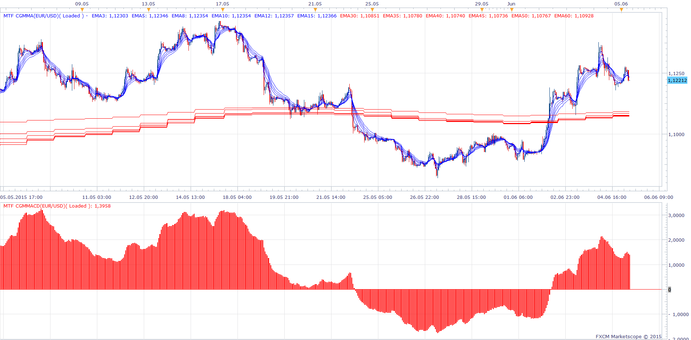

# Multi Time Frame GMMA & GMMACD

> Source: https://fxcodebase.com/code/viewtopic.php?f=17&t=62289  
> Forum: 17 · Topic 62289 · 4 post(s)

---

## Multi Time Frame GMMA & GMMACD

**Apprentice** · Fri Jun 05, 2015 6:40 am

Based on request.
[viewtopic.php?f=17&t=412&hilit=gmma&start=50](https://fxcodebase.com/code/viewtopic.php?f=17&t=412&hilit=gmma&start=50)
Will allow you to select different time frames for Slow and Fast GMMA EMA group.

 [MTF CGMMA.lua](files/100761/MTF%20CGMMA.lua)

 [MTF CGMMACD.lua](files/100761/MTF%20CGMMACD.lua)

---

## Re: Multi Time Frame GMMA & GMMACD

**Apprentice** · Mon Apr 23, 2018 8:37 am

The indicator was revised and updated.

---

## Re: Multi Time Frame GMMA & GMMACD

**seunboi4u** · Sun Apr 29, 2018 10:44 am

Hello Admin and other memeber's i really appreciate all your work on this web site and God bless you all ...........about MACD EA or Indicator i need you to include macd Oscilator settings and can it Possible to add MA Combine with MACD.....at the picture below Both Default MACD and Oscilator MACD God bless you sir all God will Bless you........

---

## Re: Multi Time Frame GMMA & GMMACD

**Apprentice** · Mon Apr 30, 2018 3:55 pm

Can you confirm strategy rules?
Open Long
MACD Signal Line / MA of MACD Signal Line Cross Over
Vice Versa for Short
