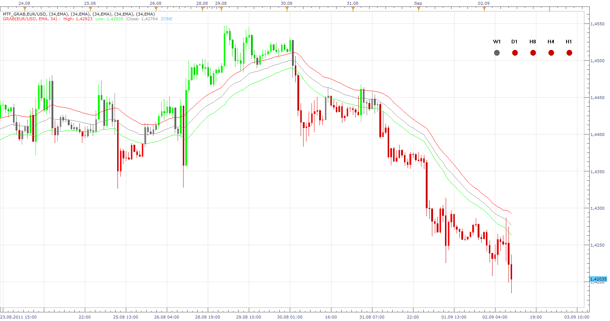

# Multi Time Frame GRAB Indicator

> Source: https://fxcodebase.com/code/viewtopic.php?f=17&t=6256  
> Forum: 17 · Topic 6256 · 14 post(s)

---

## Multi Time Frame GRAB Indicator

**Apprentice** · Fri Sep 02, 2011 9:55 am

 [MTF_GRAB.lua](files/14464/MTF_GRAB.lua)

It is necessary to install Grab indicator.
[viewtopic.php?f=17&t=4893&p=12197&hilit=grab#p12197](https://fxcodebase.com/code/viewtopic.php?f=17&t=4893&p=12197&hilit=grab#p12197)

 

Green - price is is greater than the moving average of High
Red - price is lower than the moving average of Low

Up Arrow - Price is increases
Down Arrow - Price is declining.

 [All Time Frames All Currency Pairs Grab List.lua](files/14464/All%20Time%20Frames%20All%20Currency%20Pairs%20Grab%20List.lua)

---

## Re: Multi Time Frame GRAB Indicator

**rose123** · Tue Oct 18, 2011 4:45 pm

can you creat dash board indicator base on mft grap indicator to monitor all pairs , indices .

---

## Re: Multi Time Frame GRAB Indicator

**Apprentice** · Thu Oct 03, 2013 11:06 am

All Time Frames All Currency Pairs Grab List added.

---

## Re: Multi Time Frame GRAB Indicator

**rtsayers** · Thu Oct 03, 2013 12:51 pm

Awesome thanks alot!! Just one more request I want to move it to the top corner a bit tighter I tried withe the vertical settings but not enough especially when I have multiple displays.

Thanks for the speedy return!

---

## Re: Multi Time Frame GRAB Indicator

**Apprentice** · Thu Oct 03, 2013 1:32 pm

Try to set negativ Value. Not u can do this.

---

## Re: Multi Time Frame GRAB Indicator

**rtsayers** · Thu Oct 03, 2013 2:02 pm

Hi it will only give me 0 to 500 no negative on the vertical setting

---

## Re: Multi Time Frame GRAB Indicator

**Apprentice** · Thu Oct 03, 2013 2:31 pm

Please redownload and reinstall, I have make modifications.

---

## Re: Multi Time Frame GRAB Indicator

**Apprentice** · Fri Aug 22, 2014 2:17 am

Update. Please re-download.

---

## Re: Multi Time Frame GRAB Indicator

**Apprentice** · Thu Nov 09, 2017 9:04 am

The indicator was revised and updated.

---

## Re: Multi Time Frame GRAB Indicator

**bartwas1** · Wed Nov 29, 2017 7:18 am

Hi Apprentice

When install this indicator (updated) I receive an error message: An error occurred during the calculation of the indicator 'MTF_GRAB,CHF/JPY'. The error details: C:/Program Files (x86)/Candleworks/FXTS2/Indicators/Custom/MTF_GRAB.lua:-1: The instance is not prepared yet.
It still shows on the chart though because of the error I'm not sure about its usefulness.

When it works I assume that big dots in the right corner symbolise MTF Grab. But is it possible to make MTF Grab look visually like Grab indicator and have option to display it on the chart or in separate window?

So if you would have time could you look into it, please?

Kind regards
Bart

---

## Re: Multi Time Frame GRAB Indicator

**Apprentice** · Wed Nov 29, 2017 8:36 am

> The instance is not prepared yet.

I began to note this notice on a different indicator after the last TS update.
Probably it is a TS bug.

---

## Re: Multi Time Frame GRAB Indicator

**bartwas1** · Thu Nov 30, 2017 6:17 pm

Does it have any bearing on how accurate this indicator is? I mean is still usable or I'll have to wait for some sort of fix - update?

---

## Re: Multi Time Frame GRAB Indicator

**Apprentice** · Fri Dec 01, 2017 3:40 am

As i wrote it is TS update.
The indicator works as expected.

---

## Re: Multi Time Frame GRAB Indicator

**Apprentice** · Sun Apr 22, 2018 5:22 am

The Indicator was revised and updated.
