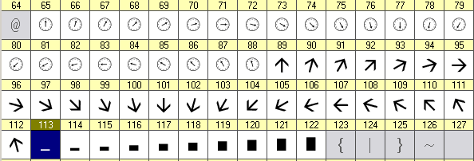
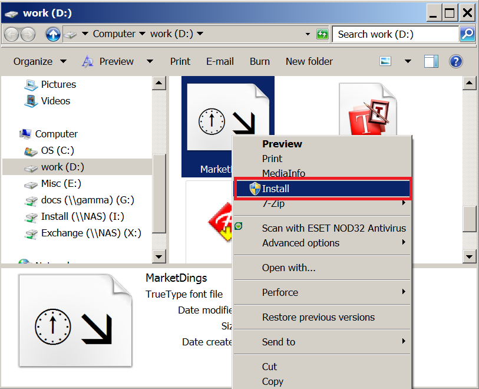
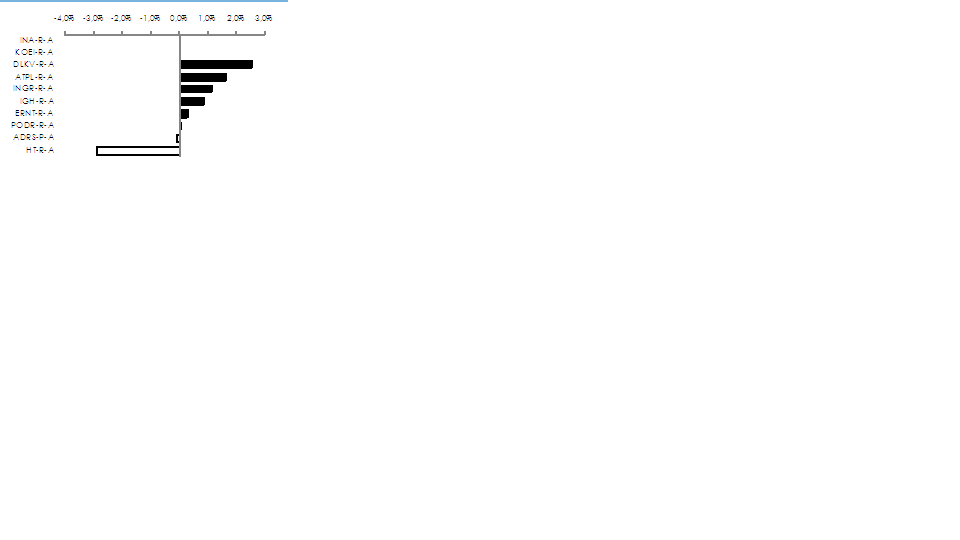

# Multi Time Frame Heikin-Ashi

> Source: https://fxcodebase.com/code/viewtopic.php?f=17&t=3934  
> Forum: 17 · Topic 3934 · 34 post(s)

---

## Multi Time Frame Heikin-Ashi

**Apprentice** · Fri Apr 15, 2011 12:42 pm

 [MTF_HA.lua](files/9727/MTF_HA.lua)

 [MTF MCP Heikin-Ashi.lua](files/9727/MTF%20MCP%20Heikin-Ashi.lua)

---

## Re: Multi Time Frame Heikin-Ashi

**forexdezert** · Mon Apr 18, 2011 10:27 am

Awesome indicator! I have been discussing almost this very indicator for quite awhile.

I wanted to call it AAOT (Average Angle Over Time)

Could you add the functionality of all the arrows with the ablity to rotate (similar to a row of gauges on the dash of an automobile) to show the average angle of trend over each of the different selected time frames. This could be accomplished by using something similar to the auto-ranging formula for calculating the automatic pip scale changes to the right side of the Marketscope 2.0 screen. This angle would indicate to the viewer the amount of movement for each time frame, thereby enabling the viewer to distinguish at a glance if the market is flat, grinding up/dwn, rocketing up/dwn etc, for each time frame.

Could this indicator be given the functionality of being added to the "Simple Dealing Rates" Page of the Trading Station by adding the arrows into line after the existing data columns. The user should be able to select the amount of arrows needed for his requirements as well as custom time frames especially a m2 time frame.

So in summation, when looking at the Simple Dealing Rates Page on the right side of the screen the user would see a row of arrows at the end of each currency pair line, allowing the user to see a snapshot of activity for every currency pair, displayed all together, at one glance.

This would be an amazing tool for all traders!

**Other "Simple Dealing Rates" Page Ideas**

I also have quite a few other ideas to incorporate into the data shown on the Simple Dealing Rates Page, such as:
the user should be able to add or delete whatever columns desired to the Simple dealing Rates Page.
At the top of each column should be a dropdown box with the following options for sorting the data shown.

The TOP 20 pairs at any given moment should be sortable and listed in order by:
Momentum - Highest or Lowest
Volatility - Highest or Lowest
% of Angle - Highest or Lowest
Pip Spread - Highest or Lowest
Pip Cost - Highest or Lowest
% of Price change - Highest or Lowest (avg amount of pips moved over any user selected period)
Breakout period - Sort by next to break, or longest avg breaking period

Thank you guys so much for all your hard work.

---

## Re: Multi Time Frame Heikin-Ashi

**Apprentice** · Mon Apr 18, 2011 12:31 pm

I'm not sure that the best way to do this, as an indicator.
This is similar to this in the plan.
I have requested it.

---

## Re: Multi Time Frame Heikin-Ashi

**forexdezert** · Tue Apr 19, 2011 1:52 am

Thanks Apprentice!
Please keep me updated if you will, about the development of my idea for the AAOT. I don't think that an indicator is the best idea for this either. I think maybe another page tab on the Trading Station, a page that lists all the currency pairs, and then the sortable by high / low data columns, and followed by the AAOT arrow/avg angle gauge columns.

On another note could you tell me how the development of my HA/AMAK2 Autobot Strategy is coming along? I've notice some other strategy requests that followed mine have been posted up already.

Thank you for your time and expertise

---

## Re: Multi Time Frame Heikin-Ashi

**Apprentice** · Tue Apr 19, 2011 3:12 am

These are solutions that I wrote.
As an example of these options.
[download/file.php?id=2941&mode=view](https://fxcodebase.com/code/download/file.php?id=2941&mode=view)
[viewtopic.php?f=17&t=3262&p=7765&hilit=filter#p7765](https://fxcodebase.com/code/viewtopic.php?f=17&t=3262&p=7765&hilit=filter#p7765)

Writing such things within the indicator is quite complicated.
And the final result is not always the best.

---

## Re: Multi Time Frame Heikin-Ashi

**Checkz** · Tue Apr 19, 2011 3:25 am

Apprentice Thanks for making this HA MTF. This indicator works perfectly so Please don't change it and if you do please leave the orginal one the way that it is. Thanks again.

---

## Re: Multi Time Frame Heikin-Ashi

**abrown8703** · Tue Apr 19, 2011 7:54 am

The question is, why is this feature not built directly into Tradestation II? Forex.com has it.

---

## Re: Multi Time Frame Heikin-Ashi

**forexdezert** · Tue Apr 19, 2011 10:03 am

The Idea is similar to the screenshot from the Movers & Shakers as far as a list goes, but it needs to be not just an indicator for Marketscope but part of the Simple Dealing Rates Page on the trading station itself. The whole point of my AAOT (Average Angle Over Time) idea is to have the arrows rotate on their axis like a gauge on a car dashboard depicting the average range of movement as an angle thus visually allowing the user to see the when trends are forming. For example - a horizontal arrow would indicate 0% of change. An arrow pointed up 30degrees from horizontal would indicate a 30% avg change long. Whereas an arrow pointed down 70 Degrees would indicate an avg change of 70% going short.
The visual depiction of arrows rotating on their axis is the most important part of this idea. It allows the user to visually see a complete picture of any given currency pair across all selected time frames at as glance. The user looks for arrows that are all beginning to rotate and line up at angles similar to each other thus indicating trends forming. Arrows rotating in a row is much easier to visually interpret than a table of numbers. Once you have decided on a currency pair to focus on by seeing the Simple Dealing Rates page then you would look to your Marketscope screen with the AAOT as an indicator applied to that selected currency pair only.

On the Multi Time Frame-HA if you give the arrows the same ability to rotate as an indicator this allows you to have the same Average Angle Over Time information for the particular currency pair being actively monitored on the Marketscope Screen.

So in summation I feel that the AAOT is an idea that could be applied to two different parts of the Trading Station. One as an indicator for the Marketscope screen for only that selected currency pair (As in the "Multi Time Frame-HA). Two as a line of arrows added to the simple dealing rates page after the "Time" column with user selected time frames.

Could you make sure that Nikolay gets a chance to read through this post as well. I would love to get his input on this idea as well. I feel that the combination and integration of these ideas into both the Trading Station and MarketScope could really give users a powerful advantage in rapidly identifying trends and trading opportunities across the range of all currency pairs.

Do you have any information available on the HA/AMKA2 Autobot Strategy?

---

## Re: Multi Time Frame Heikin-Ashi

**forexdezert** · Tue Apr 26, 2011 10:27 am

What are your thoughts about my idea for the AAOT in the post above?
We started a good disscussion about it, Ithought.

---

## Re: Multi Time Frame Heikin-Ashi

**Apprentice** · Tue Apr 26, 2011 10:38 am

I have nothing new to report.
Development sometimes takes time.
And recent days I do not have too much time.
When I have more and will post it.

---

## Re: Multi Time Frame Heikin-Ashi

**Nikolay.Gekht** · Tue Apr 26, 2011 5:44 pm

> **forexdezert wrote:**
> The whole point of my AAOT (Average Angle Over Time) idea is to have the arrows rotate on their axis like a gauge on a car dashboard depicting the average range of movement as an angle thus visually allowing the user to see the when trends are forming. For example - a horizontal arrow would indicate 0% of change. An arrow pointed up 30degrees from horizontal would indicate a 30% avg change long. Whereas an arrow pointed down 70 Degrees would indicate an avg change of 70% going short.

As far as I see, the simplest way is to use the custom font which contains characters for each degree required. We actually do not need all 360 images, 24 shall be pretty good to show smooth enough moving of the gauge. Something like on the movie available by the link below:
[http://www.gehtsoftusa.com/ngeht/font.swf.html](http://www.gehtsoftusa.com/ngeht/font.swf.html)

I created such simple font with two kinds of arrows and a simple growing bar:

 

To install the font:

1) download the font file below:

 [MarketDings.ttf](files/10070/MarketDings.ttf)

2) Right-click on the file and choose "Install" in the context menu:

 

3) Use the indicator below to see the demonstration:

 [font.lua](files/10070/font.lua)

---

## Re: Multi Time Frame Heikin-Ashi

**sunshine** · Wed Apr 27, 2011 12:52 am

If you use Windows XP, then to install the font, you should download the file and copy it to the folder:
C:\WINDOWS\Fonts
since there is no command "Install" in the context menu.

---

## Re: Multi Time Frame Heikin-Ashi

**forexdezert** · Thu Apr 28, 2011 2:19 am

Nick,

I think the font is a great way of making bringing the AAOT concept to life.

> Could you add the functionality of all the arrows with the ablity to rotate (similar to a row of gauges on the dash of an automobile) to show the average angle of trend over each of the different selected time frames. This could be accomplished by using something similar to the auto-ranging formula for calculating the automatic pip scale changes to the right side of the Marketscope 2.0 screen. This angle would indicate to the viewer the amount of movement for each time frame, thereby enabling the viewer to distinguish at a glance if the market is flat, grinding up/dwn, rocketing up/dwn etc, for each time frame.

However I think that we only really need the angles pointing from straight up (green), and then clockwise all the way through to pointing straight down (red). So basically 180 degrees of rotation up and down, covering what would be 12:00 through 6:00 on the face of a clock. I think that this is important because the arrow or dial should only rotate up or down to reflect the Average Angle of the trend over that selected time frame.

> visually allowing the user to see the when trends are forming. For example - a horizontal arrow would indicate 0% of change. An arrow pointed up 30degrees from horizontal would indicate a 30% avg change long. Whereas an arrow pointed down 70 Degrees would indicate an avg change of 70% going short.
> The visual depiction of arrows rotating on their axis is the most important part of this idea. It allows the user to visually see a complete picture of any given currency pair across all selected time frames at as glance. The user looks for arrows that are all beginning to rotate and line up at angles similar to each other thus indicating trends forming. Arrows rotating in a row is much easier to visually interpret than a table of numbers. Once you have decided on a currency pair to focus on by seeing the Simple Dealing Rates page then you would look to your Marketscope screen with the AAOT as an indicator applied to that selected currency pair only.
>
> On the Multi Time Frame-HA if you give the arrows the same ability to rotate as an indicator this allows you to have the same Average Angle Over Time information for the particular currency pair being actively monitored on the Marketscope Screen.

I got the font and demo to function correctly. I am curious to see how you and your team will integrate the function into the Multi time frame HA indicator, and once perfected, ultimately integrating them into the Simple Dealing Rates page of the Trading station itself!

---

## Re: Multi Time Frame Heikin-Ashi

**Apprentice** · Thu Apr 28, 2011 7:53 am

Nikolay,
 when you have time can you add and Horizontal Bars.
So we can add chart like this.

 

---

## Re: Multi Time Frame Heikin-Ashi

**Blackcat2** · Tue May 03, 2011 10:40 pm

Apprentice,
I, unfortunately, have limited screen real estate, so I put in the same section as MACD, etc (new section) but when I do that, I can't see the arrows anywhere..

Is it possible to change it so the arrow display nicely in a new/bottom section of the screen?

Thanks..
BC

---

## Re: Multi Time Frame Heikin-Ashi

**Apprentice** · Wed May 04, 2011 2:40 am

It is possible.
Until then you can use the Vertical Position parameter.

---

## Re: Multi Time Frame Heikin-Ashi

**Checkz** · Tue Aug 02, 2011 2:40 am

CAN YOU TURN THE ARROWS INTO A HEATMAP SO WE CAN SEE THE PAST DATA WHEN ALL THE TIMEFRAMES LINED UP. THE ARROWS ARE GOOD BUT THEY DON'T ALLOW US TO LOOK AT THE PAST DATA. THANKS ALOT.

---

## Re: Multi Time Frame Heikin-Ashi

**porschefan** · Tue Aug 02, 2011 2:24 pm

Hello
Many thanks for your work.
can you write the code of the arrow-red or green candle on the same second.
2 green candles in succession - an arrow green and two red candles, one after the red arrow.
**sorry for my english!**

Thanks

---

## Re: Multi Time Frame Heikin-Ashi

**porschefan** · Wed Aug 03, 2011 2:29 am

> **porschefan wrote:**
> Hello
> Many thanks for your work.
> can you write the code of the arrow-red or green candle on the same second.
> 2 green candles in succession - an arrow green and two red candles, one after the red arrow.
> **sorry for my english!**
>
> Thanks

---

## Re: Multi Time Frame Heikin-Ashi

**amazon1a** · Tue Aug 13, 2013 12:02 pm

> **Apprentice wrote:**
>
>
> MFT HA.png
>
>
>
>
> MTF_HA.lua

Hi Apprentice, Is it possible to Add Multi Currency pair functionality to this indicator. If so, could the new indicator appear at the bottom of the screen rather than at the side?

Many thanks, AG

---

## Re: Multi Time Frame Heikin-Ashi

**Apprentice** · Wed Aug 14, 2013 1:42 am

Your request is added to the development list.

---

## Re: Multi Time Frame Heikin-Ashi

**Apprentice** · Wed Aug 14, 2013 8:30 am

Try version from topmost post.
I have add two additional functionality.
Arrow color is an indicator of HA trend.
HA Close level can be drawn for the last period of selected Time Frame.

---

## Re: Multi Time Frame Heikin-Ashi

**SavvyStrategist** · Sat Nov 07, 2015 4:28 pm

Going back to the basics of this indicator: Why does it say RSI time frame? It has nothing to do with the Relative Strength Index indicator, or did I miss something? Also, it would be great if we could select how many time frames we want to see, three would be fine for me. And lastly, the aesthetics of it are a bit lacking: there's too much space in between the time frames, so it takes up more screen space than is necessary and the font is too big in relation to the arrows.

For me, I would like to see this indicator having left/right/top/bottom/whatever position, given the option to select the number of time frames displayed and perhaps made a bit smaller by shortening the distance between displayed time frames and increasing the arrow size.

Also, it is updated live or end of turn? With so many time frames displayed, it'd be important to know.

---

## Re: Multi Time Frame Heikin-Ashi

**Apprentice** · Mon Nov 09, 2015 4:17 am

Typo fixed.

---

## Re: Multi Time Frame Heikin-Ashi

**Apprentice** · Fri Nov 13, 2015 11:22 am

MTF_HA.lua Update

---

## Re: Multi Time Frame Heikin-Ashi

**SavvyStrategist** · Thu Nov 19, 2015 3:33 pm

Thanks, but sorry to say it works worse than before. The arrows don't point right and the format is huge. The addition of top/bottom left/right is welcome, perhaps just adding this functionality to the previous version and leave it as is?

---

## Re: Multi Time Frame Heikin-Ashi

**Apprentice** · Tue Nov 24, 2015 4:43 am

Bug Fixed.
As for arrow size, size is customizable.

---

## Re: Multi Time Frame Heikin-Ashi

**SavvyStrategist** · Thu Nov 26, 2015 4:00 pm

Thanks. I do have one more request (final request). I tried doing it myself but wasn't as straightforward as I thought it'd be. I want to add 10m and 3m candles as options, is that doable?

I just checked indicator development forum and came across your "indicator template" thread. Thanks for all the amazing work, will certainly look into it in the future.

---

## Re: Multi Time Frame Heikin-Ashi

**Apprentice** · Tue Dec 01, 2015 6:07 am

[MTF_HA.lua](files/103564/MTF_HA.lua)

Try This Version.
You can enter any time frame supported by ts.
m3 for example.

---

## Re: Multi Time Frame Heikin-Ashi

**SavvyStrategist** · Fri Dec 18, 2015 1:01 pm

Thanks!!!

---

## Re: Multi Time Frame Heikin-Ashi

**nookie** · Sun Dec 27, 2015 11:15 am

Is there a MT4 version ?

---

## Re: Multi Time Frame Heikin-Ashi

**Apprentice** · Mon Dec 28, 2015 5:07 am

Not at this point.

---

## Re: Multi Time Frame Heikin-Ashi

**Apprentice** · Thu Oct 19, 2017 7:20 am

The indicator was revised and updated.

---

## Re: Multi Time Frame Heikin-Ashi

**Apprentice** · Wed May 02, 2018 6:27 am

The Indicator was revised and updated.
