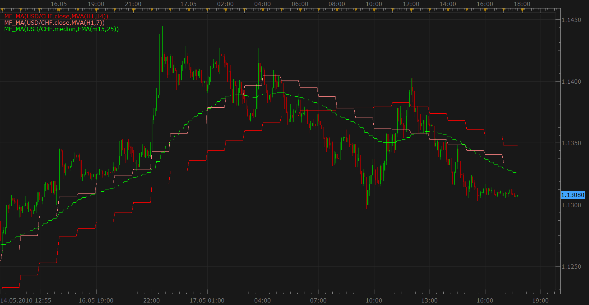
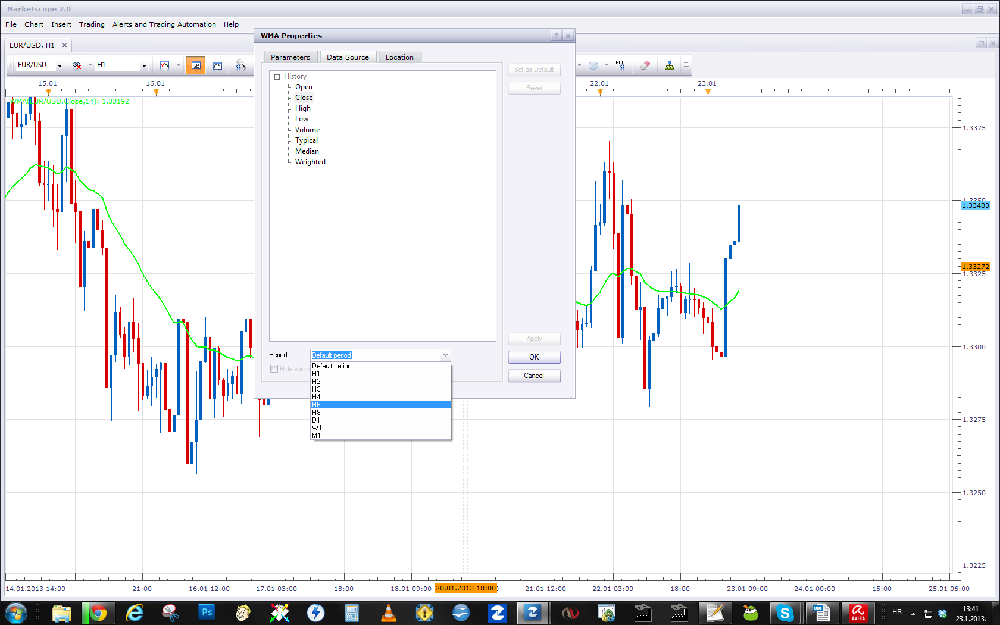

# Multi Time Frame Moving Average

> Source: https://fxcodebase.com/code/viewtopic.php?f=17&t=2287  
> Forum: 17 · Topic 2287 · 32 post(s)

---

## Multi Time Frame Moving Average

**Apprentice** · Tue Sep 28, 2010 4:39 am

The indicator displays chosen moving average of chosen price of chosen (bigger) time frame. So, you can for example show EMA(8) of closing price of 1 hour bar on 1 minute chart.

 

Download indicator:

 [MF_MA.lua](files/4850/MF_MA.lua)

MT4/MQ4 version
[viewtopic.php?f=38&t=64158](https://fxcodebase.com/code/viewtopic.php?f=38&t=64158)

---

## Re: Multi Time Frame Moving Average

**Nikolay.Gekht** · Tue Oct 05, 2010 7:41 pm

Updated again. In case the indicator is applied on alive chart and, therefore, the latest moving average value is permanently changing, now the indicator populates this changing value for all bars of the current time frame which corresponds to the latest bar of the chosen time frame.

In order version the indicator updated only the last bar of the current chart.

---

## Re: Multi Time Frame Moving Average

**patick** · Tue Oct 05, 2010 11:51 pm

Is it possible too add VAMA to the option MA list?

---

## Re: Multi Time Frame Moving Average

**Apprentice** · Wed Oct 06, 2010 1:33 am

It's possible, I just have to find VAMA, I think it is not yet officially released at the forum.

---

## Re: Multi Time Frame Moving Average

**Apprentice** · Wed Oct 06, 2010 2:55 am

VAMA (VWAP) Added.

---

## Re: Multi Time Frame Moving Average

**patick** · Wed Oct 06, 2010 4:00 am

Thank you very much.

---

## Re: Multi Time Frame Moving Average

**Apprentice** · Sun Dec 05, 2010 5:21 am

Update
12.05.2010.

---

## Re: Multi Time Frame Moving Average

**station0524** · Sat May 14, 2011 5:13 pm

Is it possible to add KAMA and T3 to the averages option?

---

## Re: Multi Time Frame Moving Average

**Apprentice** · Sun May 15, 2011 9:10 am

Your request has been added to developmental cue.

---

## Re: Multi Time Frame Moving Average

**Trader1** · Fri Jul 22, 2011 6:27 am

Hi! my first post here,
I found this indi so good I had to register.
thanks for your work with this indicator. I love it!
I find it very useful but there is a problem with it,
and Im hoping you could fix it cus I really need it in
my every day trading, the problem is that you get error messages
when you are jumping from time frame to time frame,

Failed to create the indicator 'MTF_MA' during the chart loading. The error details: [string "MTF_MA.lua"]:66: The chosen time frame must be equal to or bigger than the chart time frame!.

I understand the main reason for this indi is to make jumping timeframes un-necessary,
but I like to get a bigger view over the market and being on the Daily chart
makes it hard to see the smaller timeframes MA's,
I think that would add functionality to this indi and it will help me greatly.
Thank you!

---

## Re: Multi Time Frame Moving Average

**Apprentice** · Fri Jul 22, 2011 5:07 pm

In the current implementation it is impossible to fix this problem.
The new version is eventually possible.
The problem is how to display data from from small time frames on biger time frame chart.
We have too many data points.

---

## Re: Multi Time Frame Moving Average

**Trader1** · Sat Jul 23, 2011 7:07 am

Im sorry to hear that
when can we see the new version?

---

## Re: Multi Time Frame Moving Average

**sunshine** · Mon Jul 25, 2011 1:15 am

Hi,
In the next version of FX Trading Station, you will be able to choose any time frame for any indicator.
The beta version of the platform will published on this site pretty soon. Please watch for the updates on the site.

---

## Re: Multi Time Frame Moving Average

**fxwithme** · Tue Aug 30, 2011 3:23 am

Is it possible to add HMA to the list of choices for Multi Time Frame MA's? When you add HMA, please use the HMA that can change color. Thanks.

---

## Re: Multi Time Frame Moving Average

**fxwithme** · Tue Aug 30, 2011 12:55 pm

Can you please add HMA to the list of choices for Multi Time Frame MA's? When you do, please make sure I can change the color/width of the HMA. Thanks.

---

## Re: Multi Time Frame Moving Average

**fxwithme** · Tue Oct 25, 2011 12:55 pm

This is my third time posting this request.

Can you please add HMA to the list of MA's that can be plotted? Thanks.

P.S. Please use the HMA that changes color.

---

## Re: Multi Time Frame Moving Average

**Apprentice** · Tue Oct 25, 2011 4:49 pm

Ups.We did not notice your request.

---

## Re: Multi Time Frame Moving Average

**pudge71381** · Sun Feb 12, 2012 10:05 pm

I love using these moving averages. I'm wondering if you could add a standard deviation feature to be able to create a channel.

---

## Re: Multi Time Frame Moving Average

**Apprentice** · Mon Feb 13, 2012 5:58 am

This option has a standard Bollinger Band indicator.

---

## Re: Multi Time Frame Moving Average

**rkardatzke** · Wed Mar 14, 2012 3:13 pm

is there a ma strategy or signal that uses this indicator ?

---

## Re: Multi Time Frame Moving Average

**Apprentice** · Thu Mar 15, 2012 8:06 pm

Any strategy will support multiple time frames.
Try this one.
[viewtopic.php?f=31&t=3859&hilit=averages](https://fxcodebase.com/code/viewtopic.php?f=31&t=3859&hilit=averages)

---

## Re: Multi Time Frame Moving Average

**mschwartz** · Fri Mar 23, 2012 9:33 am

Can you please add the HMA (Hull Moving Average) the list of options for this indicator?

---

## Re: Multi Time Frame Moving Average

**Apprentice** · Sun Mar 25, 2012 4:13 am

This indicator is obsolete, and as such will not be developed further.
Trading Station now supports higher time frames,
simply select source time frame for the moving average of your choice.
If this case for HMA.

---

## Re: Multi Time Frame Moving Average

**fxwithme** · Tue Apr 03, 2012 11:19 am

Trading Station II seems to have every MA except HMA! If you could add it it will be great.

---

## Re: Multi Time Frame Moving Average

**Apprentice** · Wed Apr 04, 2012 2:03 am

I will convey this to the development team.

---

## Multi Time Frame

**arleypaez** · Wed Jan 09, 2013 4:04 am

[/img]

> **Apprentice wrote:**
> I will convey this to the development team.

good morning apprentice
My English is not very good.
I'm looking for an indicator to show me muti time frame on the same graph, and further that the time frame muti pudding have the option of placing some indicators "moving averages" (see links)

[http://www.forexfactory.com/attachment. ... 1259179004](http://www.forexfactory.com/attachment.php?attachmentid=367321&d=1259179004)

[http://www.youtube.com/watch?v=Gc486JCuQ5I](https://www.youtube.com/watch?v=Gc486JCuQ5I)

thanks.

---

## Re: Multi Time Frame Moving Average

**Apprentice** · Wed Jan 09, 2013 5:12 pm

Your request is added to the development list.

---

## Re: Multi Time Frame Moving Average

**Steven Smith** · Fri Jan 18, 2013 2:02 am

This is latest moving average value is permanently changing,
now the indicator populates this changing value for all bars of the current time frame which
corresponds to the latest bar of the chosen time frame.

---

## Re: Multi Time Frame Moving Average

**sagymmm** · Mon Jan 21, 2013 7:50 am

Thx for that great work
I will be thankful if you can add WMA to the indicator and if we can make levels appear for the last couple of candles as a line like done with pivot, support and resistance

---

## Re: Multi Time Frame Moving Average

**Apprentice** · Wed Jan 23, 2013 9:00 am

Multi Time Frame Moving Average indicator is obsolete.
U can have all the moving averages available already, from MarketScope.
Simply add the desired moving average to chart, and select the desired Time Frame for Indicator Source.

---

## Re: Multi Time Frame Moving Average

**ronald123** · Thu Jul 04, 2013 11:05 am

> **Apprentice wrote:**
> The indicator displays chosen moving average of chosen price of chosen (bigger) time frame. So, you can for example show EMA(8) of closing price of 1 hour bar on 1 minute chart.
>
>
>
> mf_ma.png
>
>
>
> Download indicator:
>
>
> MF_MA.lua

Hi Apprentice. Just downloaded and installed your MTF MA Indicator for simplified use of the MTF strategy I'm using. Works perfect and makes it easy to have more M5 charts open on the Trading Station, while still able to see where price is, regarding the same EMA I'm using on the M15 and M30 as well.

Thanks for putting in the work!

Ronald

---

## Re: Multi Time Frame Moving Average

**Apprentice** · Wed May 02, 2018 6:43 am

The indicator was revised and updated.
