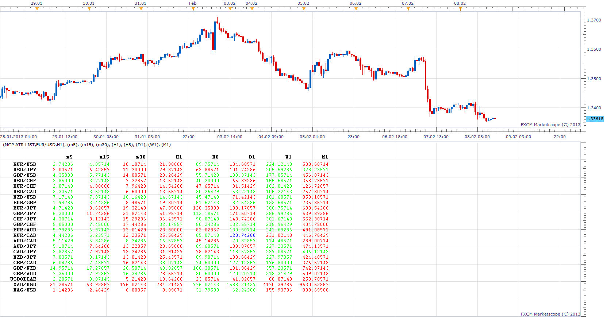

# Multi Time Frame, Multi Currency Pair, ATR List

> Source: https://fxcodebase.com/code/viewtopic.php?f=17&t=31923  
> Forum: 17 · Topic 31923 · 17 post(s)

---

## Multi Time Frame, Multi Currency Pair, ATR List

**Apprentice** · Sun Feb 10, 2013 10:23 am

This indicator will generate a list, which will contain ATR values ,
​​for all currency pairs on all selected time frames.

 [MTF MCP ATR List.lua](files/54411/MTF%20MCP%20ATR%20List.lua)

---

## Re: Multi Time Frame, Multi Currency Pair, ATR List

**allisonmagic** · Sun Feb 10, 2013 3:32 pm

can you make this for MT4 .. it doesn't work for me in tradestation II, and i dont use beta TS

---

## Re: Multi Time Frame, Multi Currency Pair, ATR List

**Apprentice** · Mon Feb 11, 2013 6:08 pm

U have to have the beta, to make it work.
Will forward your request for MT4 version.

---

## Re: Multi Time Frame, Multi Currency Pair, ATR List

**allisonmagic** · Mon Feb 11, 2013 8:34 pm

thanks apprentice.. you can see how this indicator is so awesome we can pick out the strongest movers from the weakest.. thanks for forwarding that over for me, i appreciate it

---

## Re: Multi Time Frame, Multi Currency Pair, ATR List

**Fx4mt.com** · Mon Feb 18, 2013 9:54 pm

Excellent indicator! Well done apprentice! Is there any way to get this on the non-beta TS? I would greatly appreciate it

---

## Re: Multi Time Frame, Multi Currency Pair, ATR List

**Apprentice** · Wed Feb 20, 2013 5:35 am

Unfortunately not. I do not have time for this task.
The development team promises TS update soon.

---

## Re: Multi Time Frame, Multi Currency Pair, ATR List

**Apprentice** · Fri Feb 22, 2013 4:05 am

Update.

---

## Re: Multi Time Frame, Multi Currency Pair, ATR List

**allisonmagic** · Mon Feb 25, 2013 1:35 am

useless if it doesn't work with current software....

---

## Re: Multi Time Frame, Multi Currency Pair, ATR List

**Fx4mt.com** · Mon Mar 11, 2013 1:29 pm

Really wish this worked with the current tradestation, very unfotunate that it does not

---

## Re: Multi Time Frame, Multi Currency Pair, ATR List

**SuperTrader** · Tue Feb 03, 2015 7:53 am

Fantastic indicator !!! for picking the strongest/weakest movers at any given time!
Would it be possible to sort the table by the ATR value (pips) ?
i.e. sort the table by column "m5" (or any column in fact)
or even sort it by the "average" of the chosen columns (or something similar)
and of course there's no need for the table being sorted on every price tick, only at a specified time interval, i.e. the table should be refreshed/ordered every 5 mins or so...
Or anything else that could display the table from a somehow "sort-friendly" point of view".
That would be totally awesome !!!

---

## Re: Multi Time Frame, Multi Currency Pair, ATR List

**reggytrades** · Wed Feb 11, 2015 9:15 pm

Thanks for a really useful indicator. Find it's a good compliment to Strong Weak Oscillator. See attached screenshot. Prior to finding this was using Oanda's Volatility page on their site. This is a big improvement. Thanks again.

---

## Re: Multi Time Frame, Multi Currency Pair, ATR List

**Apprentice** · Mon Nov 13, 2017 6:29 am

The indicator was revised and updated.

---

## Re: Multi Time Frame, Multi Currency Pair, ATR List

**bill8000** · Fri Jan 05, 2018 8:58 am

Does anyone have a solution to the overlapping numbers of multy currency atr list.
Thanks
Bill

---

## Re: Multi Time Frame, Multi Currency Pair, ATR List

**Apprentice** · Sun Jan 07, 2018 6:16 am

Try it now.
The old presentation was used.
It would be best to re-write indicator.

---

## Re: Multi Time Frame, Multi Currency Pair, ATR List

**bill8000** · Mon Jan 08, 2018 5:39 am

Thanks for getting back but it is still the same on my side.
 regards.
Bill

---

## Re: Multi Time Frame, Multi Currency Pair, ATR List

**Apprentice** · Wed Jan 10, 2018 1:08 pm

Try to use smaller font size.

---

## Re: Multi Time Frame, Multi Currency Pair, ATR List

**Apprentice** · Wed Jan 31, 2018 10:49 am

The Indicator was revised and updated.
