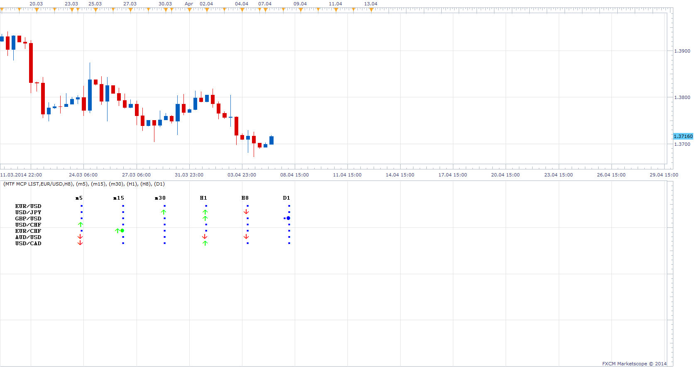

# Multi Time Frame, Multi Currency Pair MACD OSMA AO List

> Source: https://fxcodebase.com/code/viewtopic.php?f=17&t=60508  
> Forum: 17 · Topic 60508 · 6 post(s)

---

## Multi Time Frame, Multi Currency Pair MACD OSMA AO List

**Apprentice** · Mon Apr 07, 2014 5:03 am

UP ARROW:
MACD < 0 and OSMA > 0 and Awesome < 0

DOWN ARROW:
MACD >0 and OSMA <0 and Awesome >0

Additionally OSMA Cross is indicated my circle.

 [MTF MCP MACD OSMA AO List.lua](files/93407/MTF%20MCP%20MACD%20OSMA%20AO%20List.lua)

UP ARROW:
MACD < 0
OSMA/Zero Line Cross Over
Awesome < 0

DOWN ARROW:
MACD >0
OSMA/Zero Line Cross Under
Awesome >0

 [MTF MCP AO MACD OSMA Cross List.lua](files/93407/MTF%20MCP%20AO%20MACD%20OSMA%20Cross%20List.lua)

Moving Average of Oscillator (OsMA) can be found here.
[viewtopic.php?f=17&t=1856&p=89854&hilit=osma#p89854](https://fxcodebase.com/code/viewtopic.php?f=17&t=1856&p=89854&hilit=osma#p89854)

MQ4 version
[viewtopic.php?f=38&t=67769](https://fxcodebase.com/code/viewtopic.php?f=38&t=67769)

---

## Re: Multi Time Frame, Multi Currency Pair MACD OSMA AO List

**Apprentice** · Sat Apr 19, 2014 12:29 am

Please Re-Download.

---

## Re: Multi Time Frame, Multi Currency Pair MACD OSMA AO List

**Apprentice** · Thu Apr 12, 2018 7:08 am

The indicator was revised and updated.

---

## Re: Multi Time Frame, Multi Currency Pair MACD OSMA AO List

**maclaud** · Mon Mar 11, 2019 3:07 pm

Is there an MT4 version of this?

---

## Re: Multi Time Frame, Multi Currency Pair MACD OSMA AO List

**Apprentice** · Tue Mar 12, 2019 11:39 am

Your request is added to the development list under Id Number 4532

---

## Re: Multi Time Frame, Multi Currency Pair MACD OSMA AO List

**Apprentice** · Fri Mar 22, 2019 4:40 pm

MT4/MQ4 version.
[viewtopic.php?f=38&t=67769](https://fxcodebase.com/code/viewtopic.php?f=38&t=67769)
