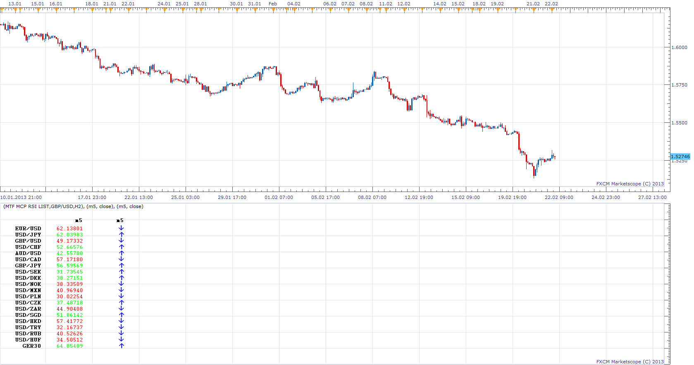
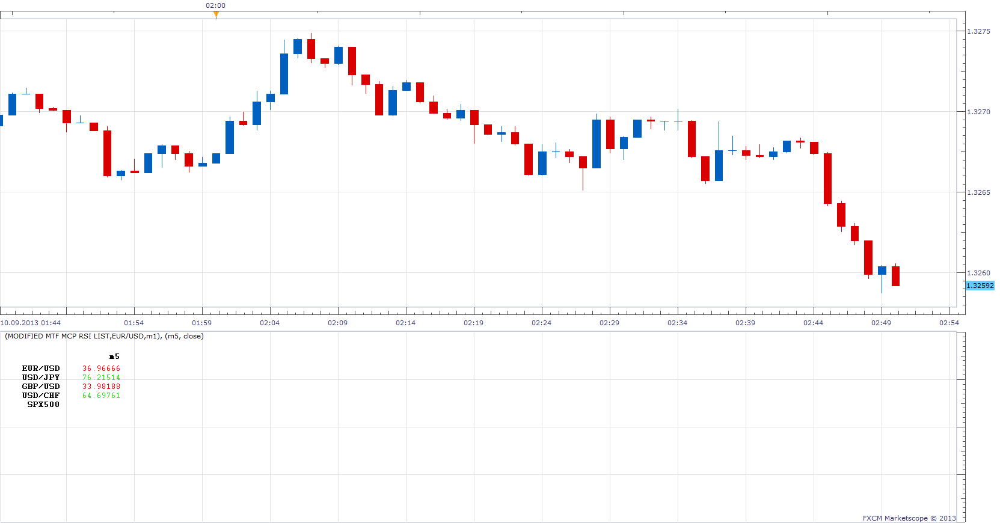

# Multi Time Frame, Multi Currency Pair, RSI List

> Source: https://fxcodebase.com/code/viewtopic.php?f=17&t=32319  
> Forum: 17 · Topic 32319 · 25 post(s)

---

## Multi Time Frame, Multi Currency Pair, RSI List

**Apprentice** · Fri Feb 22, 2013 4:48 am

This indicator will generate a list, which will contain RSI values ,
​​for all currency pairs on all selected time frames.

 [MTF MCP RSI List.lua](files/55087/MTF%20MCP%20RSI%20List.lua)

 [MTF Selectable MCP RSI List.lua](files/55087/MTF%20Selectable%20MCP%20RSI%20List.lua)

MT4/MQ4 version.
[viewtopic.php?f=38&t=65057&p=114712#p114712](https://fxcodebase.com/code/viewtopic.php?f=38&t=65057&p=114712#p114712)

---

## Re: Multi Time Frame, Multi Currency Pair, RSI List

**calvin1** · Fri Feb 22, 2013 4:15 pm

Thank you for the indicator

---

## Re: Multi Time Frame, Multi Currency Pair, RSI List

**flowtrade** · Fri Sep 06, 2013 7:22 am

Hello,

Could you please create the same indicator but with these parameters :
=> if RSI > 60 ==> green arrow and keep the arrow green until RSI < 40 for each time frame
=> if RSI < 40 ==> red arrow and keep the arrow red until RSI > 60 for each time frame

For all currency pair and at least 5 time frames.
Thanks in advance
Flowtrade

---

## Re: Multi Time Frame, Multi Currency Pair, RSI List

**Apprentice** · Sun Sep 08, 2013 1:27 am

Your request is added to the development list.

---

## Re: Multi Time Frame, Multi Currency Pair, RSI List

**Apprentice** · Sun Sep 08, 2013 6:21 am

Try Custom OB/OS algorithm.

 [Modified MTF MCP RSI List.lua](files/89259/Modified%20MTF%20MCP%20RSI%20List.lua)

RSI > Custom OB Level
Blue arrow and keep the arrow Blue until RSI < Custom OS
RSI < Custom OS
Re arrow and keep the arrow Until until RSI > Custom OB

---

## Re: Multi Time Frame, Multi Currency Pair, RSI List

**flowtrade** · Mon Sep 09, 2013 1:28 am

Hello,

Thanks for your quick return but we need to modify it, we need to get a very simple mtf mcp.
- we can't be neutral, the arrow should be green or red
 - green, the RSI value has been > 60 and has never been under 40
 - red, the RSI value has been < 40 and has never been > 60
- we don t need to change the color of the arrow live, we just need to modify the color when the specific TF is closed.
- we can change the arrow direction if RSI is increasing or decreasing but the color should change only if we close under 40 or over 60.
I hope it s clear enough, thanks again
Flowtrade

---

## Re: Multi Time Frame, Multi Currency Pair, RSI List

**Apprentice** · Mon Sep 09, 2013 2:32 am

Have you used Value Custom OB/OS or Arrows Custom OB/OS.

---

## Re: Multi Time Frame, Multi Currency Pair, RSI List

**flowtrade** · Mon Sep 09, 2013 2:44 am

Hello,
Yes i tried but there is always this neutral arrow which should not exist, the arrow should always be red or green following the condition mentionned before.

---

## Re: Multi Time Frame, Multi Currency Pair, RSI List

**Apprentice** · Mon Sep 09, 2013 3:29 am

Try Updated version.

---

## Re: Multi Time Frame, Multi Currency Pair, RSI List

**flowtrade** · Mon Sep 09, 2013 4:24 am

here is an exemple

---

## Re: Multi Time Frame, Multi Currency Pair, RSI List

**flowtrade** · Mon Sep 09, 2013 10:39 pm

Hello,

Is this better with the chart ? Did you get it ?
Flowtrade

---

## Re: Multi Time Frame, Multi Currency Pair, RSI List

**Apprentice** · Tue Sep 10, 2013 1:48 am

Updated version, Custom algorithm should behave as described.

 

Did you redownload it yesterday.

---

## Re: Multi Time Frame, Multi Currency Pair, RSI List

**flowtrade** · Tue Sep 10, 2013 3:12 am

Hello,

It does not work properly, as you can see with the attachment.
We should not have any blue arrow and we can't have any blank.
We should have green arrow when RSI has been >60 and has never been < 40 after
This green arrow is up when we are currently > 60, this green arrow is down when we are currently < 60 and > 40
The arrow is red when RSI has been < 40 and and has never been > 60 after
This arrow is down whan RSI is < 40 and up if RSI is > 40 but < 60.
Hope I m clear enough
Thanks
Flowtrade

---

## Re: Multi Time Frame, Multi Currency Pair, RSI List

**Apprentice** · Tue Sep 10, 2013 6:03 am

Missing arrows.
You're right, the algorithm had an bug.
I have fix it.

Blue arrows (second instance)
Value OB / OS / Arrows OB / OS this is Intended behavior.
Only "Custom" filters using an algorithm that you described.

---

## Re: Multi Time Frame, Multi Currency Pair, RSI List

**flowtrade** · Tue Sep 10, 2013 7:37 am

Hello,
Good job, we are close from the goal, two little things :
- the indicator crash when you parameter too many TF
- arrows are going up and down following the RSI and they shoul move as explained before

green arrow when RSI has been >60 and has never been < 40 after ==> **good job !**

This green arrow is up when we are currently > 60, this green arrow is down when we are currently < 60 and > 40 ==> **this point has to be modified**

The arrow is red when RSI has been < 40 and and has never been > 60 after ==> **good job !**
This arrow is down whan RSI is < 40 and up if RSI is > 40 but < 60 ==> **this point has to be modified**
Many thanks for your work, we are really close !
Flowtrade

---

## Re: Multi Time Frame, Multi Currency Pair, RSI List

**trader101** · Sun Nov 10, 2013 10:22 am

Hi everybody

Is it possible to make a RSI list (multi currency pair) without the signals. RSI Readings above 85 should be green, readings below 15 should be red and all other RSI readings should be black.

Thanks.

regards

Patrick

---

## Re: Multi Time Frame, Multi Currency Pair, RSI List

**Apprentice** · Sun Nov 10, 2013 2:42 pm

[MTF MCP RSI List.lua](files/90703/MTF%20MCP%20RSI%20List.lua)

Here is the required modification (Arrow mode)
Looks like 85/15 is very restrictive.

---

## Re: Multi Time Frame, Multi Currency Pair, RSI List

**trader101** · Sun Nov 10, 2013 5:35 pm

Thank you very much for you fast answer. I really appreciate it.

I hope that you can make some changes that it meets my needs.

The aim is that I can recognize overbought and oversold situations immediately. The situation now is that readings between 15 and 85 have sometimes the same color as overbought and oversold readings.

Please see graphic below:

[https://www.dropbox.com/sh/o3xhbs44688xcqq/bHQWvJ5mSC](https://www.dropbox.com/sh/o3xhbs44688xcqq/bHQWvJ5mSC)

So I hope that you can change the settings that only overbought and oversold readings have a different color from others. Readings between 15 and 85 should be neutral.

I would really appreciate if you can make these changes. Thanks in advance.

Regards

Patrick

---

## Re: Multi Time Frame, Multi Currency Pair, RSI List

**trader101** · Sun Nov 10, 2013 6:06 pm

Thank you. Now i got it. I didn't use the arrow mode. So it works as i wished.

Everthing works perfectly fine.

Best regards

Patrick

---

## Re: Multi Time Frame, Multi Currency Pair, RSI List

**trader101** · Thu Nov 28, 2013 5:15 pm

Hello everybody

Is it possible to improve the indicator and make a list of selected currency pairs? At the moment, it lists all the currency pairs you have subscribed.

My aim is that I can watch only a few currency pairs with this indicator and to see which of these selected currency pairs are overbought respectively oversold.

Thanks.

Patrick

---

## Re: Multi Time Frame, Multi Currency Pair, RSI List

**Apprentice** · Fri Nov 29, 2013 2:32 pm

This is possible. In this case U will have to choose each individual currency pair.
In Which number of the currency you would be interested.

---

## Re: Multi Time Frame, Multi Currency Pair, RSI List

**Apprentice** · Fri Nov 29, 2013 2:46 pm

MTF Selectable MCP RSI List Added
Up to ten currencies can be selected.

---

## Re: Multi Time Frame, Multi Currency Pair, RSI List

**trader101** · Sat Nov 30, 2013 2:42 pm

Great. Thank you very much.

Outstanding job.

Best regards

Patrick

---

## Re: Multi Time Frame, Multi Currency Pair, RSI List

**Apprentice** · Mon Nov 06, 2017 8:19 am

The indicator was revised and updated.

---

## Re: Multi Time Frame, Multi Currency Pair, RSI List

**Apprentice** · Mon Apr 09, 2018 6:51 am

The Indicator was revised and updated.
