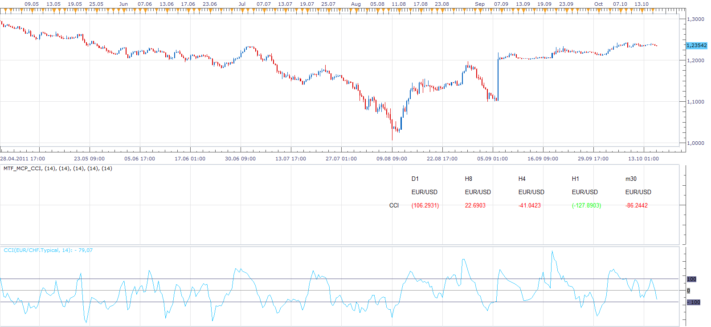

# Multi Time Frame, Multi Currency Pairs CCI

> Source: https://fxcodebase.com/code/viewtopic.php?f=17&t=7337  
> Forum: 17 · Topic 7337 · 3 post(s)

---

## Multi Time Frame, Multi Currency Pairs CCI

**Apprentice** · Mon Oct 17, 2011 9:11 am

Allows display of CCI indicator for any currency pair,
at any given time frame.
There are two display modes.
A simple (symbolic representation)
Advanced (display value)

Overbought oversold areas are indicated.

 [MTF_MCP_CCI.lua](files/16370/MTF_MCP_CCI.lua)

The indicator was revised and updated
MT4/MQ4 version.
[viewtopic.php?f=38&t=65976](https://fxcodebase.com/code/viewtopic.php?f=38&t=65976)

---

## Re: Multi Time Frame, Multi Currency Pairs CCI

**mosesnobleraj** · Mon Oct 17, 2011 9:27 am

sir,

this is golden indicator

---

## Re: Multi Time Frame, Multi Currency Pairs CCI

**Apprentice** · Fri Mar 17, 2017 7:20 am

Indicator was revised and updated.
