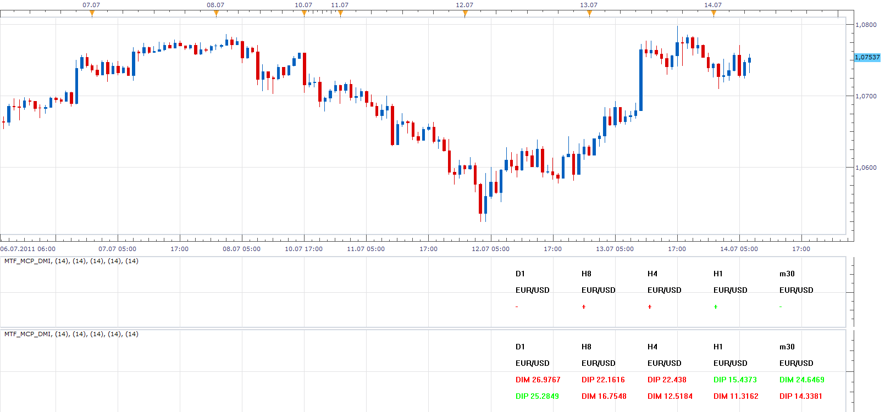

# Multi Time Frame, Multi Currency Pairs DMI

> Source: https://fxcodebase.com/code/viewtopic.php?f=17&t=5190  
> Forum: 17 · Topic 5190 · 12 post(s)

---

## Multi Time Frame, Multi Currency Pairs DMI

**Apprentice** · Thu Jul 14, 2011 6:27 am

Some of the advanced features.
Select Display Mode - Simple or Advanced
Select Lock Type - Lock to Lock Time Frame Or this currency pair

 [MTF_MCP_DMI.lua](files/12683/MTF_MCP_DMI.lua)

MT4/Mq4 version.
[viewtopic.php?f=38&t=65018&p=115228#p115228](https://fxcodebase.com/code/viewtopic.php?f=38&t=65018&p=115228#p115228)

---

## Re: Multi Time Frame, Multi Currency Pairs DMI

**nookie** · Thu Jul 14, 2011 11:08 am

This looks really nice.. but can it be combined with the MTF ADX somehow.. like if DMI is + and ADX rising > 25 - its written +DMI ADX (value of both) with blue colour.. if DMI is - and ADX rising >25 - -DMI ADX (value of both) with red colour.. if ADX is falling - values are written and ADX is grey.. if ADX is below 25 - values of DMI are written but ADX is grey and neutral. This is like my first though can be something similar

Cheers

Nookie

---

## Re: Multi Time Frame, Multi Currency Pairs DMI

**JPNWV7** · Thu Oct 06, 2011 8:18 am

Yea, I'd like to see these 2 indicators combined somehow into one

---

## Re: Multi Time Frame, Multi Currency Pairs DMI

**Apprentice** · Thu Oct 06, 2011 4:41 pm

Your request is added to the developmental cue.

---

## Re: Multi Time Frame, Multi Currency Pairs DMI

**Apprentice** · Fri Oct 07, 2011 4:59 am

I hope this version will satisfy your needs.

 [MTF_MCP_ADX_DMI.lua](files/15911/MTF_MCP_ADX_DMI.lua)

---

## Re: Multi Time Frame, Multi Currency Pairs DMI

**JPNWV7** · Fri Oct 07, 2011 4:48 pm

Thanks, that is great.

---

## Re: Multi Time Frame, Multi Currency Pairs DMI

**nookie** · Fri Oct 21, 2011 5:19 am

This is cool

---

## Re: Multi Time Frame, Multi Currency Pairs DMI

**bonnie434** · Fri Oct 21, 2011 7:11 am

Thank you very much guys for your help.

---

## Re: Multi Time Frame, Multi Currency Pairs DMI

**transformer** · Mon Feb 03, 2014 7:58 pm

hi,
can you create a mtf mcp adx dmi list with following specification

1.adx>trending level and adx (period)>adx(period-1)
and dmi positive > dmi negative
then draw UP GREEN ARROW

2.adx>trending level and adx (period)>adx(period-1)
and dmi positive < dmi negative
then draw RED DOWN ARROW

3. OTHER WISE YELLOW DOT

---

## Re: Multi Time Frame, Multi Currency Pairs DMI

**Apprentice** · Tue Feb 04, 2014 7:08 am

Requested can be found here.
[viewtopic.php?f=17&t=60275](https://fxcodebase.com/code/viewtopic.php?f=17&t=60275)

---

## Re: Multi Time Frame, Multi Currency Pairs DMI

**transformer** · Tue Feb 04, 2014 11:03 am

thank you apprentice.

---

## Re: Multi Time Frame, Multi Currency Pairs DMI

**Apprentice** · Sun Feb 04, 2018 7:12 am

The Indicator was revised and updated.
