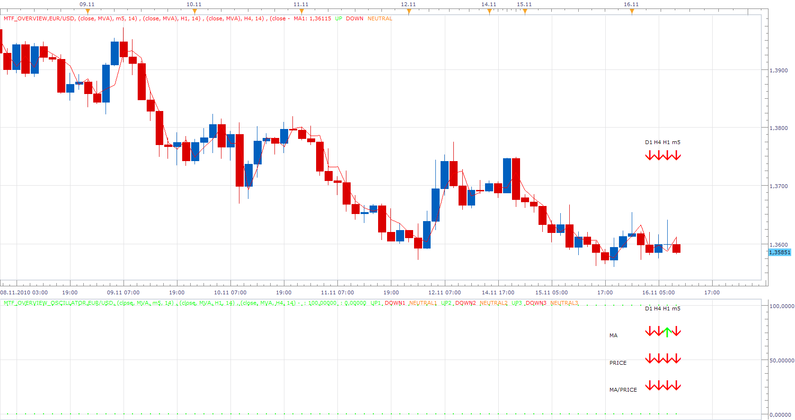

# Multi Time Frame Overview

> Source: https://fxcodebase.com/code/viewtopic.php?f=17&t=2717  
> Forum: 17 · Topic 2717 · 16 post(s)

---

## Multi Time Frame Overview

**Apprentice** · Tue Nov 16, 2010 8:34 am

This indicator allows you, selection of.
up to four, moving average, their periods, time frames and types of moving average.
The display is available as a moving average or as an arrows Helper.

Arrows Helper Examined, for each time frame, one of the following options.
The growth or decline of the moving average.
Growth or decline in the closing price.
Does the price is above or below average

Multi Time Frame Overview Indicator

 [MTF_Overview.lua](files/6173/MTF_Overview.lua)

Multi Time Frame Overview Oscillator (All 3 in 1)

 [MTF_Overview_Oscillator.lua](files/6173/MTF_Overview_Oscillator.lua)

MT4/MQ4 version.
[viewtopic.php?f=38&t=64697](https://fxcodebase.com/code/viewtopic.php?f=38&t=64697)

---

## Re: Multi Time Frame Overview

**thetruth** · Tue Apr 12, 2011 1:06 pm

exelent indicator,
can you change the text output for some similar presentation to MTF_LAGUERRE_RSI
thanks!

---

## Re: Multi Time Frame Overview

**Apprentice** · Tue Apr 12, 2011 2:12 pm

It is possible for the first two of three components.

---

## Re: Multi Time Frame Overview

**serchfx** · Wed Apr 27, 2011 6:23 pm

Hello guys.

Anybody have a MFT MACD. I cant find any.

Thanks

---

## Re: Multi Time Frame Overview

**Apprentice** · Thu Apr 28, 2011 5:47 am

Your request has been added to developmental cue.

---

## Re: Multi Time Frame Overview

**Hybrid** · Thu Apr 28, 2011 7:40 am

[viewtopic.php?f=17&t=430&p=697&hilit=hft#p697](http://www.fxcodebase.com/code/viewtopic.php?f=17&t=430&p=697&hilit=hft#p697)

---

## Re: Multi Time Frame Overview

**serchfx** · Thu Apr 28, 2011 2:37 pm

Thank you Hybrid. But I want a Multi Time Frame like MTF Stochastic or MTF RSI, that shows in arrows (4 or 5) the direccion of the some diferents Time Frames at the same time.

Thank's Apprentice I will wait for it.
Thank's for youe time and dedication.

---

## Re: Multi Time Frame Overview

**Apprentice** · Mon May 02, 2011 9:18 am

Requested can be found here.
[viewtopic.php?f=17&t=4089&p=10255#p10255](https://fxcodebase.com/code/viewtopic.php?f=17&t=4089&p=10255#p10255)

---

## Re: Multi Time Frame Overview

**serchfx** · Mon May 02, 2011 2:50 pm

Than you so much.

---

## Re: Multi Time Frame Overview

**Apprentice** · Mon Jun 20, 2011 4:06 pm

First Row Price
Second Row MA
Third Row Price / MA position

 [MTF Overview Heat_Map.lua](files/11906/MTF%20Overview%20Heat_Map.lua)

---

## Re: Multi Time Frame Overview

**nookie** · Mon Sep 12, 2011 8:14 am

Hello,

Is it possible an ADX Heat map to be done for MTF similar to this indicator, green for rising, red for decreasing, or does it exist already ?

Thanks

Nookie

---

## Re: Multi Time Frame Overview

**Apprentice** · Tue Sep 13, 2011 4:28 am

Can you describe your requirement with a little more detail.

---

## Re: Multi Time Frame Overview

**nookie** · Tue Sep 13, 2011 5:00 am

It should be much similar to this indicator but for ADX with option to set the period and 5 or more higher timeframes so values of multiple timeframes can be seen:

[download/file.php?id=2797&mode=view](https://fxcodebase.com/code/download/file.php?id=2797&mode=view)

[viewtopic.php?f=30&t=3102&p=7227#p7227](https://fxcodebase.com/code/viewtopic.php?f=30&t=3102&p=7227#p7227)

I would like the same but for ADX, please let me know if more info is needed

Thanks

Nookie

---

## Re: Multi Time Frame Overview

**nookie** · Tue Sep 13, 2011 5:04 am

So it should be like this: green if it was rising compared to previous value, red if it was decreasing compared to previous value.. and this should be for all the upper timeframe values

---

## Re: Multi Time Frame Overview

**nsaale** · Fri Jul 27, 2012 9:25 am

Why does the mtf overview heatmap consume too much memory, it really slows down the marketscope .

---

## Re: Multi Time Frame Overview

**Apprentice** · Sun Feb 04, 2018 7:09 am

The Indicator was revised and updated.
