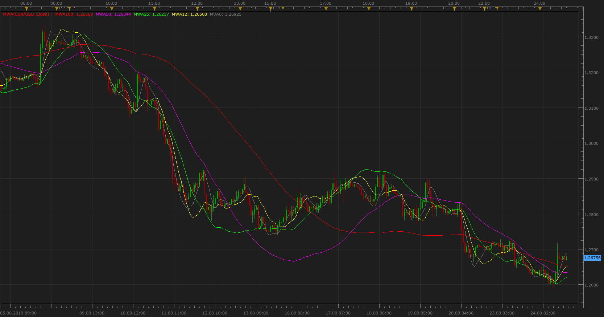
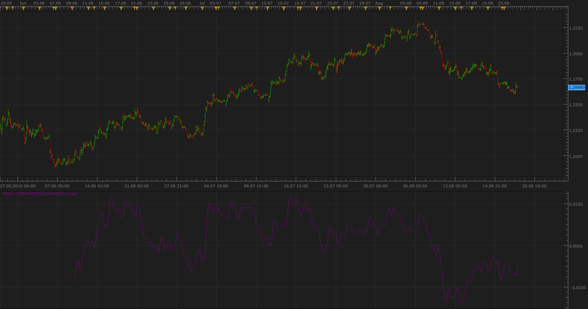
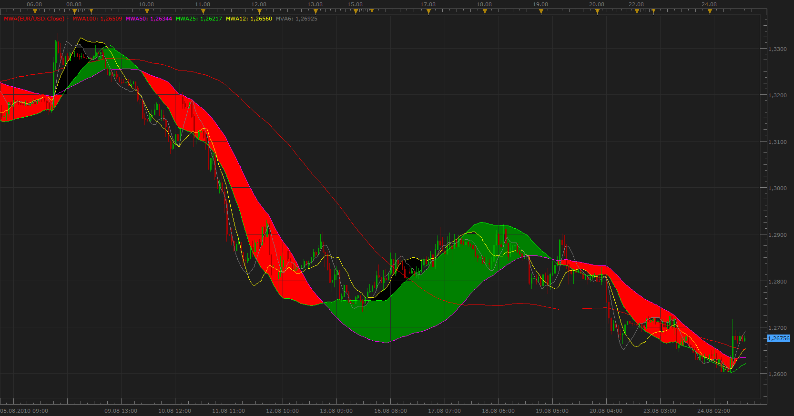
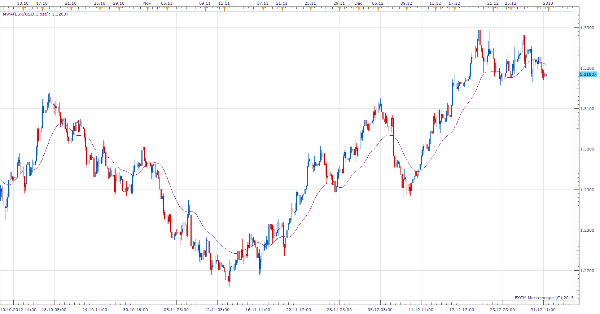

# Multi Wave Analysis (MWA)

> Source: https://fxcodebase.com/code/viewtopic.php?f=17&t=1921  
> Forum: 17 · Topic 1921 · 11 post(s)

---

## Multi Wave Analysis (MWA)

**Apprentice** · Tue Aug 24, 2010 2:40 pm

Theoretical basis of the indicators I've developed in the very beginning of my work on this forum, still did not know how to write indicator.

This indicator that I suggest was never developed for any other platform.
I call it Multi Wave Analysis.

**Idea that have led me in developing this indicator is to try to distinguish waves of different amplitude and period.**

Simplified, moving average with a larger period is the baseline for a shorter period moving average.
Shorter period moving average, fluctuated around a longer period moving average.

Unlike moving average, which followed the closing price, WMA predict price trends, and indicate, the deviation from the defined wave.

WMA can reach a value higher than the maximum closing price for that period, the reason, the price moves below the short-wave, the moving average continue to grow, but due to changes in market conditions, momentum, inertia, or the fundamental data, price did not continue its growth.

As a basis, I suggest the ordinary 200 period MVA,
then we deduct MWA 200 from the closing price,
now we Calculate 100 period MVA of Residual,
Again, deduct MVA 100 from Residual.

Procedure must be repeated for 50, 25, 12 and 6 period.

You can use all MWA components simultaneously, one pair,
 or only one component as Wave Moving Average.

Advantages of these modified moving average is obvious, at least to me,
earlier detection of changes in trend precise support and resistance definitions,

 [MWA.lua](files/3885/MWA.lua)

**Signals
Signal is generated if MWA with Lower period Growth / Fall Above / Below Higher period WMA.**

Better results would be achieved if they could determine the exact period, the cycle of each wave.

In the future I want to develop a formula, an algorithm that identifies each wave, with different amplitudes and duration.
But despite my searching I have not managed to find a solution to this problem.

Heat Map based on this indicator is available here.
[viewtopic.php?f=17&t=65098&p=114978#p114978](https://fxcodebase.com/code/viewtopic.php?f=17&t=65098&p=114978#p114978)

---

## Re: Multi Wave Analysis (MWA)

**Apprentice** · Tue Aug 24, 2010 3:59 pm

This oscillator is a variant of this indicator.
Can display single and all MWA components .

Or, you can only use the oscillator based on WMA as in this example.
MWA Average is the Sum of all MWA components.

In both cases the signal line is zero line.

 [MWA Components.lua](files/3888/MWA%20Components.lua)

---

## Re: Multi Wave Analysis (MWA)

**Apprentice** · Wed Aug 25, 2010 1:51 am

An example of signals obtained by the interaction between MWA 25 and 50.

 

An example of signals obtained from the MWA 12.
5 winners, 1 loser.

---

## Re: Multi Wave Analysis (MWA)

**Apprentice** · Tue Jan 01, 2013 8:01 am

MWA Components & MVA Updated.

 

Average of MVA Components added to MVA.
Periods and Methods for moving averages are now Adjustable.

---

## Re: Multi Wave Analysis (MWA)

**Apprentice** · Tue Aug 20, 2013 2:22 am

Bump Up

---

## Re: Multi Wave Analysis (MWA)

**greenfork** · Mon Oct 07, 2013 5:03 pm

Hi,
Is it possible to convert the MWA.lua to MT4.
Please Please Please.

---

## Re: Multi Wave Analysis (MWA)

**Apprentice** · Tue Oct 08, 2013 2:08 am

I will try to fix something for you today.
Unfortunately, I'm not sure, Will I Be Able to have same functionality as we have it MarketScope.
The reason, MT4 has some limits, for which I can not find work around.

---

## Re: Multi Wave Analysis (MWA)

**Apprentice** · Tue Oct 08, 2013 7:46 am

Requested can be found here.
[viewtopic.php?f=38&t=59619](https://fxcodebase.com/code/viewtopic.php?f=38&t=59619)

---

## Re: Multi Wave Analysis (MWA)

**greenfork** · Tue Oct 08, 2013 7:58 am

Amazing work as always.
Thank you.

---

## Re: Multi Wave Analysis (MWA)

**Apprentice** · Sun Jul 30, 2017 6:39 am

The indicator was revised and updated.

---

## Re: Multi Wave Analysis (MWA)

**Apprentice** · Mon Feb 05, 2018 10:11 am

The indicator was revised and updated.
