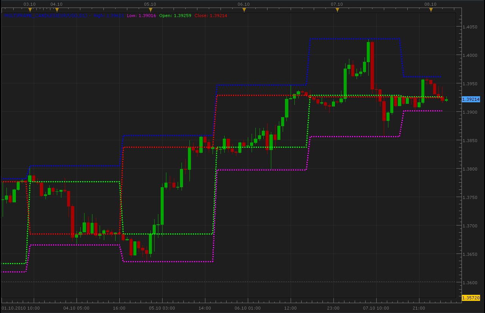
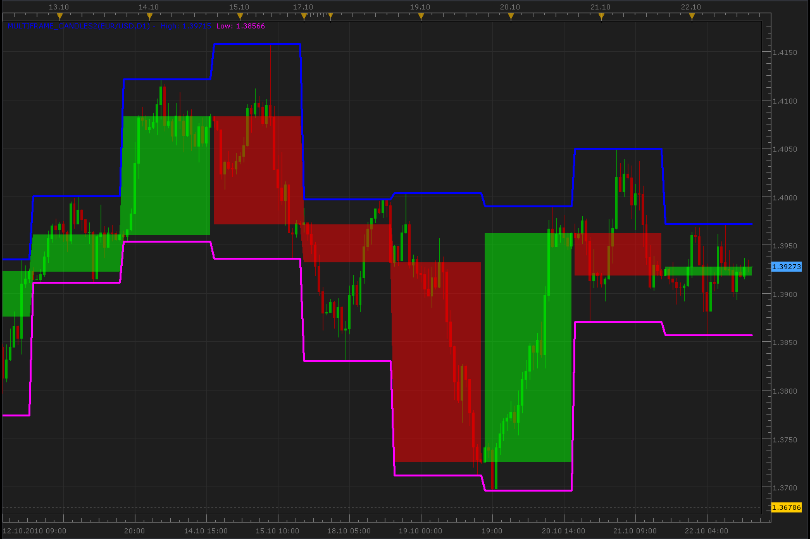

# Multiframe candles

> Source: https://fxcodebase.com/code/viewtopic.php?f=17&t=2364  
> Forum: 17 · Topic 2364 · 6 post(s)

---

## Multiframe candles

**Alexander.Gettinger** · Fri Oct 08, 2010 3:09 am

Indicator shows OHLC information from other timeframe.

 

The indicator was revised and updated

---

## Re: Multiframe candles

**Alexander.Gettinger** · Sun Oct 24, 2010 12:42 pm

Update this indicator.

 

Code: [Select all](https://fxcodebase.com/code/)
`function Init()
    indicator:name("Bigger timeframe OHLC");
    indicator:description("");
    indicator:requiredSource(core.Bar);
    indicator:type(core.Indicator);

    indicator.parameters:addGroup("Calculation");
    indicator.parameters:addString("BS", "Time frame", "", "D1");
    indicator.parameters:setFlag("BS", core.FLAG_PERIODS);

    indicator.parameters:addGroup("Style");
    indicator.parameters:addColor("HIGH", "Color for High", "Color for High", core.rgb(0,0,255));
    indicator.parameters:addColor("LOW", "Color for Low", "Color for Low", core.rgb(255,0,255));
    indicator.parameters:addColor("UP", "Color for UP", "Color for UP", core.rgb(0,255,0));
    indicator.parameters:addColor("DOWN", "Color for DOWN", "Color for DOWN", core.rgb(255,0,0));
    indicator.parameters:addInteger("widthLinReg", "Line width", "Line width", 3, 1, 5);
    indicator.parameters:addInteger("styleLinReg", "Line style", "Line style", core.LINE_SOLID);
    indicator.parameters:setFlag("styleLinReg", core.FLAG_LINE_STYLE);
    indicator.parameters:addInteger("Transparency", "Transparency", "", 50,0,100);
end

local source;                   -- the source
local bf_data = nil;          -- the high/low data
local BS;
local bf_length;                 -- length of the bigger frame in seconds
local dates;                    -- candle dates
local host;
local day_offset;
local week_offset;
local extent;
local up;
local down;
local High;
local Low;
local hUP=nil;
local hDN=nil;
local lUP=nil;
local lDN=nil;

function Prepare()
    source = instance.source;
    host = core.host;

    day_offset = host:execute("getTradingDayOffset");
    week_offset = host:execute("getTradingWeekOffset");

    BS = instance.parameters.BS;
    extent = 20;

    local s, e, s1, e1;

    s, e = core.getcandle(source:barSize(), core.now(), 0, 0);
    s1, e1 = core.getcandle(BS, core.now(), 0, 0);
    assert ((e - s) <= (e1 - s1), "The chosen time frame must be bigger than the chart time frame!");
    bf_length = math.floor((e1 - s1) * 86400 + 0.5);

    local name = profile:id() .. "(" .. source:name() .. "," .. BS .. ")";
    instance:name(name);
    High = instance:addStream("High", core.Line, name .. ".High", "High", instance.parameters.HIGH, 0);
    Low = instance:addStream("Low", core.Line, name .. ".Low", "Low", instance.parameters.LOW, 0);
    hUP=instance:addInternalStream(0, 0);
    hDN=instance:addInternalStream(0, 0);
    lUP=instance:addInternalStream(0, 0);
    lDN=instance:addInternalStream(0, 0);
    High:setWidth(instance.parameters.widthLinReg);
    High:setStyle(instance.parameters.styleLinReg);
    Low:setWidth(instance.parameters.widthLinReg);
    Low:setStyle(instance.parameters.styleLinReg);
    instance:createChannelGroup("UpGroup","Up" , hUP, hDN, instance.parameters.UP, 100-instance.parameters.Transparency);
    instance:createChannelGroup("DnGroup","Dn" , lUP, lDN, instance.parameters.DOWN, 100-instance.parameters.Transparency);
end

local loading = false;
local loadingFrom, loadingTo;
local pday = nil;

-- the function which is called to calculate the period
function Update(period, mode)
    -- get date and time of the hi/lo candle in the reference data
    local bf_candle;
    bf_candle = core.getcandle(BS, source:date(period), day_offset, week_offset);

    -- if data for the specific candle are still loading
    -- then do nothing
    if loading and bf_candle >= loadingFrom and (loadingTo == 0 or bf_candle <= loadingTo) then
        return ;
    end

    -- if the period is before the source start
    -- the do nothing
    if period < source:first() then
        return ;
    end

    -- if data is not loaded yet at all
    -- load the data
    if bf_data == nil then
        -- there is no data at all, load initial data
        local to, t;
        local from;

        if (source:isAlive()) then
            -- if the source is subscribed for updates
            -- then subscribe the current collection as well
            to = 0;
        else
            -- else load up to the last currently available date
            t, to = core.getcandle(BS, source:date(period), day_offset, week_offset);
        end

        from = core.getcandle(BS, source:date(source:first()), day_offset, week_offset);
        High:setBookmark(1, period);
        -- shift so the bigger frame data is able to provide us with the stoch data at the first period
        from = math.floor(from * 86400 - (bf_length * extent) + 0.5) / 86400;
        local nontrading, nontradingend;
        nontrading, nontradingend = core.isnontrading(from, day_offset);
        if nontrading then
            -- if it is non-trading, shift for two days to skip the non-trading periods
            from = math.floor((from - 2) * 86400 - (bf_length * extent) + 0.5) / 86400;
        end
        loading = true;
        loadingFrom = from;
        loadingTo = to;
        bf_data = host:execute("getHistory", 1, source:instrument(), BS, loadingFrom, to, source:isBid());
        return ;
    end

    -- check whether the requested candle is before
    -- the reference collection start
    if (bf_candle < bf_data:date(0)) then
        High:setBookmark(1, period);
        if loading then
            return ;
        end
        -- shift so the bigger frame data is able to provide us with the stoch data at the first period
        from = math.floor(bf_candle * 86400 - (bf_length * extent) + 0.5) / 86400;
        local nontrading, nontradingend;
        nontrading, nontradingend = core.isnontrading(from, day_offset);
        if nontrading then
            -- if it is non-trading, shift for two days to skip the non-trading periods
            from = math.floor((from - 2) * 86400 - (bf_length * extent) + 0.5) / 86400;
        end
        loading = true;
        loadingFrom = from;
        loadingTo = bf_data:date(0);
        host:execute("extendHistory", 1, bf_data, loadingFrom, loadingTo);
        return ;
    end

    -- check whether the requested candle is after
    -- the reference collection end
    if (not(source:isAlive()) and bf_candle > bf_data:date(bf_data:size() - 1)) then
        High:setBookmark(1, period);
        if loading then
            return ;
        end
        loading = true;
        loadingFrom = bf_data:date(bf_data:size() - 1);
        loadingTo = bf_candle;
        host:execute("extendHistory", 1, bf_data, loadingFrom, loadingTo);
        return ;
    end

    local p;
    p = findDateFast(bf_data, bf_candle, true);
    if p == -1 then
        return ;
    end
   
    High[period]=bf_data.high[p];
    Low[period]=bf_data.low[p];
    if bf_data.open[p]>bf_data.close[p] then
     lUP[period]=bf_data.open[p];
     lDN[period]=bf_data.close[p];
    else
     hUP[period]=bf_data.close[p];
     hDN[period]=bf_data.open[p];
    end
end

-- the function is called when the async operation is finished
function AsyncOperationFinished(cookie)
    local period;

    pday = nil;
    period = High:getBookmark(1);

    if (period < 0) then
        period = 0;
    end
    loading = false;
    instance:updateFrom(period);
end

function findDateFast(stream, date, precise)
    local datesec = nil;
    local periodsec = nil;
    local min, max, mid;

    datesec = math.floor(date * 86400 + 0.5)

    min = 0;
    max = stream:size() - 1;

    while true do
        mid = math.floor((min + max) / 2);
        periodsec = math.floor(stream:date(mid) * 86400 + 0.5);
        if datesec == periodsec then
            return mid;
        elseif datesec > periodsec then
            min = mid + 1;
        else
            max = mid - 1;
        end
        if min > max then
            if precise then
                return -1;
            else
                return min - 1;
            end
        end
    end
end`

---

## Re: Multiframe candles

**Nikolay.Gekht** · Mon Oct 25, 2010 12:33 pm

Wow. The second version is beautiful! Thank you!

---

## Re: Multiframe candles

**Jigit Jigit** · Thu Nov 04, 2010 11:25 am

Excellent job.
Cheers guys.
But could you, possibly, make them look even more like normal candles, i.e. with wicks instead of lines for highs and lows?

Here's what it could look like (and the indi for MT4):

---

## Re: Multiframe candles

**Jigit Jigit** · Thu Nov 04, 2010 11:28 am

MT4 version of the aforementioned Proper Multiple Time Frame Candles:

Code: [Select all](https://fxcodebase.com/code/)
`#property link      "[[email protected]](https://fxcodebase.com/cdn-cgi/l/email-protection)"
#property copyright "© 2006, mankurt"
#property indicator_chart_window
//+------------------------------------------------------------------------------------------------+
extern int   TimeFrame=15;
extern color UpCandle=Lime;
extern color DnCandle=Red;
extern color DojiColor=Blue;
extern int   Width=1;
extern bool  BGCandle=false;
//+------------------------------------------------------------------------------------------------+
int      Nbar,OpenBar,timer,i,timerTF,name,MidBar;
double   HighPrevBar,LowPrevBar,ClosePrevBar;
double   OpenNewBar,HighNewBar,LowNewBar,CloseNewBar;
double   HighCurBar,LowCurBar,CloseCurBar;
double   priceNewSH,priceNewSL,pricePrevSH,pricePrevSL,priceCurSH,priceCurSL;
string   nameNewCandle,namePrevCandle;
string   nameNewShadowH,nameNewShadowL,namePrevShadowH,namePrevShadowL;
string   NameBar, NameHigh, NameLow;
datetime TimeOpenNewBar,TimeCloseNewBar,TimeClosePrevBar;
datetime timeNewShadow,timePrevShadow;
bool     NewBar;
//+------------------------------------------------------------------------------------------------+
int init(){
IndicatorShortName("M"+TimeFrame+" íŕ M"+Period());
Nbar=TimeFrame/Period();
timer=Period()*60;
timerTF=TimeFrame*60;
name=0;
TimeOpenNewBar=Time[Bars-1];
OpenNewBar=Open[Bars-1];
NewBar=false;
NameBar="Bar M"+TimeFrame+"-";
NameHigh="High M"+TimeFrame+"-";
NameLow="Low M"+TimeFrame+"-";
return(0);}
//+------------------------------------------------------------------------------------------------+
int deinit(){
for(int DelOBJ=1; DelOBJ<=name; DelOBJ++){
ObjectDelete(NameBar+DelOBJ);
ObjectDelete(NameHigh+DelOBJ);
ObjectDelete(NameLow+DelOBJ);}
Comment("");
return(0);}
//+------------------------------------------------------------------------------------------------+
int start(){
if(TimeFrame>1440)
{Comment("\n"," TimeFrame more than D1 is not supporting!!!");return(0);}
if(Period()>240)
{Comment("\n"," Period more than H4 is not supporting!!!");return(0);}
if(TimeFrame<=Period()||MathMod(TimeFrame,Period())!=0)
{Comment("\n"," TimeFrame should be more or divisible by M",Period());return(0);}
i=Bars-IndicatorCounted();
while(i>0){i--;
while(i>=0) if(Time[i]==TimeOpenNewBar||BarNew(i,TimeFrame)==false)i--;
             else{NewBar=true; name++; break;}
if(i<0) i=0;
if(NewBar==true){
//+-----------------------------------------Previos Bar--------------------------------------------+
  OpenBar=iBarShift(0,0,TimeOpenNewBar,false);
  TimeClosePrevBar=Time[i+1];
  ClosePrevBar=Close[i+1];
  HighPrevBar=High[Highest(0,0,MODE_HIGH,OpenBar-i,i+1)];
  LowPrevBar=Low[Lowest(0,0,MODE_LOW,OpenBar-i,i+1)];
  namePrevCandle=NameBar+(name-1);
  MidBar=OpenBar-MathRound((OpenBar-i)/2);
  timePrevShadow=Time[MidBar];
  pricePrevSH=PriceShadow(OpenNewBar,ClosePrevBar,0);
  pricePrevSL=PriceShadow(OpenNewBar,ClosePrevBar,1);
  namePrevShadowH=NameHigh+(name-1);
  namePrevShadowL=NameLow+(name-1);
//+----------------------------------Modifi Previos Bar & Shadow-----------------------------------+
if(ObjectFind(namePrevCandle)==0){
  ObjectMove(namePrevCandle,1,TimeClosePrevBar,ClosePrevBar);
  PropBar(OpenNewBar,ClosePrevBar,namePrevCandle);
  if(OpenBar==i+1) ObjectSet(namePrevCandle,OBJPROP_WIDTH, Width*3);}
if(ObjectFind(namePrevShadowH)==0){
  if(pricePrevSH==HighPrevBar) ObjectDelete(namePrevShadowH);
   else{ObjectMove(namePrevShadowH,0,timePrevShadow,pricePrevSH);
    ObjectMove(namePrevShadowH,1,timePrevShadow,HighPrevBar);
    ColorShadow(OpenNewBar,ClosePrevBar,namePrevShadowH);
    ObjectSetText(namePrevShadowH,"High="+DoubleToStr(HighPrevBar,Digits),7,"Tahoma");}}
if(ObjectFind(namePrevShadowL)==0){
  if(pricePrevSL==LowPrevBar) ObjectDelete(namePrevShadowL);
   else{ObjectMove(namePrevShadowL,0,timePrevShadow,pricePrevSL);
    ObjectMove(namePrevShadowL,1,timePrevShadow,LowPrevBar);
    ColorShadow(OpenNewBar,ClosePrevBar,namePrevShadowL);
    ObjectSetText(namePrevShadowL,"Low="+DoubleToStr(LowPrevBar,Digits),7,"Tahoma");}}
//+-------------------------------------------New Bar----------------------------------------------+
  OpenNewBar=Open[i];
  TimeOpenNewBar=Time[i];
  HighNewBar=High[i];
  LowNewBar=Low[i];
  CloseNewBar=Close[i];
  TimeCloseNewBar=Time[i]+timerTF-timer;
  nameNewCandle=NameBar+name;
  timeNewShadow=Time[i]+MathRound(Nbar/2)*timer;
  priceNewSH=PriceShadow(OpenNewBar,CloseNewBar,0);
  priceNewSL=PriceShadow(OpenNewBar,CloseNewBar,1);
  nameNewShadowH=NameHigh+name;
  nameNewShadowL=NameLow+name;
  NewBar=false;}
 else{
//+------------------------------------------Current Bar-------------------------------------------+
  OpenBar=iBarShift(0,0,TimeOpenNewBar,false);
  CloseCurBar=Close[i];
  HighCurBar=High[Highest(0,0,MODE_HIGH,OpenBar+1,i)];
  LowCurBar=Low[Lowest(0,0,MODE_LOW,OpenBar+1,i)];
  priceCurSH=PriceShadow(OpenNewBar,CloseCurBar,0);
  priceCurSL=PriceShadow(OpenNewBar,CloseCurBar,1);}
//+------------------------------Create New Object & Modifi Current--------------------------------+
if(ObjectFind(nameNewCandle)!=0){
  ObjectCreate(nameNewCandle,OBJ_RECTANGLE,0,TimeOpenNewBar,OpenNewBar,TimeCloseNewBar,CloseNewBar);
  ObjectSet(nameNewCandle,OBJPROP_STYLE, STYLE_SOLID);
  PropBar(OpenNewBar,CloseNewBar,nameNewCandle);}
 else{
  ObjectMove(nameNewCandle,1,TimeCloseNewBar,CloseCurBar);       
  PropBar(OpenNewBar,CloseCurBar,nameNewCandle);}
if(ObjectFind(nameNewShadowH)!=0){
  ObjectCreate(nameNewShadowH,OBJ_TREND,0,timeNewShadow,priceNewSH,timeNewShadow,HighNewBar);
  ObjectSet(nameNewShadowH,OBJPROP_STYLE, STYLE_SOLID);
  ObjectSet(nameNewShadowH,OBJPROP_WIDTH, Width);
  ObjectSet(nameNewShadowH,OBJPROP_RAY, false);
  ColorShadow(OpenNewBar,CloseNewBar,nameNewShadowH);}
 else{
  ObjectMove(nameNewShadowH,0,timeNewShadow,priceCurSH);
  ObjectMove(nameNewShadowH,1,timeNewShadow,HighCurBar);
  ColorShadow(OpenNewBar,CloseCurBar,nameNewShadowH);}
if(ObjectFind(nameNewShadowL)!=0){
  ObjectCreate(nameNewShadowL,OBJ_TREND,0,timeNewShadow,priceNewSL,timeNewShadow,LowNewBar);
  ObjectSet(nameNewShadowL,OBJPROP_STYLE, STYLE_SOLID);
  ObjectSet(nameNewShadowL,OBJPROP_WIDTH, Width);
  ObjectSet(nameNewShadowL,OBJPROP_RAY, false);
  ColorShadow(OpenNewBar,CloseNewBar,nameNewShadowL);}
 else{
  ObjectMove(nameNewShadowL,0,timeNewShadow,priceCurSL);
  ObjectMove(nameNewShadowL,1,timeNewShadow,LowCurBar);
  ColorShadow(OpenNewBar,CloseCurBar,nameNewShadowL);}}
//+-------------------------------------Comment OHLC-----------------------------------------------+
Comment(Symbol(),",M",TimeFrame,"   O=",OpenNewBar,",  H=",HighCurBar,
                                ",  L=",LowCurBar,",  C=",CloseCurBar,"\n");
return(0);}
//+---------------------Main Function "New Bar or Old Bar"-----------------------------------------+
bool BarNew (int j, int tmf)
{int t0=1440*(TimeDayOfWeek(Time[j])-1)+60*TimeHour(Time[j])+TimeMinute(Time[j]),
t1=1440*(TimeDayOfWeek(Time[j+1])-1)+60*TimeHour(Time[j+1])+TimeMinute(Time[j+1]);
if(MathMod(t0,tmf)-MathMod(t1,tmf)==t0-t1)return(false);
else return(true);}
//+---------------------Function "Price Shadow"----------------------------------------------------+
double PriceShadow (double OpnB, double ClsB, int swt)
{double prH, prL;
if(OpnB<ClsB){prH=ClsB; prL=OpnB;}
if(OpnB>ClsB){prH=OpnB; prL=ClsB;}
if(OpnB==ClsB){prH=ClsB; prL=ClsB;}
switch(swt){case 0:return(prH);break;
case 1:return(prL);break;}}
//+---------------------Function "Properti Bars"---------------------------------------------------+
void PropBar (double OpPr, double ClPr, string NmOBJ)
{string Cl=" Close="+DoubleToStr(ClPr,Digits);
string Op=" Open="+DoubleToStr(OpPr,Digits);
if(OpPr==ClPr){ObjectSet(NmOBJ,OBJPROP_BACK, false);
ObjectSet(NmOBJ,OBJPROP_COLOR,DojiColor);
ObjectSetText(NmOBJ,"Doji "+Op+Cl,7,"Tahoma");}
if(OpPr<ClPr){ObjectSet(NmOBJ,OBJPROP_COLOR,UpCandle);
ObjectSet(NmOBJ,OBJPROP_BACK, BGCandle);
ObjectSetText(NmOBJ,"UpBar "+Op+Cl,7,"Tahoma");}
if (OpPr>ClPr){ObjectSet(NmOBJ,OBJPROP_COLOR,DnCandle);
ObjectSet(NmOBJ,OBJPROP_BACK, BGCandle);
ObjectSetText(NmOBJ,"DnBar "+Op+Cl,7,"Tahoma");}
ObjectSet(NmOBJ,OBJPROP_WIDTH, Width);}
//+----------------------Function "Color Shadow"---------------------------------------------------+
void ColorShadow (double OP, double CP, string NOBJ)
{if(OP==CP)ObjectSet(NOBJ,OBJPROP_COLOR,DojiColor);
if(OP<CP)ObjectSet(NOBJ,OBJPROP_COLOR,UpCandle);
if (OP>CP)ObjectSet(NOBJ,OBJPROP_COLOR,DnCandle);}
//+----------------------------------------------END-----------------------------------------------+`

---

## Re: Multiframe candles

**Apprentice** · Thu Feb 02, 2017 4:00 pm

Indicator was revised and updated.
