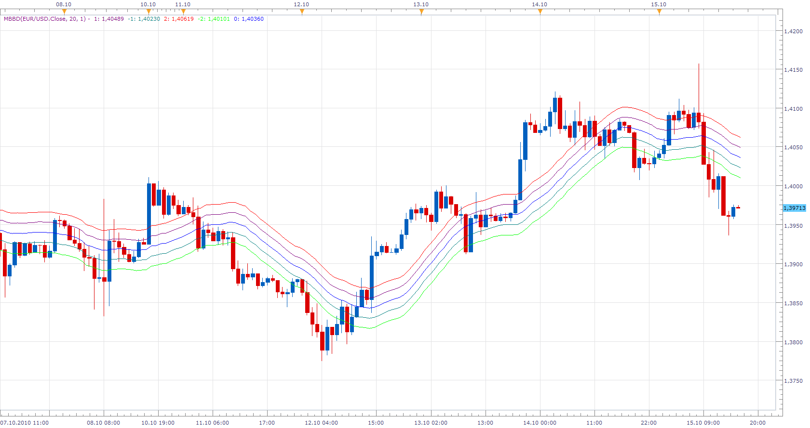

# Multiple Bollinger Bands Deviation Lines

> Source: https://fxcodebase.com/code/viewtopic.php?f=17&t=1319  
> Forum: 17 · Topic 1319 · 8 post(s)

---

## Multiple Bollinger Bands Deviation Lines

**Apprentice** · Sun Jun 13, 2010 9:02 am

*Multiple Bollinger Bands Deviation Lines*

Multiple Bollinger Bands Deviation Lines Options

 

*Multiple Bollinger Bands Deviation Lines Options*

This version of the BB indicator has several parameters
**Number of periods**
Standard parameter defines the time frame for calculating the moving average, required for B.B.

**Number of deviations Line Shown**
Define, How many deviation lines (pairs), we want to draw.

**Number of standard deviations between Lines**
Number of standard deviations between the lines.
Default value is 1.

Example.
If this parameter is set to 1.4 then the indicator draw lines,
 1.4, 1.8, 3.2 ... standard deviations from the value of moving average for the period

The color of the lines are set automatically.

Oh yes, the indicator has one limitation.
You can draw only 100 lines

 

The last update I added a not Bullinger, option.
Along with standard deviation, I added a shift of moving averages.
Style options added.

 [MBBD.lua](files/2520/MBBD.lua)

 

*Rainbow*

---

## Re: Multiple Bollinger Bands Deviation Lines

**zekelogan** · Sun Jun 13, 2010 11:58 am

Yet again, you all rock

---

## Re: Multiple Bollinger Bands Deviation Lines

**zekelogan** · Sun Jun 13, 2010 1:29 pm

Wow. Speechless.

---

## Re: Multiple Bollinger Bands Deviation Lines

**gcardo** · Sun Aug 22, 2010 9:13 pm

Hi Apprentice,
Is it possible to develop a MMBD with different types of mean calculation (like SMA, LWMA, etc)?

Thanks

Gustavo

---

## Re: Multiple Bollinger Bands Deviation Lines

**gcardo** · Mon Aug 23, 2010 7:41 am

Thanks again !

Cheers

---

## Re: Multiple Bollinger Bands Deviation Lines

**Apprentice** · Sun Oct 17, 2010 5:20 am

The last update I added a not Bullinger, option.
Along with standard deviation, I added a shift of moving averages.
Style options added.

---

## Re: Multiple Bollinger Bands Deviation Lines

**Alexander.Gettinger** · Tue Jan 06, 2015 11:44 am

MQL4 version of Multiple Bollinger Bands Deviation Lines: [viewtopic.php?f=38&t=61672](https://fxcodebase.com/code/viewtopic.php?f=38&t=61672).

---

## Re: Multiple Bollinger Bands Deviation Lines

**Apprentice** · Fri Jul 06, 2018 6:48 am

The indicator was revised and updated.
