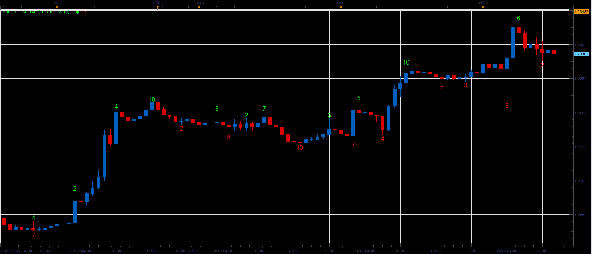

# Multiple fractals

> Source: https://fxcodebase.com/code/viewtopic.php?f=17&t=23328  
> Forum: 17 · Topic 23328 · 2 post(s)

---

## Multiple fractals

**Alexander.Gettinger** · Wed Sep 12, 2012 11:43 am

Indicator calculates the maximum fractal level and displays it on a chart.

For example level 5 for the upper fractal means that the top of the fractal more than 5 bars on the left and 5 bars on the right from the fractal.

 

Download:

 [MultipleFractals.lua](files/40159/MultipleFractals.lua)

---

## Re: Multiple fractals

**Apprentice** · Wed Feb 21, 2018 8:22 am

The Indicator was revised and updated.
