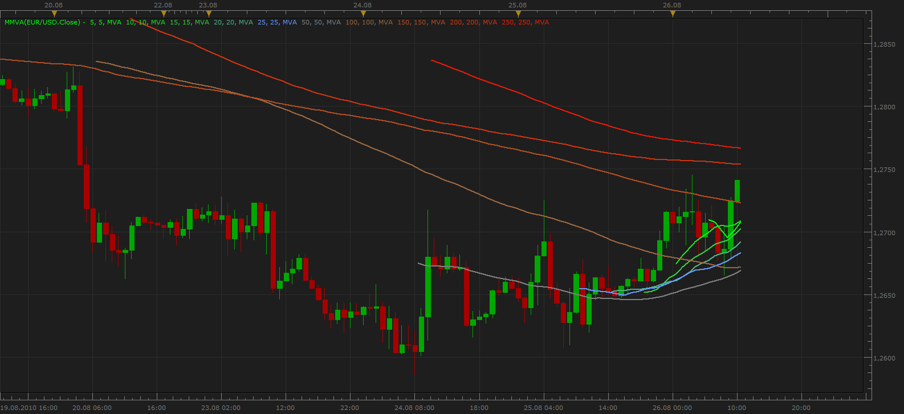
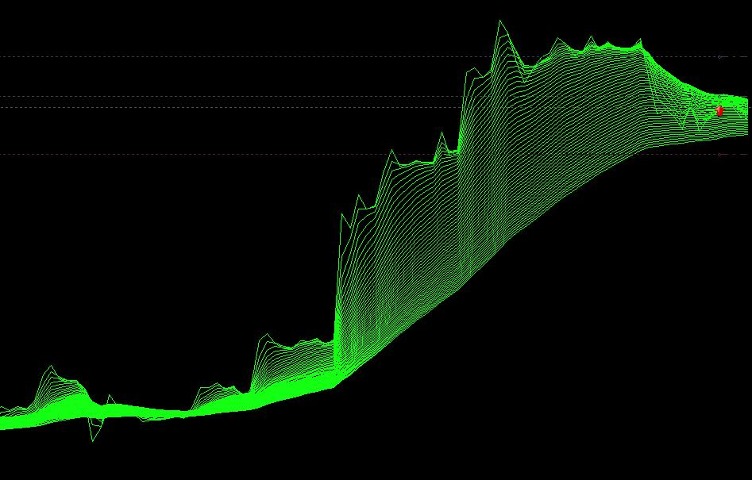
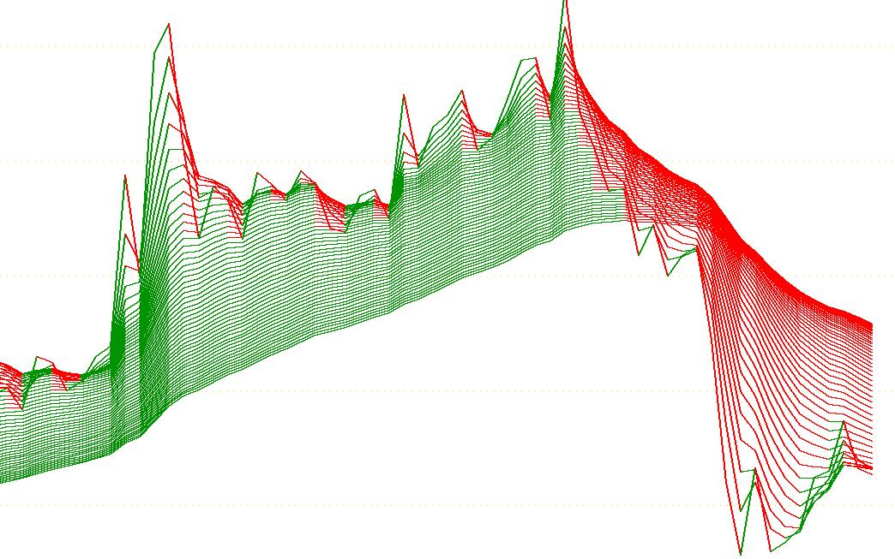
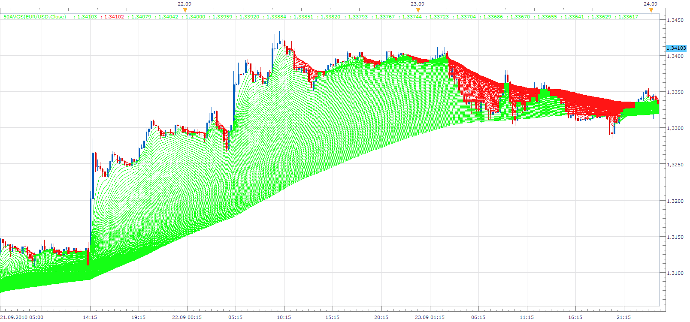

# Multiple Moving Average (MMVA)

> Source: https://fxcodebase.com/code/viewtopic.php?f=17&t=1939  
> Forum: 17 · Topic 1939 · 16 post(s)

---

## Multiple Moving Average (MMVA)

**Apprentice** · Thu Aug 26, 2010 9:12 am

Based on the requests I made the next indicator.

**Allows you to define the following parameters.**
Switching on / off individual average.
Period for the moving average.
Methods of moving average.
Period in which the average is displayed (From the last period)
The line color.

You can define up to ten lines.
I was planning to enable you, the definition of the line number,
However, due to current restrictions is not currently possible.

 [MMVA.lua](files/3933/MMVA.lua)

---

## Re: Multiple Moving Average (MMVA)

**Apprentice** · Tue Aug 31, 2010 2:03 pm

**20 in 1 a.k.a. Averages version**

 [MMVA 20 IN 1.lua](files/4077/MMVA%2020%20IN%201.lua)

To work, you must install AVERAGES Indikcator.
[viewtopic.php?f=17&t=2430](https://fxcodebase.com/code/viewtopic.php?f=17&t=2430)

---

## Re: Multiple Moving Average (MMVA)

**pawelas** · Tue Aug 31, 2010 2:49 pm

Great job,
It is very helpful,
Thank you

---

## Re: Multiple Moving Average (MMVA)

**Pipsology** · Tue Aug 31, 2010 2:58 pm

It works great. Thank you

---

## Re: Multiple Moving Average (MMVA)

**iamaaditya** · Thu Sep 23, 2010 2:28 pm

I have made my own version of multiple moving averages. 50 averages gives a great trend following look.
I have attached the file. But I want to color the avg lines in such a way that if the line is rising it should be colored green and if falling then red, presently it's all Green.

i am attaching the screenshot of what it is , and what i want..
if anyone can do the needful, it will be of immense help...

What_It_Is

 

What I want

 

And the Code is here....

---

## Re: Multiple Moving Average (MMVA)

**DS0167** · Thu Sep 23, 2010 4:39 pm

Very good indicator, thank you

Just one thing, I noticed that the small averages are effetively displayed as requested but for instance the 200 or the 250 can not be displayed over than the initial parameter... For instance if I want to display the 200 back to 500 periods (or 300) it stops at 200 anyway...

Kind regards
DS0167

---

## Re: Multiple Moving Average (MMVA)

**Apprentice** · Fri Sep 24, 2010 6:05 am

I added a few more options.

 [50avgs.lua](files/4764/50avgs.lua)

---

## Re: Multiple Moving Average (MMVA)

**iamaaditya** · Fri Sep 24, 2010 11:43 am

Thanks a lot Apprentice. It was exactly what I wanted and by going through the code learnt few things which i wanted to.
Thanks again and have prosperous trading.

---

## Re: Multiple Moving Average (MMVA)

**Jigit Jigit** · Sat Oct 30, 2010 4:57 pm

Thank for this MMVA, Apprentice.
It's great.

Can you, possibly, add line style and thickness.
Cheers,

---

## Re: Multiple Moving Average (MMVA)

**Apprentice** · Thu Nov 04, 2010 5:42 am

Multiple Moving Average (MMVA) Style Update.
More MA Added.

---

## Re: Multiple Moving Average (MMVA)

**Jigit Jigit** · Thu Nov 04, 2010 2:00 pm

Once again apprentice - you're the man.
Thanks a lot.

The ultimate MMVA would be if you added to this latest version an option for the averages to change colours depending on the trend they are in, e.g. green for an "up trend" red for a "down trend". And if we could actually choose prefered colours...

One could want nothing more.
That would be literally perfect.
Can you do it for us mate?

---

## Re: Multiple Moving Average (MMVA)

**Jigit Jigit** · Thu Nov 04, 2010 3:12 pm

Actually, I guess, the ultimate Multiple Moving Average indicator would be "Moving Average Indicator:20 in 1" (as published here [viewtopic.php?f=17&t=2430](https://fxcodebase.com/code/viewtopic.php?f=17&t=2430)) times 10 in 1 (i.e. 10 of them combined in what Apprentice has just given us as MMVA).

We would have it all then
Can that be done?

---

## Re: Multiple Moving Average (MMVA)

**Apprentice** · Thu Nov 04, 2010 3:32 pm

Regarding the first, request
 wait for the next version of the platform.

Nikolay promised functionality that will allow,
easy implementation of your request, not just in my two.
But a gradual change from green to red in a few thousand shades.

As regards the second application I think it is possible, now.

---

## Re: Multiple Moving Average (MMVA)

**Apprentice** · Thu Nov 04, 2010 3:46 pm

20 in 1 a.k.a. Averages version Added.

---

## Re: Multiple Moving Average (MMVA)

**Apprentice** · Wed Oct 01, 2014 10:43 am

Update.

---

## Re: Multiple Moving Average (MMVA)

**Apprentice** · Sun Feb 18, 2018 7:17 am

The indicator was revised and updated.
