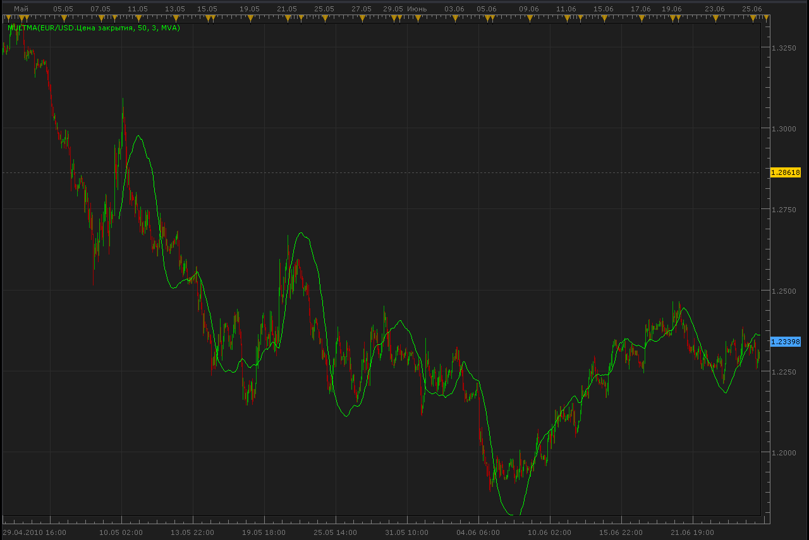

# Multiple Moving Average

> Source: https://fxcodebase.com/code/viewtopic.php?f=17&t=1419  
> Forum: 17 · Topic 1419 · 2 post(s)

---

## Multiple Moving Average

**Alexander.Gettinger** · Mon Jun 28, 2010 8:22 am

This indicator is a development of double and triple moving average ([viewtopic.php?f=17&t=1052&p=2358&hilit=tema#p2358](https://fxcodebase.com/code/viewtopic.php?f=17&t=1052&p=2358&hilit=tema#p2358));

if Mode=1 Indicator = MA (MVA, EMA, ...)
if Mode=2 Indicator = Double MA
if Mode=3 Indicator = Triple MA

 

 [MultMA.lua](files/2770/MultMA.lua)

The indicator was revised and updated

---

## Re: Multiple Moving Average

**Apprentice** · Thu Jan 12, 2017 8:45 am

Indicator was revised and updated.
