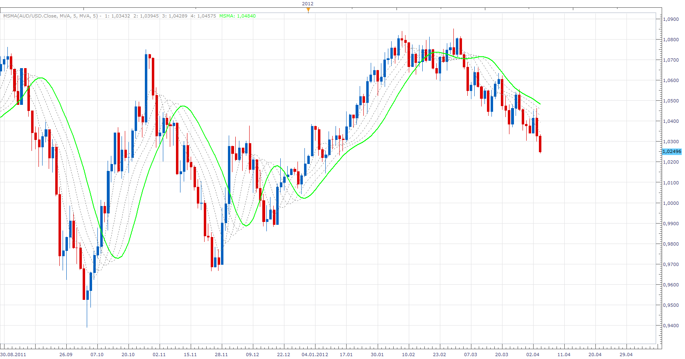

# Multiple smoothing moving Average

> Source: https://fxcodebase.com/code/viewtopic.php?f=17&t=15548  
> Forum: 17 · Topic 15548 · 3 post(s)

---

## Multiple smoothing moving Average

**Apprentice** · Wed Apr 04, 2012 9:48 am

The indicator allows multiple smoothing the initial data.
The user can choose the period and method of moving average,
Number of repetitions.
Each successive repetitions, using the data of previous step.

 [MSMA.lua](files/29315/MSMA.lua)

The indicator was revised and updated

---

## Re: Multiple smoothing moving Average

**Alexander.Gettinger** · Tue Nov 18, 2014 4:51 pm

MQL4 version of Multiple smoothing moving Average: [viewtopic.php?f=38&t=61472](https://fxcodebase.com/code/viewtopic.php?f=38&t=61472).

---

## Re: Multiple smoothing moving Average

**Apprentice** · Wed Jun 28, 2017 5:26 am

The indicator was revised and updated.
