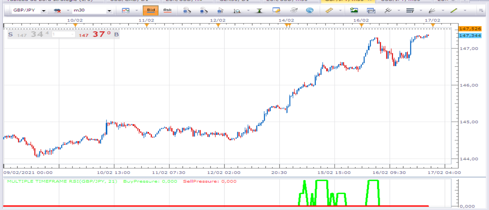
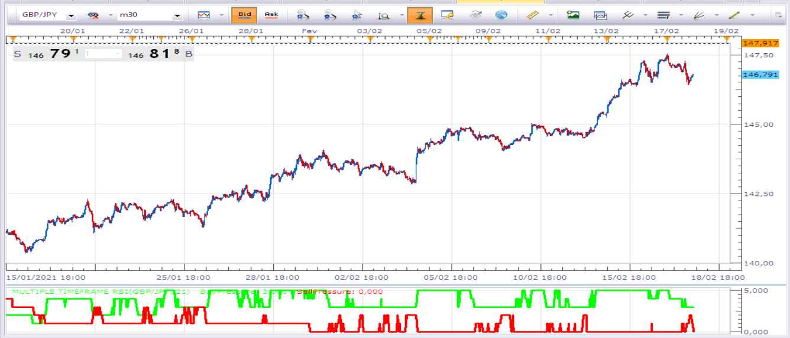

# Multiple Timeframe Stochastic

> Source: https://fxcodebase.com/code/viewtopic.php?f=17&t=70592  
> Forum: 17 · Topic 70592 · 12 post(s)

---

## Multiple Timeframe Stochastic

**Apprentice** · Mon Nov 02, 2020 10:28 am

Based on “Voting With Multiple Timeframes,” which appeared in the
August 2020 issue of S&C, author F. Arden Thomas

 [RAW_STOCHASTIC.lua](files/138618/RAW_STOCHASTIC.lua)

 [Multiple Timeframe Stochastic.lua](files/138618/Multiple%20Timeframe%20Stochastic.lua)

---

## Re: Multiple Timeframe Stochastic

**fortesan9** · Thu Feb 04, 2021 2:14 am

Hello there Apprentice & Co

iS there a strategy for these methodologies?

Respectfully
fortesan9

---

## Re: Multiple Timeframe Stochastic

**Apprentice** · Thu Feb 04, 2021 7:36 am

Was written based on request.
Can write one if you can provide the rules.

---

## Re: Multiple Timeframe Stochastic

**mulligan** · Thu Feb 04, 2021 11:02 am

If I may offer a possible strategy.
1. Choose an action level. Example 2.1 (on right hand side of screen)
2. Strategy buy when buy pressure rises above 2.1 and sell pressure is below 2.1, exit if either changes.
3. Strategy sell when sell pressure rises above 2.1 and buy pressure is below 2.1, exit if either changes.

Adding a value line option to the indicator with normal options of color, etc. would be visually helpful.

Thank you

---

## Re: Multiple Timeframe Stochastic

**Apprentice** · Sat Feb 06, 2021 10:23 am

Your request is added to the development list.
Development reference 158.

---

## Re: Multiple Timeframe Stochastic

**Apprentice** · Mon Feb 08, 2021 3:32 am

Try this version.
[viewtopic.php?f=31&t=70892](https://fxcodebase.com/code/viewtopic.php?f=31&t=70892)

---

## Re: Multiple Timeframe Stochastic

**Avignon** · Wed Feb 10, 2021 5:27 pm

Someone has a link on “Voting With Multiple Timeframes"?

Thanks.

---

## Re: Multiple Timeframe Stochastic

**Avignon** · Sun Feb 14, 2021 5:29 pm

Looking at the script, I see that there is an oversold or overbought condition.

If I want to change the indicator using the RSI, that's fine, but if I want to use MACD or Elder, how do I do it? Do we have to completely rewrite the script?

---

## Re: Multiple Timeframe Stochastic

**Apprentice** · Tue Feb 16, 2021 2:39 pm

Rewrite or create a generic version.

---

## Re: Multiple Timeframe Stochastic

**Avignon** · Tue Feb 16, 2021 5:00 pm

With the RSI (and default settings), I have something strange.

Did I miss something?

 

 [Multiple Timeframe RSI.lua](files/140787/Multiple%20Timeframe%20RSI.lua)

---

## Re: Multiple Timeframe Stochastic

**Apprentice** · Wed Feb 17, 2021 10:29 am

Looks ok.

---

## Re: Multiple Timeframe Stochastic

**Avignon** · Wed Feb 17, 2021 3:13 pm

This was resolved by launching the RSI indicator.

 

