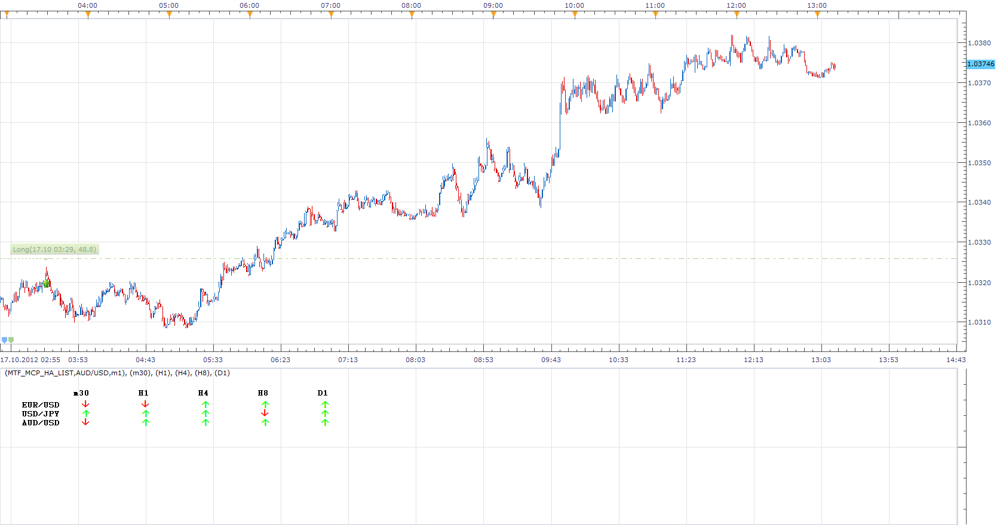
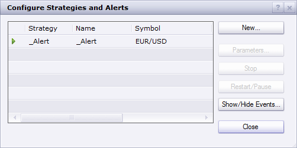

# Multitimeframe Heikin-Ashi (MTF HA)

> Source: https://fxcodebase.com/code/viewtopic.php?f=17&t=7459  
> Forum: 17 · Topic 7459 · 38 post(s)

---

## Multitimeframe Heikin-Ashi (MTF HA)

**Apprentice** · Thu Oct 20, 2011 1:43 pm

Blue border line suggests, price and HA have the opposite indication.

 [MFT HA .lua](files/16555/MFT%20HA%20.lua)

 

 [MTF_MCP_HA_List.lua](files/16555/MTF_MCP_HA_List.lua)

---

## Re: Multitimeframe Heikin-Ashi (MTF HA)

**taypot** · Fri Oct 21, 2011 5:57 am

Hello,

New to this board and to platform. I have downloaded your impressive indicator but it is switching off after a while on eurusd 15 min with an error message about being out of range but ok on usdollar 15 min. I have just reapplied it to the eurusd 1 hr and it stayed for a while then gave error message and switched off.

An error occurred during the calculation of the indicator 'MFT HA '. The error details: [string "MFT HA .lua"]:157: Index is out of range

It is still on my usdollar chart. Hope this helps.

---

## Re: Multitimeframe Heikin-Ashi (MTF HA)

**Apprentice** · Fri Oct 21, 2011 8:05 am

I will continue with testing.
But for now I have not managed to reproduce this error.

---

## Re: Multitimeframe Heikin-Ashi (MTF HA)

**taypot** · Fri Oct 21, 2011 4:39 pm

It may be because I did not restart platform after loading indicator. It seems to be working now. Excellent work thank you.

---

## Re: Multitimeframe Heikin-Ashi (MTF HA)

**nookie** · Tue Oct 25, 2011 4:34 pm

Interesting indicator, but I'm testing the new beta TS II and it looks kind of really weird there.. shape of the lines is something like the following instead of straight lines... is it a bug ?
_____
)____)

On 1 pair after 30-40 min. stopped working and showed "Error!" with a blank indicator field, also the "set as default" and "reset" are not working properly on the Beta of TSII

---

## Re: Multitimeframe Heikin-Ashi (MTF HA)

**Apprentice** · Tue Oct 25, 2011 4:59 pm

Thanks for your report.

I have post it on my bord.
Probably the question of compatibility.

---

## Re: Multitimeframe Heikin-Ashi (MTF HA)

**nookie** · Tue Oct 25, 2011 6:24 pm

No worries.. I tried it on my old version TS II, same issue and here is the error message from the indicators log:

An error occurred during the calculation of the indicator 'MTF HA '. The error details: [string "MTF HA .lua"]:157: Index is out of range.

I think could be probably issue with the update function as when I click on the indicator twice when it stops working and then click only OK it refreshed and starts working again

---

## Re: Multitimeframe Heikin-Ashi (MTF HA)

**virgilio** · Wed Oct 26, 2011 7:30 am

I have downloaded this indicator but it switches off after some time. I used it on EURUSD 15 min. Any ideas if it can be fixed?
Thank you for your help.

---

## Re: Multitimeframe Heikin-Ashi (MTF HA)

**Apprentice** · Wed Oct 26, 2011 11:21 am

The problem has been corrected.

---

## Re: Multitimeframe Heikin-Ashi (MTF HA)

**nookie** · Thu Oct 27, 2011 4:09 am

its ok

---

## Re: Multitimeframe Heikin-Ashi (MTF HA)

**ClivePackham** · Mon Jan 16, 2012 4:23 am

Hi Apprentice

Just downloaded your MTF HA indicator. Awesome, absolutely love it!

Many thanks this will turn my trading around, will let you know how I get on.

Many thanks again for awesome indicator.

Happy Trading, Clive.

---

## Re: Multitimeframe Heikin-Ashi (MTF HA)

**iarudi** · Sun Jan 22, 2012 7:20 am

Hi

This is a great indicator. Thank you for developing it.
is it possible to develop an alert for change in Heikin-Ashi oscillator color of daily line sent to email?

Also when I loaded the oscillator I see only green and red. I do not see neutral color on any of the time frames of the oscillator. does it have to with the settings? could you advise how I can get the neutral color on the oscillator when the trend is shifting.

Thank you very much for your time

---

## Re: Multitimeframe Heikin-Ashi (MTF HA)

**Apprentice** · Sun Jan 22, 2012 5:54 pm

What is the definition for Neutral?

---

## Re: Multitimeframe Heikin-Ashi (MTF HA)

**lisa_baby_xx** · Mon Oct 15, 2012 11:35 am

Hi,

I would like to request a modification to this indicator:
Can you make this indicator MCP, where a list of subscribed fx pairs has the MTF HAS direction with user-defined TFs. A "send email" parameter would also be nice.

I think this would be an excellent addition to this indicator.

Thank you for your time.
Take care sweetie. X.
lisa_baby_xx

---

## Re: Multitimeframe Heikin-Ashi (MTF HA)

**Apprentice** · Mon Oct 15, 2012 11:47 am

Indicator similar to this one.
[viewtopic.php?f=17&t=24056&p=41388&hilit=MTF+MCP#p41388](https://fxcodebase.com/code/viewtopic.php?f=17&t=24056&p=41388&hilit=MTF+MCP#p41388)

"user-defined TFs " makes me uncertain on what you want.

---

## Re: Multitimeframe Heikin-Ashi (MTF HA)

**lisa_baby_xx** · Mon Oct 15, 2012 11:58 am

Hi Apprentice,

I have attached an image of the desired 'look' of the indicator.
When all 5 TFs are Green or Red a email/visual alert will notify the user of this.

Hope this helps sweetie.
lisa_baby_xx

---

## Re: Multitimeframe Heikin-Ashi (MTF HA)

**Apprentice** · Mon Oct 15, 2012 2:33 pm

Your request is added to the development list.

---

## Re: Multitimeframe Heikin-Ashi (MTF HA)

**Apprentice** · Wed Oct 17, 2012 12:09 pm

I have added Version without Email Alerts in topmost post.

This indicator is written for the current beta version of TS.
Beta Version can be found here.
[viewtopic.php?f=30&t=20383](https://fxcodebase.com/code/viewtopic.php?f=30&t=20383)

---

## Re: Multitimeframe Heikin-Ashi (MTF HA)

**lisa_baby_xx** · Wed Oct 17, 2012 3:15 pm

Hi Apprentice,

Thanks.
But I am receiving an error message:

> [String "MTF_MCP_HA_List.lua"]: 109: Cannot recognise host command

Can you tell me what this means?

Many thanks sweetie. X
lisa_baby_xx

PS: Can you create an alert for this indicator? If so, thanks again.

---

## Re: Multitimeframe Heikin-Ashi (MTF HA)

**Apprentice** · Wed Oct 17, 2012 4:28 pm

As I wrote, this indicator is for the Beta version of Trading Station.
You have to have it,to be able to use it.
Yes, i can, but i have some problems, I hope i will eliminate them tomorrow.

In matter of fact, you can already download indicator, here,
[download/file.php?id=7705](https://fxcodebase.com/code/download/file.php?id=7705)
however it is not fully tested, and does not work on some systems.
If you're willing, you can give a try.

---

## Re: Multitimeframe Heikin-Ashi (MTF HA)

**lisa_baby_xx** · Tue Oct 23, 2012 7:56 am

Hi Apprentice,

This indi is excellent!
May I add a recommendation: **Show/Hide the various TFs.**

Q) Does this indi update itself or do I have to do it manually?

Thank you for your time. X.
lisa_baby_xx

---

## Re: Multitimeframe Heikin-Ashi (MTF HA)

**lisa_baby_xx** · Tue Oct 23, 2012 8:58 am

Hi Apprentice,

There is an error with this indicator:
Under "Postiv Consensus Sound" and "Negativ Consensus Sound" there are two sound selector parameters. What is the the other used for?

Do these show a visual alert?

Thanks again. X
lisa_baby_xx

---

## Re: Multitimeframe Heikin-Ashi (MTF HA)

**Apprentice** · Tue Oct 23, 2012 9:20 am

Try Updated Version.

---

## Re: Multitimeframe Heikin-Ashi (MTF HA)

**lisa_baby_xx** · Tue Oct 23, 2012 9:49 am

Hi Apprentice,

In my last two posts on the previous page, I was referring to the indi "MTF_MCP_HA_List_WITH_ALERT__TEMPLATE.lua"

Sorry for any confusion. X

lisa_baby_xx

---

## Re: Multitimeframe Heikin-Ashi (MTF HA)

**Apprentice** · Tue Oct 23, 2012 11:04 am

I'm aware of that.

---

## Re: MTF_MCP_HA_List_WITH_ALERT__TEMPLATE

**lisa_baby_xx** · Tue Oct 23, 2012 11:43 am

Hi Apprentice,

Thanks.
I am still receiving no visual or email notifications.

Can you mod the indi so that the notifications occur on closed bar values only?

Again, many thanks for your time. X
lisa_baby_xx

---

## Re: Multitimeframe Heikin-Ashi (MTF HA)

**Apprentice** · Tue Oct 23, 2012 12:20 pm

In order to this could work, install and activate Alert Signal.

---

## Re: MTF_MCP_HA_List_WITH_ALERT__TEMPLATE

**lisa_baby_xx** · Tue Oct 23, 2012 1:15 pm

Hi again,

Can you fix the following problems with this indi:

-I have installed "_Alert" but I am still not receieving any visual notifications.
-Alerts will only occur on closed bar values.

Can you add the following condition:
-If any TF is opposite to main trend then show message "No Trade" or "Close Trade." Eg:

If open position is BUY(green) and one TF displays a RED arrow several closed bars ahead, then a email/visual message will display showing "Close Trade."

(Again) Many thanks for your time. X-X.
lisda_baby_xx

---

## Re: Multitimeframe Heikin-Ashi (MTF HA)

**Apprentice** · Tue Oct 23, 2012 1:55 pm

Do you have activ _Alert Signal, Like i have Here?

Can you contact me on my private mail.

---

## Private Job Request USD160

**lisa_baby_xx** · Wed Oct 24, 2012 1:30 pm

Hi Apprentice,

I would like an indicator created that works by listing subscribed FX Pairs and then looking at the Heiken Ashi Trend direction plus one bar back (See image.)

I also need a spread column added to specify what the spread is.

Alert and Email Parameters.
These will be added so when all TFs and 'look back' (-1) bars are GREEN we BUY and if they are RED we SELL.
Anything other than this will generate a 'No Trade' or 'Close Trade' notification (if trade is OPEN.)

The alerts/email will work on CLOSED BAR VALUES ONLY.

Extra Parameters
Each TF and its 'look back' bar will have a show/hide switch.

I have set aside USD160 for this job. If it is not enough, let me know how much you require and the estimated time of completion.

Thats it.
I look forward to your replies.
lisa_baby_xx

---

## Re: Multitimeframe Heikin-Ashi (MTF HA)

**Apprentice** · Thu Oct 25, 2012 1:58 am

You want to modify MTF_MCP_List_with_Alert_Template.
Add -1, Spread, and Buy / Sell / Neutral Text Label.
Is so, i can squeeze you in my scheduler next week.
Contact me by email.
Just for info, Indicator can not be traded.

---

## Re: Multitimeframe Heikin-Ashi (MTF HA)

**rgirhotra** · Sun Sep 04, 2016 7:46 am

Hi Apprentice,

I can't find the MTF_MCP_HA_List_WITH_ALERT__TEMPLATE.lua indicator.

Can you point me to that?

Thanks,
rgirhotra

---

## Re: Multitimeframe Heikin-Ashi (MTF HA)

**Apprentice** · Mon Sep 05, 2016 4:06 am

I believe, does not exist anymore.
lisa_baby?

---

## Re: Multitimeframe Heikin-Ashi (MTF HA)

**rgirhotra** · Tue Sep 06, 2016 3:13 pm

Hi Apprentice,

Is it possible to create that indicator again?

Thanks,
Rgirhotra

---

## Re: Multitimeframe Heikin-Ashi (MTF HA)

**Apprentice** · Wed Sep 07, 2016 3:57 am

Will ask lisa_baby if this indicator still exists.

---

## Re: Multitimeframe Heikin-Ashi (MTF HA)

**Apprentice** · Sun Feb 04, 2018 7:59 am

The indicator was revised and updated.

---

## Re: Multitimeframe Heikin-Ashi (MTF HA)

**Sumone** · Wed Jan 12, 2022 9:43 pm

> **Apprentice wrote:**
> The indicator was revised and updated.

Hi Apprentice,
Happy New Year and Happpy Trading. Hope you are even more healthier, wealthier and wiser from the
last year .

And thanks for helping the trading community out. I came across this post when was looking for #MFT Heiken Ashi MT5 indicator. But unable to find it in this forum. If it is my mistake, can you please post the link? If not then is it possible to create one fr MT5 dear? Appreciate your help and thanks in advance.

---

## Re: Multitimeframe Heikin-Ashi (MTF HA)

**Apprentice** · Fri Jan 14, 2022 7:04 am

Your request is added to the development list.
Development reference 30.
