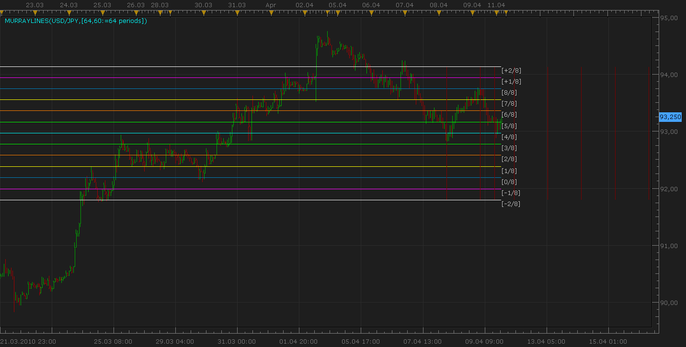

# Murray Math lines

> Source: https://fxcodebase.com/code/viewtopic.php?f=17&t=608  
> Forum: 17 · Topic 608 · 45 post(s)

---

## Murray Math lines

**Nikolay.Gekht** · Sun Apr 11, 2010 8:24 pm

Please, find the detailed explanation of the Murray Math lines technique here: [http://www.foretrade.com/MM_description.htm](http://www.foretrade.com/MM_description.htm)

The short description of the lines is below:

> **Tim Kruzel wrote:**
> Characteristics of MMLs
>
> * Since, according to Gann, prices move in 1/8's, these 1/8's act as points of price support and resistance as an entity's price changes in time. Given this 1/8 characteristic of price action, Murrey assigns properties to each of the MML's in an a given octave. These properties are listed here for convenience.
>
>
> * 8/8 th's and 0/8 th's Lines (Ultimate Resistance)
> These lines are the hardest to penetrate on the way up, and give the greatest support on the way down. (Prices may never make it thru these lines).
>
>
> * 7/8 th's Line (Weak, Stall and Reverse)
> This line is weak. If prices run up too far too fast, and if they stall at this line they will reverse down fast. If prices do not stall at this line they will move up to the 8/8 th's line.
>
>
> * 6/8 th's and 2/8 th's Lines (Pivot, Reverse)
> These two lines are second only to the 4/8 th's line in their ability to force prices to reverse. This is true whether prices are moving up or down.
>
>
> * 5/8 th's Line (Top of Trading Range)
> The prices of all entities will spend 40% of the time moving between the 5/8 th's and 3/8 th's lines. If prices move above the 5/8 th's line and stay above it for 10 to 12 days, the entity is said to be selling at a premium to what one wants to pay for it and prices will tend to stay above this line in the "premium area". If, however, prices fall below the 5/8 th's line then they will tend to fall further looking for support at a lower level.
>
>
> * 4/8 th's Line (Major Support/Resistance)
> This line provides the greatest amount of support and resistance. This line has the greatest support when prices are above it and the greatest resistance when prices are below it. This price level is the best level to sell and buy against.
>
>
> * 3/8 th's Line (Bottom of Trading Range)
> If prices are below this line and moving upwards, this line is difficult to penetrate. If prices penetrate above this line and stay above this line for 10 to 12 days then prices will stay above this line and spend 40% of the time moving between this line and the 5/8 th's line.
>
>
> * 1/8 th Line (Weak, Stall and Reverse)
> This line is weak. If prices run down too far too fast, and if they stall at this line they will reverse up fast. If prices do not stall at this line they will move down to the 0/8 th's line.
>
>
> * Completing the square in time requires the identification of the upper and lower price boundaries of the square. These boundaries must be MML's. The set of all possible MML's that can be used as boundaries for the square were specified with the selection of the scale factor (rhythm) SR. Given SR, all of the possible MMMI's, mMMI's, bMMI's and MMML's, mMML's, and bMML's can be calculated as shown above. The following rules dictate what the lower and upper boundaries of the square in time will be.

 [MurreyLines.lua](files/1077/MurreyLines.lua)

 [Historical MurreyLines.lua](files/1077/Historical%20MurreyLines.lua)

 [Candle By Candle Murrey Lines.lua](files/1077/Candle%20By%20Candle%20Murrey%20Lines.lua)

Murray Math lines based strategy
[viewtopic.php?f=31&t=65388](https://fxcodebase.com/code/viewtopic.php?f=31&t=65388)

The indicator was revised and updated

---

## Re: Murray Math lines

**Laurus12** · Mon Apr 12, 2010 9:50 am

Thanks for a great indicator. I am wondering if is possible to move the labels for the lines a couple of notches more to the right? The way it is now the active bar or candle gets hidden behind the labels.

Thanks,
Laurus12

---

## Re: Murray Math lines

**thetruth** · Fri Oct 22, 2010 8:18 am

i move the labels, with just some spaces in code.

---

## Re: Murray Math lines

**Laurus12** · Sun Oct 31, 2010 4:30 pm

Thank you very much Thetruth

---

## Re: Murray Math lines

**Jigit Jigit** · Thu Nov 04, 2010 1:47 pm

Thanks a million guys. It looks really promising.

Please forgive me perhaps a silly question...

How does it paint its lines?
Are the lines on the historical data repainted once a new high appears?
Is it possibly to test it manually on historical data?

Cheers everybody

---

## Re: Murray Math lines

**leftygolfer** · Fri Dec 03, 2010 5:43 am

Thanks so much for this indicator - love it. One more question:

Would it be possible to display the actual price along the label e.g "[4/8] - 1.3184"

Sorry, I'm not a programmer, but this would be a great feature. Thanks much again

---

## Re: Murray Math lines

**Apprentice** · Fri Dec 03, 2010 6:04 am

Yes it is possible,
we'll add this as an option.

---

## Re: Murray Math lines

**sniper012** · Sun May 08, 2011 6:11 pm

I have a request. Hopefully it is possible to add an actual price value to the lines. It's kinda like you have to estimate the actual price value. Let's say that you are using the 8/8 line as a target, it would just be helpful if we could see exactly what the price was at that level.

---

## Re: Murray Math lines

**Apprentice** · Mon May 09, 2011 3:56 am

Your request has been added to developmental cue.

---

## Re: Murray Math lines

**leftygolfer** · Mon May 09, 2011 2:35 pm

Try this one for a start ... it's my first fxcodebase project, so please be kind

---

## Re: Murray Math lines

**Apprentice** · Mon May 09, 2011 3:12 pm

Looks good to me.

---

## Re: Murray Math lines

**Rectav** · Fri Jul 22, 2011 4:47 pm

Hello,

and thank you for this indicator. Would it be possible to have the ability to hide some of the lines.

I only use the three extreme line.

Thanks in advance.

Regards,

Sam

---

## Re: Murray Math lines

**Apprentice** · Fri Jul 22, 2011 5:18 pm

Your request has been added to our database.

---

## Re: Murray Math lines

**Rectav** · Sat Jul 23, 2011 2:06 pm

Thank you Apprentice.

Have a good one.

---

## Re: Murray Math lines

**RJH501** · Sun Aug 14, 2011 4:12 am

Nikolay,

Would you please add the ability to select the color of the label fonts. As it is now the black font will not allow you to read the labels on a black chart background.

Thank you for your time and consideration.

Richard

---

## Re: Murray Math lines

**Apprentice** · Sun Aug 21, 2011 12:19 pm

Your Request is added to our database.

---

## Re: Murray Math lines

**Apprentice** · Mon Aug 22, 2011 1:43 am

Stype Option Added to Top Most Post.

---

## Re: Murray Math lines

**RJH501** · Mon Aug 22, 2011 2:52 am

Thank you Apprentice!

Richard

---

## Re: Murray Math lines-dashboard

**luciana** · Mon Aug 22, 2011 12:13 pm

Hi, is it possible to develop the dashboard for MML (see attachment)? Thanks. Luciana

---

## Re: Murray Math lines

**Apprentice** · Mon Aug 22, 2011 1:01 pm

I will try to offer this solution as soon as possible.

---

## Re: Murray Math lines

**luciana** · Mon Aug 22, 2011 1:33 pm

thank you

---

## Re: Murray Math lines

**luciana** · Tue Aug 23, 2011 2:41 pm

Thank you. The idea behind the MMLdashboard is that just looking to it, we glance in a moment where the current price is related to the MM'sline for each and every pair we choose to have on the dashboard. In the picture I posted, the current price appears in a box -same color as the corresponding MM'sline, below or above one line, for each and every pair. I mean is a dynamic indicator, actively the price moves on the dashboard. In the picture was difficult to spot it, but if you can code it this way, that would be beneficial for many MML users. Thanks Cheers.

---

## Re: Murray Math lines

**Apprentice** · Tue Aug 23, 2011 3:44 pm

I have not had time to implement this functionality.
I'm trying to find the best solution for it.

---

## Re: Murray Math lines

**Apprentice** · Tue Aug 23, 2011 4:31 pm

You can test my Last version.
[viewtopic.php?f=17&t=6030&p=14097#p14097](https://fxcodebase.com/code/viewtopic.php?f=17&t=6030&p=14097#p14097)
Improvements to the interface are still needed.

---

## Re: Murray Math lines

**RJH501** · Wed Jul 25, 2012 8:23 am

Gentlemen,

Would you please add the capability to change the line width.

Thank you,

RJH

---

## Re: Murray Math lines

**rose123** · Fri Nov 23, 2012 1:52 am

hi,

can you add show/hide option for each line.

( if i want to seen 0/8 and 8/8 line only . i want to hide other lines , is it possible)

---

## Re: Murray Math lines

**Apprentice** · Fri Nov 23, 2012 3:53 am

This is possible.
Will do it.

---

## Re: Murray Math lines

**Apprentice** · Fri Nov 23, 2012 5:19 am

Line Selector Option Added to TopMost Post.

---

## Re: Murray Math lines

**rose123** · Fri Nov 23, 2012 6:14 am

Thank you for adding selector option.

in selector option 0/8 is missing , can you correct it.

---

## Re: Murray Math lines

**Apprentice** · Fri Nov 23, 2012 8:43 am

corrected.

---

## Re: Murray Math lines

**Swissy** · Sun Dec 22, 2013 9:57 am

Is it possible to allow size of period in minutes to be set like an MTF? For example, I would like to have MML draw the lines based on my setting of 1440(daily) to be seen on 4hr chart or weekly murrey settings to be seen on 4hr chart. Hope this is understandable. Right now, you can only set it up to a maximum of 1000 minutes. Thank you.

Would also be nice to be able to select line thickness and line style. Right now, it just makes the chart too cluttered with those thick lines. Thank you once again. I am new to Marketscope, after many years on MT4.

---

## Re: Murray Math lines

**Apprentice** · Mon Dec 23, 2013 11:38 am

See, First (Topmost) Post.
The limit is increased to 10,000.
Style Options Added.

---

## Re: Murray Math lines

**Swissy** · Mon Dec 23, 2013 4:19 pm

> **Apprentice wrote:**
> See, First (Topmost) Post.
> The limit is increased to 10,000.
> Style Options Added.

Perfect. Thank you. Would you be kind as to tell me what the vertical lines are for? What do they represent? I've never seen that on an MML MT4 version before.

Thanks again. Merry Christmas.

---

## Re: Murray Math lines

**Apprentice** · Wed Dec 25, 2013 2:36 pm

Here you can find a detailed description.
[http://www.foretrade.com/MM_description.htm](http://www.foretrade.com/MM_description.htm)

---

## Re: Murray Math lines

**Stance** · Mon Jun 01, 2015 8:24 pm

Is an alert possible for this indicator?

---

## Re: Murray Math lines

**Apprentice** · Sun Jun 07, 2015 4:05 am

Sure.
I guess. Alerts will be given on-line cross?

---

## Re: Murray Math lines

**Stance** · Tue Jun 09, 2015 2:03 am

Yes, can certain lines be set on and off so when the price crosses a certain line, then an alert is sent out.

---

## Re: Murray Math lines

**Apprentice** · Wed Jun 10, 2015 3:14 am

Your request is added to the development list.

---

## Re: Murray Math lines

**Apprentice** · Fri Jun 16, 2017 5:39 am

The indicator was revised and updated.

---

## Re: Murray Math lines

**conjure** · Wed Nov 22, 2017 7:59 am

Is it possible to have a Custom Historical Murray Math lines indicator,
like Custom Historical Pivot shows its Historical lines?

---

## Re: Murray Math lines

**Apprentice** · Thu Nov 23, 2017 6:36 am

Historical MurreyLines.lua added.

---

## Re: Murray Math lines

**Apprentice** · Thu Nov 23, 2017 6:44 am

Candle By Candle Murrey Lines.lua added.

---

## Re: Murray Math lines

**Finny7** · Wed Jan 24, 2018 4:06 pm

Can anybody explain me what is the number of periods and size of the period in minutes?

---

## Re: Murray Math lines

**Finny7** · Thu Jan 25, 2018 12:23 pm

Scratched that last question about the periods. I got it figured out. But someone tell me what is the color of the time line represent?

---

## Re: Murray Math lines

**Apprentice** · Fri Jan 26, 2018 12:04 pm

Color or vertical lines.
