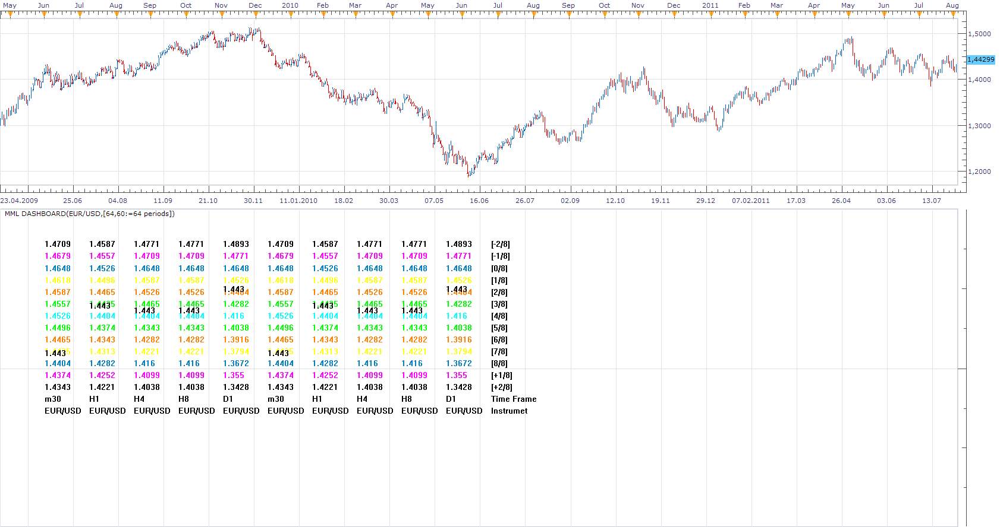

# Murrey Math Lines Dashboard

> Source: https://fxcodebase.com/code/viewtopic.php?f=17&t=6030  
> Forum: 17 · Topic 6030 · 6 post(s)

---

## Murrey Math Lines Dashboard

**Apprentice** · Tue Aug 23, 2011 4:29 pm

 [MML Dashboard.lua](files/14097/MML%20Dashboard.lua)

This is Multi Time Frame, Multi Currency Pair Murrey Math Lines Dashboard.

---

## Re: Murrey Math Lines Dashboard

**Coondawg71** · Tue Aug 23, 2011 7:24 pm

Apprentice, Sir, you are THE man!

---

## Re: Murrey Math Lines Dashboard

**Coondawg71** · Fri Sep 07, 2012 10:24 am

I may be wrong, but I just noticed that the MML dashboard levels are "upside down" compared to the MML indicator.

sjc

---

## Re: Murrey Math Lines Dashboard

**amirpali** · Tue Jun 25, 2013 8:53 pm

Do you have a converted file for MT4?

---

## Re: Murrey Math Lines Dashboard

**Apprentice** · Fri Jun 28, 2013 2:24 am

No it is not.
Your request is added to the development list.

---

## Re: Murrey Math Lines Dashboard

**Apprentice** · Sat May 05, 2018 6:33 am

The indicator was revised and updated.
