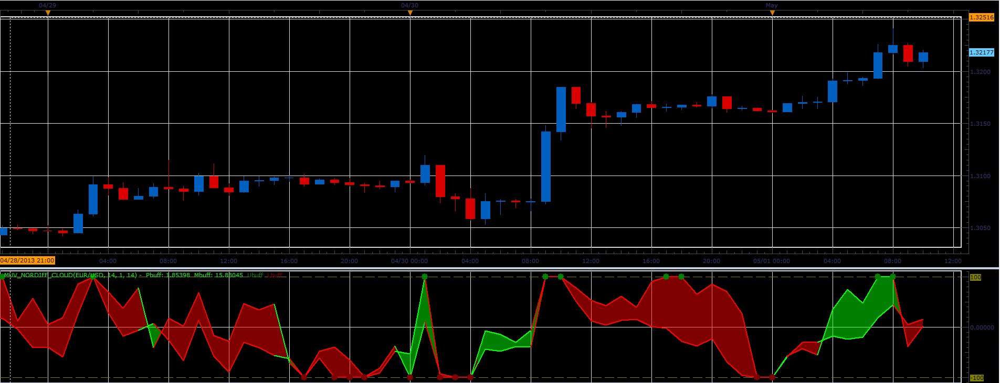

# MUV_NorDIFF cloud oscillator

> Source: https://fxcodebase.com/code/viewtopic.php?f=17&t=36270  
> Forum: 17 · Topic 36270 · 2 post(s)

---

## MUV_NorDIFF cloud oscillator

**Alexander.Gettinger** · Thu May 02, 2013 11:08 am

This oscillator is a ported MQL5 oscillator from [http://www.mql5.com/ru/code/1666](http://www.mql5.com/ru/code/1666) (in Russian).

 

Download:

 [MUV_NorDIFF_Cloud.lua](files/60897/MUV_NorDIFF_Cloud.lua)

For this indicator must be installed Averages indicator ([viewtopic.php?f=17&t=2430](https://fxcodebase.com/code/viewtopic.php?f=17&t=2430)) and XMUV indicator ([viewtopic.php?f=17&t=36267](https://fxcodebase.com/code/viewtopic.php?f=17&t=36267)).

The indicator was revised and updated

---

## Re: MUV_NorDIFF cloud oscillator

**Apprentice** · Tue May 23, 2017 6:23 am

Indicator was revised and updated.
