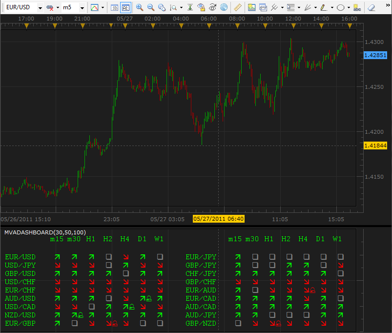
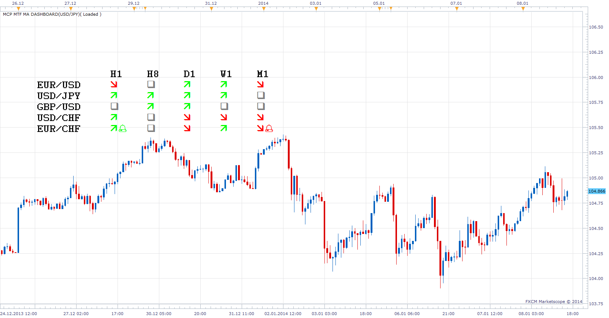

# MVA Dashboard

> Source: https://fxcodebase.com/code/viewtopic.php?f=17&t=4504  
> Forum: 17 · Topic 4504 · 102 post(s)

---

## MVA Dashboard

**vstrelnikov** · Fri May 27, 2011 3:11 pm

Indicator analyze 3 simple MVA values (Short, Medium, Long) and displays dashboard for specified set of currency pairs and periods. The dashboard legenda is the following.

- Red arrow displayed if ShortMVA < MediumMVA < LongMVA
- Green arrow displayed if ShortMVA > MediumMVA > LongMVA

The bell sign is displayed next to the arrow if current price is between Short and Medium MVAs.
Please, note that you should be subscribed to all pairs you want to be displayed.

 

 [MVADashboard.lua](files/11122/MVADashboard.lua)

 

Multi currency pair, Multi Time Frame, MA Dashboard brings major MVADashboard update.
Allows customization or MA Type and MA Period for each Time Frame. All Instruments are now available.

 [MCP MTF MA Dashboard.lua](files/11122/MCP%20MTF%20MA%20Dashboard.lua)

MT4/MQ4 version.
[viewtopic.php?f=38&t=63528](https://fxcodebase.com/code/viewtopic.php?f=38&t=63528)

---

## Re: MVA Dashboard

**oritzbaba** · Thu Jun 02, 2011 3:40 am

Hi,

Please are there any other indicators/signals/strategy that gives a pictorial representation (dashboard) of what a particular or several indicators is doing on all the various time frames like this MVA Dashboard?

Please help.

Thanks.

---

## Re: MVA Dashboard

**Apprentice** · Thu Jun 02, 2011 6:16 pm

Filter (Bulls and Bears)
[viewtopic.php?f=17&t=3262&p=7733&hilit=list#p7733](https://fxcodebase.com/code/viewtopic.php?f=17&t=3262&p=7733&hilit=list#p7733)

Movers and Shakers (Price)
[viewtopic.php?f=17&t=3234&p=7691&hilit=list#p7691](https://fxcodebase.com/code/viewtopic.php?f=17&t=3234&p=7691&hilit=list#p7691)

MTF Ichimoku
[viewtopic.php?f=17&t=4127&p=11086&hilit=MTF#p11086](https://fxcodebase.com/code/viewtopic.php?f=17&t=4127&p=11086&hilit=MTF#p11086)

Ichimoku MTF Panel
[viewtopic.php?f=17&t=3890](https://fxcodebase.com/code/viewtopic.php?f=17&t=3890)

Multi Time Frame Overview
[viewtopic.php?f=17&t=2717](https://fxcodebase.com/code/viewtopic.php?f=17&t=2717)

This is only a few of them, which you can find on this forum.

---

## Re: MVA Dashboard

**oritzbaba** · Sun Jun 05, 2011 3:58 pm

Thanks Apprentice,

I have installed MVA Dashboard but it is not working, it shows error '152: the parameter is not found' what am I doing wrong or have not installed to make it work.

---

## Re: MVA Dashboard

**Apprentice** · Mon Jun 06, 2011 12:00 am

Strange.
I am I have tested this code before.
And everything was fine.
Now, I confirm this, I have the same problem.

---

## Re: MVA Dashboard

**oritzbaba** · Wed Jun 08, 2011 8:49 am

Hi Apprentice,

Thanks for your response. Have you been able to correct the error? Is it now working and updated?

---

## Re: MVA Dashboard

**vstrelnikov** · Wed Jun 08, 2011 9:51 am

I've fixed the error. Just re-download file from the first post.

---

## Re: MVA Dashboard

**luigifx** · Wed Jun 22, 2011 8:06 pm

HI ! Is it possible to have same indicator with EMA ?
Thanks

---

## Re: MVA Dashboard

**Greggs66** · Thu Sep 15, 2011 6:17 am

vstrelnikov,

Thanks for making the time to create this, I have found it useful. However I too was hoping you may be able to alter it to include EMAs rather than SMAs.

Would be greatly appreciated

---

## Re: MVA Dashboard

**Apprentice** · Thu Sep 15, 2011 7:04 am

Your request is added to the developmental cue.

---

## Re: MVA Dashboard

**Greggs66** · Fri Sep 16, 2011 6:00 am

Thank you Apprentice, much appreciated

---

## Re: MVA Dashboard

**mosesnobleraj** · Mon Sep 19, 2011 1:56 am

sir,
can you add signal for indices with this dashboard indicator

---

## Re: MVA Dashboard

**Apprentice** · Mon Sep 19, 2011 4:24 am

Can you describe your request in more detail.
When these signals should be given.
Describe them conditionally.
If ... then ....

---

## Re: MVA Dashboard

**mosesnobleraj** · Mon Sep 19, 2011 7:25 am

sir,
your idea behind this dashboard indicator is correct.This indicator shows only currency pairs .we can not monitor indices and gold and silver .can you add indices(NAS100, SPX500,UK100,& etc) , gold and siver in this dash board.This is my request sir.

---

## Re: MVA Dashboard

**Apprentice** · Mon Sep 19, 2011 4:47 pm

All is now clear. Thank you for explaining it.

---

## Re: MVA Dashboard

**Greggs66** · Tue Sep 20, 2011 9:14 am

Apprentice,

May I also request the indicator has the ability to choose three different EMAs under EACH different timeframe. At the moment you may only select three averages which are used for all timeframes. I use different MAs on different TFs.

No worries if its too much trouble, it would just be very handy

Thanks

---

## Re: MVA Dashboard

**thetruth** · Thu Sep 22, 2011 7:28 am

Exelent tool, thanks!! can you add an option to change the method? with the famous indi averages?
and, can you put the indicator in the graph like ichimoku mtf panel??
good work and thanks!

---

## Re: MVA Dashboard

**Apprentice** · Thu Sep 22, 2011 3:05 pm

Your request is added to the developmental cue.

---

## Re: MVA Dashboard

**thetruth** · Thu Sep 22, 2011 6:13 pm

i have this error,

An error occurred during the calculation of the indicator 'MVADASHBOARD'. The error details: [string "MVADashboard.lua"]:292: The parameter is not found.

---

## Re: MVA Dashboard

**Apprentice** · Fri Sep 23, 2011 2:53 am

Testing this indicator now.
Not for now I have not managed to reproduce this error.
Can you describe a situation in which he appears.
What time frame you use, the currency pair.

---

## Re: MVA Dashboard

**thetruth** · Sat Sep 24, 2011 9:23 am

I do not know what happend, in the last time, maybe a just a little of patience,...
i tested today when market is closed and i dont have the problem.
thanks!

---

## Re: MVA Dashboard

**kumaresan** · Fri Sep 30, 2011 2:47 pm

Hi,
Can u add Gold and Silver symbols (XAU/USD & XAG/USD) .
Thanks.

---

## Re: MVA Dashboard

**Apprentice** · Sat Oct 01, 2011 3:39 pm

Your request is added to the developmental cue.

---

## Re: MVA Dashboard

**Greggs66** · Wed Nov 23, 2011 8:25 am

Hello Apprentice,

Sorry to bombard, but just wondered if you had any luck altering this indicator to include EMAs aswell as MVAs?

Thanks for all your help

---

## Re: MVA Dashboard

**Apprentice** · Wed Nov 23, 2011 10:17 am

Unfortunately not.
It's not a matter of luck, lack of time is the reason.

---

## Re: MVA Dashboard

**Greggs66** · Wed Nov 23, 2011 11:00 am

Hi Apprentice,

I understand - so many requests, such little time. Just be great if you could eventually get round to it.
Be useful
All the best

---

## Re: MVA Dashboard

**samiam111** · Thu Dec 08, 2011 3:46 pm

Hi. Is it possible to make a similar dashboard using 10SMA, 20SMA, and 50SMA instead of 30,50,100 just to find trends earlier? Seems like EMA is too difficult so would settle for SMAs.

---

## Re: MVA Dashboard

**Apprentice** · Thu Dec 08, 2011 5:45 pm

Your request is added to the developmental cue.

---

## Re: MVA Dashboard

**samiam111** · Fri Dec 09, 2011 4:37 pm

Thanks for considering the dashboard!

---

## Dashboard Request

**BabyCoder** · Tue Feb 14, 2012 10:36 am

Hi,

Could another dashboad similar to the MVA Dashboard please be created .

In this new one, it will show in ascending order (ie small number on top in each currency pair), the difference in pips between current price and the MAE envelopes with the option to include the super trend indicator to confirm the trend.

So if the super trend indicates green for a long position, the dashboad will show how many pips are between current price and the lower envelope (with the option of a signal) and vice versa.

Once again thanks for your invaluable work

---

## Re: MVA Dashboard

**BabyCoder** · Tue Feb 14, 2012 7:24 pm

Hello,

Can this dashboard have the option of the supertrend indicator as an additional confirmation of the trend.

Keep up the good work.

---

## Re: MVA Dashboard

**Apprentice** · Wed Feb 15, 2012 7:10 am

Your request is added to the development list.

---

## Re: MVA Dashboard

**jirjibeik** · Tue Mar 20, 2012 10:30 am

Hi,,, could someone please explain how does the Dashboard indicator works? much appreciated

---

## Re: MVA Dashboard

**Apprentice** · Wed Mar 21, 2012 6:18 am

An explanation is given on Topmost post.
Which part is not clear to you.

---

## Re: MVA Dashboard

**jackfx09** · Wed May 30, 2012 3:55 pm

Can you please update this dashboard to support the multitude of moving average types that most other indicators support. Can ILRS please be one of the types included.

thanks!

sjc

---

## Re: MVA Dashboard

**Apprentice** · Thu May 31, 2012 3:01 am

Your request is added to the development list.

---

## Re: MVA Dashboard

**Alokasi** · Fri Apr 12, 2013 5:15 pm

I just discovered that you can overlay two copies of this onto the same area, allowing for quick at-a-glance comparison of different MVA sets. I'm using 8,34,200 on top of the default 30,50,100. Just go to location tab to overlay one on the other and then alter the colors for one of them. Then when they disagree you can see it. When they agree you only see the symbol of the study copy that is "on top".

---

## Re: MVA Dashboard

**matson** · Thu Nov 14, 2013 8:23 am

Hi

can you please the possibility to see the mva lines on the graphs and also Unit of time M1 is not working. Can you repair?
many thanks for your nice job
France

---

## Re: MVA Dashboard

**Pierre20** · Sat Nov 23, 2013 6:01 am

Hi Apprentice,

This is a great indicator.

Could you please add additional options in the MVA filter: Tenkan Line, Kijun Line, Senkou Span A, Senkou Span B of Ichimoku. They are sort of moving averages too. This will help me very much !

Many thanks in advance !

---

## Re: MVA Dashboard

**Apprentice** · Sun Nov 24, 2013 11:38 am

Your request is added to the development list.

---

## Re: MVA Dashboard

**Taskryr** · Tue Nov 26, 2013 8:32 pm

Hi,

I know you're getting a bunch of requests for modifications for this one. . . . because it is such a great tool. Thanks.

My request is that we be able to separate into separate columns positive and negative correlations OR alternately, include a column next to each timeframe that includes the the currencies' correlation to the charted currency for that timeframe.

thanks

---

## Re: MVA Dashboard

**Apprentice** · Thu Nov 28, 2013 4:39 am

Something similar to this.
[viewtopic.php?f=17&t=26274&p=49065&hilit=correlation#p49065](https://fxcodebase.com/code/viewtopic.php?f=17&t=26274&p=49065&hilit=correlation#p49065)

As multitime frame, to simplify things.
I can calculate the correlation only by default currency, currency or chart.
Only then i can apply filters and sorting.

---

## Re: MVA Dashboard

**James_s** · Thu Dec 26, 2013 1:25 am

Hi, I would like to submit a development wish-list request.

I would like two numbers added to the arrows on the Moving Average Dashboard, the Daily Average Range, and the Weekly Average Range. These could be the Daily ATR(14) and Weekly ATR(14) with adjustable periods.

The reason it would be useful is that in one place you could see which currency has the largest range and would likely give you the most pips in a trade.

I hope you agree.

Thanks.

---

## Re: MVA Dashboard

**Apprentice** · Fri Dec 27, 2013 4:06 am

I believe that you're looking for something like Multi Time Frame, Multi Currency Pair, ATR List
[viewtopic.php?f=17&t=31923&p=54411#p54411](https://fxcodebase.com/code/viewtopic.php?f=17&t=31923&p=54411#p54411)

---

## Re: MVA Dashboard

**Apprentice** · Wed Jan 08, 2014 10:38 am

MCP MTF MA Dashboard Added.

---

## Re: MVA Dashboard

**Phil4910** · Tue Feb 18, 2014 12:21 pm

Hi Apprentice,

Is it possible to have the dashboard in post 1 with only 2 EMA and have an alert when the arrows are going in the same direction for the selected timeframes?
Thanks in advance and sorry for my english

Phil4910

---

## Re: MVA Dashboard

**ainelle** · Tue Feb 18, 2014 6:29 pm

Hi Apprentice,

I try to learn how LUA is working. I already reached to create some simple indicators and now I can see the power of a dashboard looking to several odds on several timeframes.

I understood how to select the odds, but not how to specify the timeframe.

That is why I need your help :
- I have a simple squeeze indicator

 [Squeeze.lua](files/92741/Squeeze.lua)

- I tried to understand your MVA Dashboard
=> I would like to replace the arrows by the bubbles from my squeeze indicator.

Can you help me ?

---

## Re: MVA Dashboard

**Apprentice** · Wed Feb 19, 2014 4:28 am

Try first with this simple Other TF Indicator
[download/file.php?id=6857](https://fxcodebase.com/code/download/file.php?id=6857)
Also try this Multi Time Frame
[download/file.php?id=8230](https://fxcodebase.com/code/download/file.php?id=8230)
As for arrows.
Simply replace the "\ 230" and "\ 228" with "\ 108"

---

## Re: MVA Dashboard

**gabrielvelezr** · Sat Apr 05, 2014 1:19 pm

Hi Apprentice, can you make a MCP and MTF Dasboarf like this:

UP ARROW:
MACD main line < 0 and OSMA cross up ZL and Awesome < 0

DN ARROW:
MACD main line >0 and OSMA cross down ZL and Awesome >0

Thanks a lot!

---

## Re: MVA Dashboard

**Apprentice** · Mon Apr 07, 2014 2:09 am

Your request is added to the development list.

---

## Re: MVA Dashboard

**Apprentice** · Mon Apr 07, 2014 5:04 am

Requested can be found here.
[viewtopic.php?f=17&t=60508](https://fxcodebase.com/code/viewtopic.php?f=17&t=60508)

---

## Re: MVA Dashboard

**Avignon** · Tue Mar 17, 2015 5:52 pm

Hello,

No all currency and other times it crashes with this bug in french : An error occurred during the calculation of the indicator. Detailed error: MVADashboard.lua: 292: the parameter was not found.

---

## Re: MVA Dashboard

**Apprentice** · Wed Mar 18, 2015 2:52 am

I failed to reproduce it.
Use MCP MTF MA Dashboard.lua for additional currencies.

---

## Re: MVA Dashboard

**Avignon** · Wed Mar 18, 2015 3:23 am

I found out how ! => Refresh

---

## Re: MVA Dashboard

**Paul W** · Mon Apr 06, 2015 10:57 am

hello,

could you enhance to include CFD's

thanks

---

## Re: MVA Dashboard

**baccicin** · Wed Apr 08, 2015 5:29 am

Hi, is it also possible to add any kind of indicator i can find in this site?
many thanks, Fabio

---

## Re: MVA Dashboard

**Apprentice** · Wed Apr 08, 2015 6:39 am

Paul W, Please use MCP MTF MA Dashboard.lua
[download/file.php?id=10828](https://fxcodebase.com/code/download/file.php?id=10828)

---

## Re: MVA Dashboard

**Apprentice** · Wed Apr 08, 2015 6:41 am

baccicin, u can use Dashboard of Indicators
[viewtopic.php?f=17&t=61967&hilit=of+indicators](https://fxcodebase.com/code/viewtopic.php?f=17&t=61967&hilit=of+indicators)

---

## Re: MVA Dashboard

**baccicin** · Wed Apr 08, 2015 8:11 am

QUOTE
"baccicin, u can use Dashboard of Indicators
viewtopic.php?f=17&t=61967&hilit=of+indicators"
UNQUOTE

Thank you but unfortunately the output is not readable.
rgds
Fabio

---

## Re: MVA Dashboard

**stainer** · Mon Jun 22, 2015 1:21 am

Would it be possible to have a EMA Dashboard just the same as this one.

---

## Re: MVA Dashboard

**Apprentice** · Mon Jun 22, 2015 2:34 am

MCP MTF MA Dashboard.lua Allows customization or MA Type.

---

## Re: MVA Dashboard

**dstoltz** · Mon Nov 30, 2015 6:57 pm

Now that you have coded the TMA signals, would it be difficult to create a dashboard with multiple pairs (maybe most active 10 or 12 pairs) to show which pairs have a positive or negative arrow or are neutral? .even if it was only for the 4hr TF, that would be ok, as that is the timeframe that yields goo results. Ideally, weekly, daily, and 4hr would be nice . Could this dashboard pull the alert from the TMA breakout alert and put an arrow on a dashboard.., it would be a good trading enhancement as opposed to individually scrolling thru every pair. Currently, once the alerts fire, it's cumbersome for me to search, after the fact, which pairs were alerted.
I am trying to build a methodology to accommodate trading this manually.
thanks
Doug S.

---

## Re: MVA Dashboard

**Apprentice** · Tue Dec 01, 2015 5:58 am

Can you specify the exact indicator name, version.

---

## Re: MVA Dashboard

**dstoltz** · Tue Dec 01, 2015 7:34 am

I apologize, I didn't realize I had switched forums looking for a diy solution.

The indicator/alert I was referring to is the "Moving Average Channel Break w/ Alert"

Thank you,
Doug S.

---

## Re: MVA Dashboard

**MrRiversideDude** · Thu Dec 03, 2015 1:51 am

This is a great indicator!!! But for some reason it's not showing the status:

core.host:execute ("setStatus", "Loaded");

Is there a reason why? I haven't modified the code.

Thanks!!

---

## Re: MVA Dashboard

**Apprentice** · Thu Dec 03, 2015 6:17 am

About which version are we talking about?

---

## Re: MVA Dashboard

**MrRiversideDude** · Thu Dec 03, 2015 11:12 pm

Let me try it again. It's working now.

Thanks,

Ed

---

## Re: MVA Dashboard

**jrichardson83** · Sun Feb 07, 2016 12:37 pm

I use MT4 and Marketscope regularly, would it be possible to have this in MT4 version?

---

## Re: MVA Dashboard

**yoelyaacov** · Sun Feb 07, 2016 10:19 pm

Hi,

would you add tema for your MVADashboard.lua and MCP MTF MA Dashboard.lua ?

thanks

---

## Re: MVA Dashboard

**Apprentice** · Mon Feb 08, 2016 3:54 am

Tema/Dema added to MCP MTF MA Dashboard.lua

---

## Re: MVA Dashboard

**Apprentice** · Mon Feb 08, 2016 3:56 am

jrichardson83
Your request is added to the development list.

---

## Re: MVA Dashboard

**dandee** · Mon Feb 08, 2016 9:31 am

> **Greggs66 wrote:**
> vstrelnikov,
>
> Thanks for making the time to create this, I have found it useful. However I too was hoping you may be able to alter it to include EMAs rather than SMAs.
>
> Would be greatly appreciated

And while you are altering it, is there any chance of having it working with indices as well? ie spx500.ger30,nas100

---

## Re: MVA Dashboard

**Apprentice** · Mon Feb 08, 2016 10:18 am

For alternative moving averages, instruments, please use MCP MTF MA Dashboard.

---

## Re: MVA Dashboard

**yoelyaacov** · Tue Feb 09, 2016 6:45 am

there s too much money in the MCP MTF MA Dashboard., i just need the majors, that s why i wanted the tema in the mva dashboard. How can i choose just the majors in the MCP MTF MA Dashboard.? and it takes too much memory in the trading station...

---

## Re: MVA Dashboard

**Apprentice** · Tue Feb 09, 2016 7:25 am

Try updated version of MCP MTF MA Dashboard.lua

---

## Re: MVA Dashboard

**yoelyaacov** · Tue Feb 09, 2016 7:58 am

i tried it 2 hours ago...it s not easy to use

---

## Re: MVA Dashboard

**Apprentice** · Tue Feb 09, 2016 8:59 am

I add Intrument selecector in this two hours.

---

## Re: MVA Dashboard

**dandee** · Tue Feb 09, 2016 10:55 am

A suggestion would be to have all the instruments selection to false as default so that the user can select which ones they are interested in using,

---

## Re: MVA Dashboard

**yoelyaacov** · Tue Feb 09, 2016 1:36 pm

itried your update from mcp mtf...wonderfull...but it still showsme this error:

with m5 true, 6 majors in the slot, and tema 15, tema 240 and 470, see the message error in attached picture

---

## Re: MVA Dashboard

**Apprentice** · Wed Feb 10, 2016 4:09 am

Re-Download or use periods less than 300.

---

## Re: MVA Dashboard

**yoelyaacov** · Wed Feb 10, 2016 7:14 am

it works great until tema 400, coll...but what does mean the sign on the right, it looks like a bell ?

sometimes there s a bell, sometimes there s not...?

---

## Re: MVA Dashboard

**yoelyaacov** · Wed Feb 10, 2016 8:01 am

it works great, but what does mean the bell on the right of the sign ?
and whatdoes mean a gray square ?

---

## Re: MVA Dashboard

**Apprentice** · Sun Feb 14, 2016 4:59 am

Bell logic is as follows.
For Short
close>short
close < medium
For Long
close<short
close >medium

---

## Re: MVA Dashboard

**kevintrade11** · Thu Feb 18, 2016 5:14 am

it is possible to have a dashboard in ema (20 and 50 no 100) for all pairs and indices with all units of time ?

---

## Re: MVA Dashboard

**gezisLV** · Sun Feb 21, 2016 7:05 pm

can you add sound alert when all three arrows show the same direction?

---

## Re: MVA Dashboard

**Apprentice** · Wed Feb 24, 2016 2:46 pm

Your request is added to the development list.

---

## Re: MVA Dashboard

**Apprentice** · Sun Feb 04, 2018 7:36 am

The Indicator was revised and updated.

---

## Re: MVA Dashboard

**Cuchulain** · Sat Oct 27, 2018 2:50 pm

Hello,

i am using this indicator.

I have two questions :

 - it is normal to not see all the "offers" but only 10 ?
 - a way to see the NAS100 for exmeple? when i modify the code, it is not working, maybe cause of the id?)

Best regards

---

## Re: MVA Dashboard

**Apprentice** · Sun Oct 28, 2018 4:56 am

Can you please post/email me your version?
Will fix it for you.

---

## Re: MVA Dashboard

**LoneWolf** · Fri Jan 04, 2019 7:39 am

Have almost the same question
Changed the code to see the NAS100,... same problem.

> **Cuchulain wrote:**
> Hello,
>
> i am using this indicator.
>
> I have two questions :
>
> - it is normal to not see all the "offers" but only 10 ?
> - a way to see the NAS100 for exmeple? when i modify the code, it is not working, maybe cause of the id?)
>
> Best regards

---

## Re: MVA Dashboard

**Apprentice** · Sat Jan 05, 2019 5:27 am

Your request is added to the development list under Id Number 4407

---

## Re: MVA Dashboard

**Apprentice** · Sun Jan 06, 2019 6:15 am

The second file already has all you needed.

 [MVADashboard.lua](files/123221/MVADashboard.lua)

You can select any instrument on your trading station.

---

## Re: MVA Dashboard

**amazon1a** · Sun Jan 20, 2019 11:21 am

Hi Apprentice,

 A favor if it is possible. Could you add a Style font option to this indi. It is great, but with my poor eye sight it is a little difficult to read. I need slightly more line spacing and a bolder text.

Many thanks as always, AG

---

## Re: MVA Dashboard

**amazon1a** · Thu Jan 24, 2019 11:27 am

Hi Apprentice, I have solved the prior question. But now another, can you make an MT4 version? I have several friends that would be interested.

Thanks, AG

---

## Re: MVA Dashboard

**Apprentice** · Fri Jan 25, 2019 7:08 am

Have this version in MT4/MQ4
[viewtopic.php?f=38&t=63528](https://fxcodebase.com/code/viewtopic.php?f=38&t=63528)

---

## Re: MVA Dashboard

**stainer** · Thu Jan 31, 2019 11:45 am

Hi, I appreciate you are busy and have a lot of requests but is there any chance of a EMA dashboard in the same style as this?

---

## Re: MVA Dashboard

**Apprentice** · Fri Feb 01, 2019 7:23 am

You can select EMA in MCP MTF MA Dashboard
Can you clarify, For which version of the indicator is this modification?

---

## Re: MVA Dashboard

**mtrptr** · Fri Mar 31, 2023 2:27 pm

Hello

I use 2 moving averages (EMAs to be exact).
Could we please have "MCP MTF MA Dashboard" with only 2 moving averages instead of 3?
Or maybe the same indicator with a selection "yes or no" for each moving average so one could select the 2 moving averages that he wants among the 3 that are offered with this indicator.

---

## Re: MVA Dashboard

**Apprentice** · Mon Apr 03, 2023 8:07 am

We have added your request to the development list.
Development reference 294.

---

## Re: MVA Dashboard

**mtrptr** · Mon Apr 03, 2023 1:58 pm

Hello,

I found this [viewtopic.php?f=17&t=70419](https://fxcodebase.com/code/viewtopic.php?f=17&t=70419) and it is fine for my needs so you can forget about my request.
Thank you.

---

## Re: MVA Dashboard

**Apprentice** · Wed Apr 05, 2023 7:28 am

Something like this?
[https://fxcodebase.com/code/viewtopic.php?f=17&t=73563](https://fxcodebase.com/code/viewtopic.php?f=17&t=73563)

---

## Re: MVA Dashboard

**mtrptr** · Wed Apr 05, 2023 12:15 pm

Yes, this is what I had in my mind!
Thank you Apprentice.
