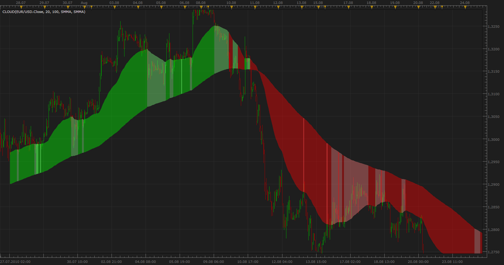
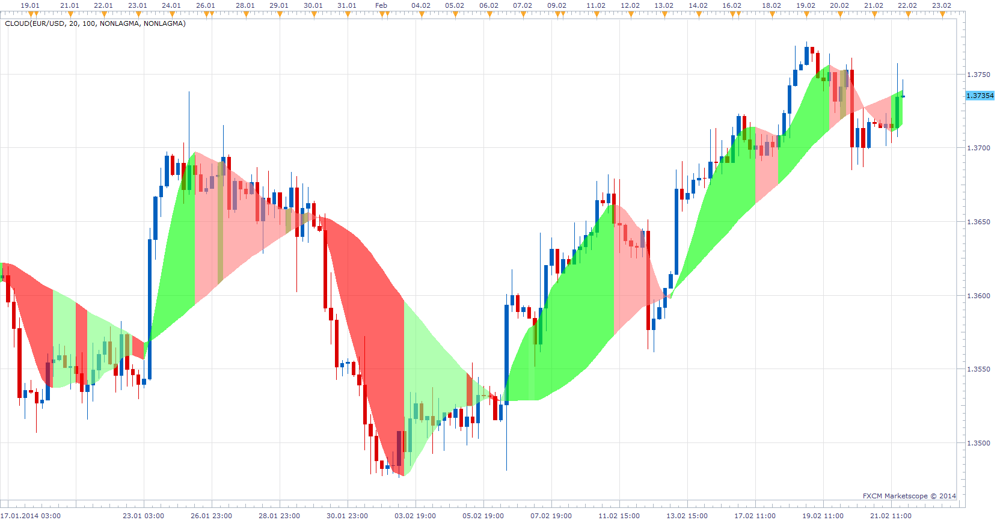

# MVA/EMA Cloud

> Source: https://fxcodebase.com/code/viewtopic.php?f=17&t=1589  
> Forum: 17 · Topic 1589 · 67 post(s)

---

## MVA/EMA Cloud

**Apprentice** · Mon Jul 26, 2010 4:12 pm

The relationship between moving average determines the color of the clouds.
We distinguish 4 cases.
Short & Long Growing
Growing Short & Long Falling
Falling Short & Long Growing
Short & Long Falling

 [Cloud.lua](files/3117/Cloud.lua)

 

MTF Inddicator that accompanies cloud Indicator,
will show Slope of clouds moving averages, for all selected time frames.

 [MTF Cloud.lua](files/3117/MTF%20Cloud.lua)

 [MA Cloud with Alternatively Source.lua](files/3117/MA%20Cloud%20with%20Alternatively%20Source.lua)

 [MA Cloud with Alternatively Source and Alert.lua](files/3117/MA%20Cloud%20with%20Alternatively%20Source%20and%20Alert.lua)

MT4/Mq4 version is available here.
[viewtopic.php?f=38&t=63831](https://fxcodebase.com/code/viewtopic.php?f=38&t=63831)

 [Averages Cloud.lua](files/3117/Averages%20Cloud.lua)

Averages.lua
[viewtopic.php?f=17&t=2430](https://fxcodebase.com/code/viewtopic.php?f=17&t=2430)

---

## Re: MVA/EMA Cloud

**larryfolson** · Sun Aug 29, 2010 5:56 pm

very nice, thanks

---

## Re: MVA/EMA Cloud

**jsi@jp** · Tue Aug 31, 2010 5:42 am

Thank you very much Apprentice.
You have helped me in a big way.

jsi@jp

---

## Re: MVA/EMA Cloud

**Jigit Jigit** · Wed Oct 20, 2010 2:08 pm

Hi Apprentice,
Great job as usual.

Could you, possibly, ad Volume Adjusted Moving Average to the drop down list in this indicator?

Thanks a million.

---

## Re: MVA/EMA Cloud

**Jigit Jigit** · Wed Oct 20, 2010 2:14 pm

Also, on second thoughts,

It would be very nice if someone could make this indicator actually display the two moving averages used (perhaps in darker colours). That would make the cloud even more aesthetically pleasing.

Thanks a lot.

---

## Re: MVA/EMA Cloud

**Jigit Jigit** · Fri Oct 22, 2010 6:18 am

Dear Apprentice,
Please, please, could you add to the drop down list of moving averages in your Cloud
 the Non-lag Moving Average as posted by Alexander Gettinger here: [viewtopic.php?f=17&t=2231&p=5006&hilit=non+lag+ma#p5006](https://fxcodebase.com/code/viewtopic.php?f=17&t=2231&p=5006&hilit=non+lag+ma#p5006)

Thank you.

---

## Re: MVA/EMA Cloud

**Apprentice** · Fri Oct 22, 2010 12:35 pm

Update

Non-lag Moving Average Added
VAMA Added
Show MA Line Option Added
Set Transparency Option Added
Price Type Option Added

Note.
To use ZeroLagMa Download RC1 Version of this indicator.
[viewtopic.php?f=17&t=2231&p=5455#p5455](https://fxcodebase.com/code/viewtopic.php?f=17&t=2231&p=5455#p5455)

---

## Re: MVA/EMA Cloud

**Jigit Jigit** · Fri Oct 22, 2010 7:10 pm

I just can't find words to thank you enough Apprentice.
Well, once again, thanks a million.

Two issues regarding this indicator:
1. In the drop-down list for "Method One" VAMA is still missing.

2. (Of crucial importance) Has anyone experienced problems with Trading Station/Marketscope while using this indicator. On my PC, the cloud, literally, seems to kill the charts. This is what happens:
* I add the Cloud to a plain candlestick chart.
* It does load but:

a) It spreads itself only over several dozens of candles (60-100 candles at most). I have to drag the chart back manually to actually make the cloud draw itself back beyond that. That in itself wouldn't be strange but once I drag , say, an M15 chart about a month back, it basically stops responding to the cursor moves and Marketscope, quite literally, freezes. Not to mention that it keeps crashing the whole Trading station every now and then, that is when loaded on several charts at the same time (say 8-12 charts).

I don't think it is due to some hardware issues (I work on an Intel Core i3 CPU 3GHz with 4 GB RAM and I checked the system performance during those hang-ups: CPU usage doesn't exceed 40%, neither does Memory usage exceed 50%). Would it be because of my 64-bit Windows 7?

b) The Cloud seems to have problems while working on the Non-Lag MA indicator. That is to say, it doesn't seem to be happy with anything above 100 periods. For example, drawing a cloud based on the famous 200 periods (Non-Lag MA) is rather problematic - more often than not it simply doesn't work.

Ant suggestions guys.
Please help me out.
Cheers

---

## Re: MVA/EMA Cloud

**Apprentice** · Sat Oct 23, 2010 10:49 am

First, Problem solved.
Second problem, I'll make a test on Monday.

---

## Re: MVA/EMA Cloud

**Jigit Jigit** · Fri Oct 29, 2010 10:59 am

Hi Apprentice,
Any progress on this cloud indicator?

---

## Re: MVA/EMA Cloud

**Apprentice** · Fri Oct 29, 2010 12:57 pm

I have two remedys for you
To try it out.
First install the last patch.
[viewtopic.php?f=31&t=2337](https://fxcodebase.com/code/viewtopic.php?f=31&t=2337)
Install the latest version of NonLagMA.

This should help.

As for scrolling backwards.
Currently there is no help for it.
Some indicators require more data input than others.
NonLagMa is one of them.

---

## Re: MVA/EMA Cloud

**Jigit Jigit** · Sun Oct 31, 2010 3:52 pm

Cheers mate,
I really like this Cloud of yours and I'd love to use it.
But for some reason it does slow things down too much.
Especially when I load it up to several charts at one time.
I work with multiple screens, so I would need it at as many as 12 charts simultaneously.
Which makes me think, is this just one of the limitations of Marketscope?

Whenever I load multiple instances of an indicator like this Cloud here or Non-lag Moving Average at all of my 12 charts, Marketscope tends to struggle. It freezes much too often.
Hmm, I don't know. Or is it a matter of the indicators I use? Is there something wrong with them?
(Again as I said before I don't think it is related to some harware issues).

---

## Re: MVA/EMA Cloud

**Apprentice** · Sun Oct 31, 2010 5:26 pm

Would not advise that you use non-standard indicators.
They often in the calculation use other indicators.
So that retrieval of such data can take, especially if you have 12 chart.

This is especially true for NonLagMA.

---

## Re: MVA/EMA Cloud

**SNT1983** · Fri Nov 05, 2010 7:18 am

Hi all!

can you do a strategy on this cloud system?

1)Buy 0,10 lot when EMA13 cross up MA34 at market price with take profit at 100 pips and stop-loss at 150 pips. And **Exit from position if cloud change colour!**

2)Sell when EMA13 cross down MA34 at market price with Take Profit at 100 pips and stop-loss at 150 pips. And **Exit from position if cloud change colour!**

you understand me?

let me know please.

---

## Re: MVA/EMA Cloud

**Apprentice** · Fri Nov 05, 2010 7:21 am

This is possible using MA Strategy.
[viewtopic.php?f=31&t=2602](https://fxcodebase.com/code/viewtopic.php?f=31&t=2602)
Sorry, Exit from position if cloud change colour!, this is not possible

---

## Re: MVA/EMA Cloud

**Apprentice** · Wed Oct 03, 2012 12:40 am

Updated.

---

## Re: MVA/EMA Cloud

**speakinmymind** · Thu Mar 28, 2013 10:37 am

Can you add a transparency option for color?

---

## Re: MVA/EMA Cloud

**speakinmymind** · Thu Mar 28, 2013 10:49 am

sorry i overlooked it!

---

## Re: MVA/EMA Cloud

**speakinmymind** · Thu Mar 28, 2013 11:08 am

Could you develop an MTF version of this? something that says we are up in and uptrend, down in uptrend, down in down trend and up in downtrend for multiple time frames?

---

## Re: MVA/EMA Cloud

**Apprentice** · Sat Mar 30, 2013 11:10 am

MTF Cloud added to topmost, first post of this Topic.

---

## Re: MVA/EMA Cloud

**speakinmymind** · Sat Mar 30, 2013 9:01 pm

Thanks! This is a great indicator!

I was wondering if there was an MTF similar to this one that only uses one moving average. The closest thing to it was MTF 200SMA CCI20 but there was no visual indicator.

---

## Re: MVA/EMA Cloud

**speakinmymind** · Fri Apr 12, 2013 10:12 am

Could you please develop an indicator that displays the following information for the moving averages of the cloud?

Upper cloud price (and distance in pips from current price)

Lower cloud price (and distance in pips from current price)

Last time of price touch

Thanks!

---

## Re: MVA/EMA Cloud

**Apprentice** · Mon Apr 15, 2013 5:20 am

Your request is added to the development list.

---

## Re: MVA/EMA Cloud

**Coondawg71** · Fri Aug 30, 2013 4:53 pm

Vama Cloud error:

Clud lua 212: Vama .lua:62: ema.lu:67:attempt to perform arithmetic on local 'value' (a nil value)

????

Thanks,

sjc

---

## Re: MVA/EMA Cloud

**Apprentice** · Sun Sep 01, 2013 12:47 pm

Unfortunately I was unable to reproduce this problem.
Can you post screenshot of your settings.

---

## Re: MVA/EMA Cloud

**Patrick Sweet** · Mon Feb 17, 2014 8:19 am

Thank you. I found this.
It looks like it is good.

As you know, I use the latest VIDYA, well that is missing.

I use other MAs as well.

Rather than a duck chase of Vidya plus parma plus.....

Is it possible to modify this to select two sources from the marketscope screen that is open?

It looks to be exactly what I am looking for otherwise.

Patrick

---

## Re: MVA/EMA Cloud

**Apprentice** · Tue Feb 18, 2014 5:45 am

If i modify it to be a tick-based, you can select one source, which can be, for example indicator, as source for both moving averages.
Another way is to add build in indicator/price, selector as an alternative source for moving average.

---

## Re: MVA/EMA Cloud

**Apprentice** · Tue Feb 18, 2014 6:33 am

Plese Try MA Cloud with Alternatively Source.lua

U can select MA`s or other Indicators as Cloud source,
Select Indicator under Type.

Vidya Added as well.

---

## Re: MVA/EMA Cloud

**Patrick Sweet** · Tue Feb 18, 2014 2:51 pm

Excellent!
Patrick

---

## Re: MVA/EMA Cloud

**Patrick Sweet** · Tue Feb 18, 2014 5:42 pm

Working great for MAs.
When selecting other sources under indicator.....seems not to show-up on screen?
Do you get this error?
P

---

## Re: MVA/EMA Cloud

**Apprentice** · Wed Feb 19, 2014 3:56 am

If you choose RSI, for example.
In can be outside of chart area, values ​​are from 0 to 100
will be similarly for the other indicator, moving averages of price are the only safe bet.

---

## Re: MVA/EMA Cloud

**Tidontrack** · Wed Feb 19, 2014 6:28 pm

Hi gents, I've tried to use the cloud with nonlagma but get this error:

Cloud.lua:153: The indicator with id NONLAGMA is not found.
I've used nonlagma in the past so its there.
I redownloaded the nonlagma and still nothing. Any clues?
Would like to be able to use ssnonlagma with the cloud as well if you could add that to the list

---

## Re: MVA/EMA Cloud

**Apprentice** · Sat Feb 22, 2014 5:56 am

In my testing, I have not encountered this problem.
One Note Make sure to install RC1 version of NONLAGMA.
Scroll a few posts, down.
[viewtopic.php?f=17&t=2231&p=5455&hilit=NONLAGMA#p5455](https://fxcodebase.com/code/viewtopic.php?f=17&t=2231&p=5455&hilit=NONLAGMA#p5455)

---

## Re: MVA/EMA Cloud

**Francis D** · Thu Feb 27, 2014 10:20 am

Hello,

Would it be possible to use cloud-Averages for other data sources, such as RSI.

Thank you very much for your great work.

---

## Re: MVA/EMA Cloud

**TxChristopher** · Tue Jun 17, 2014 8:56 am

Can you please modify this cloud so that there is an option to color based purely on the relationship of the two moving averages? In other words its one color when one average is higher than the other and is another color when they swap, without all the updown downup that forces the striping that it currently does.

---

## Re: MVA/EMA Cloud

**Apprentice** · Tue Jun 17, 2014 12:07 pm

Try This version.

 [Cloud.lua](files/94522/Cloud.lua)

---

## Re: MVA/EMA Cloud

**traderschmoe** · Sun Aug 31, 2014 8:28 am

Thanks Apprentice. I really like this Cloud indicator.

---

## Re: MVA/EMA Cloud

**amazon1a** · Sun Mar 29, 2015 7:46 pm

Hi Apprentice,

This is a great indi, but is it possible to modify it or Cloud_Averages so to incorporate a Shift function for at least one of the 2 averages.

For example I would like to emulate the TMS averages in which the averages might be 3EMA Typical, Shift 0 and 5EMA Typical, Shift 3.

Many Thanks, AG

---

## Re: MVA/EMA Cloud

**Apprentice** · Mon Mar 30, 2015 5:01 am

MA Cloud with Alternatively Source.lua and Cloud.lua Major Update
Shift functionality introduced.

---

## Re: MVA/EMA Cloud

**amazon1a** · Mon Mar 30, 2015 6:05 am

Hi Apprentice,

Thanks for the additional Shift functionality. The fit is not quite as tight against the EMA lines as your other Clouds but more than good enough for my needs.

AG

---

## Re: MVA/EMA Cloud

**mchurch2006** · Wed Sep 02, 2015 6:48 am

Hi Admins,

Thanks for the most recent update to this cloud .lua using only 2 colours, It's great and I use this lua file on the majority of my charts, though would it be possible to include the option to disable/enable the MA lines similar to the previous version, as I personally don't need the lines displayed as I simply take my orientation from the colour?

Thanks in advance,

Mike

---

## Re: MVA/EMA Cloud

**Apprentice** · Sun Sep 06, 2015 4:37 am

Option Added.

---

## Re: MVA/EMA Cloud

**mchurch2006** · Fri Sep 11, 2015 11:00 am

Hi Apprentice,

Many thanks for doing the update, much appreciated.

---

## Re: MVA/EMA Cloud

**Mohamed85** · Sun Aug 21, 2016 1:36 pm

Hi Apprentice, that is such an amazing indicator, I have been looking for a similar one for along time.
I really appreciate your perfect work.
furthermore, I have a request if you could kindly help me, could you add alert to the alternatively source cloud upon the MA crosses.

Thank you so much in advance.

---

## Re: MVA/EMA Cloud

**Mohamed85** · Sun Aug 21, 2016 10:10 pm

Hi Apprentice,

That's such a piece of art, I've been looking for a similar indicator for a long time, really appreciate your perfect work.
Further more I have a request, if you can kindly add an alert to the alteratively source cloud upon the crossing of the averages, that would be much appreciated.
Thanks so much in advance.

---

## Re: MVA/EMA Cloud

**Apprentice** · Mon Aug 22, 2016 7:26 am

MA Cloud with Alternatively Source and Alert.lua added.

---

## Re: MVA/EMA Cloud

**Mohamed85** · Mon Aug 22, 2016 1:17 pm

Hi Apprentice
Thank you so much for your prompt support, Extremely Appreciate it, you are a hero .
one more please, can you update the alert to respond to the candles close not to the ticks as it generates tons of alerts per sec currently

---

## Re: MVA/EMA Cloud

**Mohamed85** · Thu Aug 25, 2016 6:51 am

Hi Apprentice, can you please have a quick look on the added alert, I have applied the cloud to an indicator and even i have checked the "alert once" box, it keeps generating alerts for every tick change, like when the price oscillates around the cross within the candle it keeps generating alerts, it could exceed 50 alert per one signal which paralysis the market scope.
I hope you can help me by solving this issue.

---

## Re: MVA/EMA Cloud

**Apprentice** · Fri Aug 26, 2016 3:25 am

Fixed.

---

## Re: MVA/EMA Cloud

**Mohamed85** · Fri Aug 26, 2016 9:34 am

Thank you so much, really appreciate your support.
but could you please check the e-mail alert as well, that will be too helpful, the indicator is not sending e-mails.
I have tried to debug the file it gave error in line 355, but I couldn't do anything about it, I hope you can find sometime to check it please.

---

## Re: MVA/EMA Cloud

**Mohamed85** · Tue Aug 30, 2016 10:14 pm

I hope you can find some time to check the alert please,
The e-mail, pop-up message that shows the details (time, and signal type) snd the sound alert are not working.
only a warning message appears on the cross.
Thank you for all your support and help in advance.

---

## Re: MVA/EMA Cloud

**Mohamed85** · Tue Aug 30, 2016 10:30 pm

As a matter of fact, the indicator has sent e-mails for a couple of times, i'm not quite sure based on what.
As it did not send emails when started then it sends on thse incidents then stopped again.
Thanks for bearing with me.

---

## Re: MVA/EMA Cloud

**Apprentice** · Fri Sep 02, 2016 2:41 am

I could not reproduce.
Anyone?

---

## Re: MVA/EMA Cloud

**Mohamed85** · Fri Sep 02, 2016 7:00 am

Thank you so much for all he help that you provided so far, really appreciate it.
and hope that somebody could help on that issue.

---

## Re: MVA/EMA Cloud

**Apprentice** · Thu May 10, 2018 5:52 am

The indicator was revised and updated.

---

## Re: MVA/EMA Cloud

**bruno2017** · Thu Nov 21, 2019 7:03 am

Hello ,
Can you color code this indicator as a histogram as a MACD.
thank you
I don’t know if I made myself clear:
transformed the indicator into a histogram

---

## Re: MVA/EMA Cloud

**Apprentice** · Thu Nov 21, 2019 1:36 pm

Your request is added to the development list.
Development reference 338.

---

## Re: MVA/EMA Cloud

**Apprentice** · Fri Nov 22, 2019 4:48 am

Try this version.
[viewtopic.php?f=17&t=69151](https://fxcodebase.com/code/viewtopic.php?f=17&t=69151)

---

## Re: MVA/EMA Cloud

**fx1954** · Fri Jul 17, 2020 4:32 pm

Hi,
could you please add the SineWMA to the options of MAs in the Cloud indicator?
I like this indi very much and would like to use it together with my SineWMAs.
Thank you.

---

## Re: MVA/EMA Cloud

**Apprentice** · Sun Jul 19, 2020 5:09 pm

Your request is added to the development list.
Development reference 1724.

---

## Re: MVA/EMA Cloud

**Apprentice** · Tue Jul 21, 2020 9:29 am

Averages Cloud.lua added to top/first post of the topic.

---

## Re: MVA/EMA Cloud

**fx1954** · Tue Jul 21, 2020 10:06 am

Thank you, works great.

---

## Re: MVA/EMA Cloud

**fx1954** · Sat Mar 25, 2023 5:28 am

Hi, is it possible to add a shift function to this indicator?

best regards

---

## Re: MVA/EMA Cloud

**Apprentice** · Sat Mar 25, 2023 1:05 pm

We have added your request to the development list.
Development reference 265.

---

## Re: MVA/EMA Cloud

**Apprentice** · Fri Mar 31, 2023 1:31 am

You can use the "Shift in periods" parameter of Averages Cloud.lua

---

## Re: MVA/EMA Cloud

**AlexanderS** · Wed Nov 19, 2025 9:14 am

HI
Can you make alert with first cloud indikaktor
but not cross line
better change color
i take high low mva

THANKS

---

## Re: MVA/EMA Cloud

**Apprentice** · Sat Nov 22, 2025 4:34 pm

We have added your request to the development list.
Development reference 750
