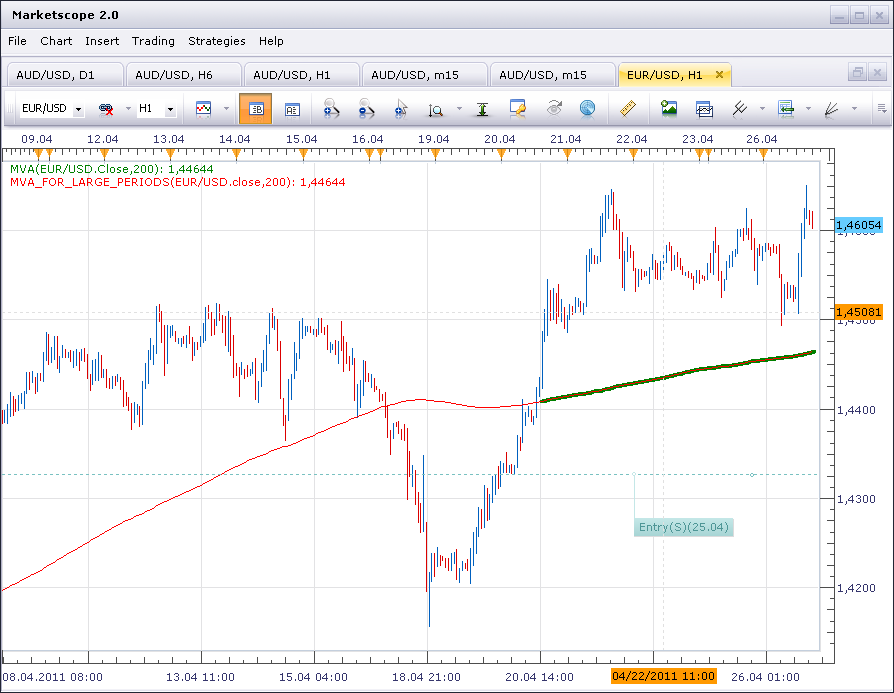

# MVA for Large Number of Periods

> Source: https://fxcodebase.com/code/viewtopic.php?f=17&t=4024  
> Forum: 17 · Topic 4024 · 3 post(s)

---

## MVA for Large Number of Periods

**sunshine** · Tue Apr 26, 2011 6:55 am

When you use the standard moving average indicator with a large number of periods, for example 200, you have to scroll your chart to download additional data since the indicator doesn't draw automatically to the full length of the chart.

I've uploaded the simple moving average which can be used with a large number of periods.
Compare the standard 200-periods MVA with 200-periods MVA from the attachment:

 

With the next update of the FX Trading Station, Marketscope will have more price data loaded by default. So it seems that the problem with the standard moving average will appear only when scrolling to the beginning of the available data.

The indicator was revised and updated

---

## Re: MVA for Large Number of Periods

**DS0167** · Tue Apr 26, 2011 1:22 pm

Awesome!

Thank you, I was waiting for this one since my beginning

---

## Re: MVA for Large Number of Periods

**Apprentice** · Mon Mar 06, 2017 8:12 am

Indicator was revised and updated.
