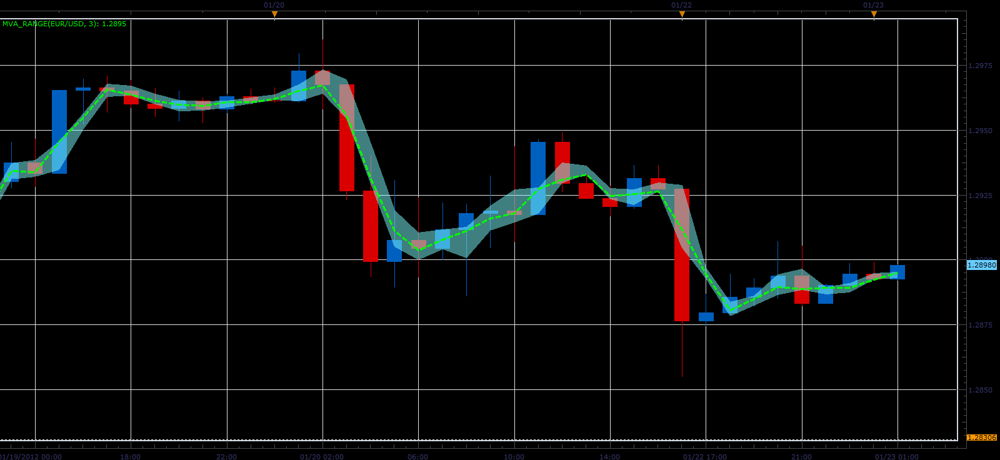

# MVA Range indicator

> Source: https://fxcodebase.com/code/viewtopic.php?f=17&t=12169  
> Forum: 17 · Topic 12169 · 2 post(s)

---

## MVA Range indicator

**Alexander.Gettinger** · Mon Jan 23, 2012 1:48 am

The indicator shows the range in which changed the MVA (simple moving average) during the each bar.

Formulas:
MVA[i]=Sum[i]/Period, where
Sum[i]=sum close prices in the range from (i-Period+1) to (i),
Top of cloud=(Sum-Close+High)/Period and
Bottom of cloud=(Sum-Close+Low)/Period.

 

Download:

 [MVA_Range.lua](files/24127/MVA_Range.lua)

The indicator was revised and updated

---

## Re: MVA Range indicator

**Apprentice** · Thu Mar 23, 2017 2:49 pm

Indicator was revised and updated.
