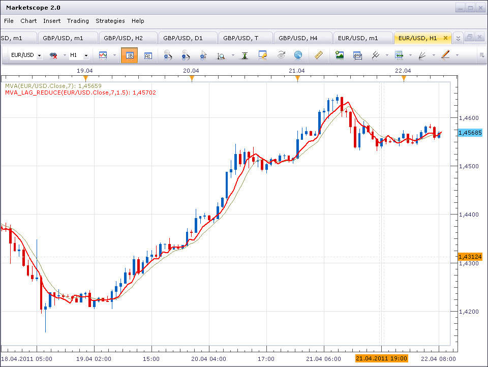

# MVA with Lag Reducing

> Source: https://fxcodebase.com/code/viewtopic.php?f=17&t=3993  
> Forum: 17 · Topic 3993 · 3 post(s)

---

## MVA with Lag Reducing

**sunshine** · Fri Apr 22, 2011 3:46 am

This simple moving average indicator has an option to set reducing of lag.
The image below shows how lag has been reduced compared with the standard simple moving average:

 

The indicator was revised and updated

---

## Re: MVA with Lag Reducing

**Alexander.Gettinger** · Tue Nov 25, 2014 11:14 am

MQL4 version of indicator: [viewtopic.php?f=38&t=61537](https://fxcodebase.com/code/viewtopic.php?f=38&t=61537).

---

## Re: MVA with Lag Reducing

**Apprentice** · Sat Jul 01, 2017 5:27 am

The indicator was revised and updated.
